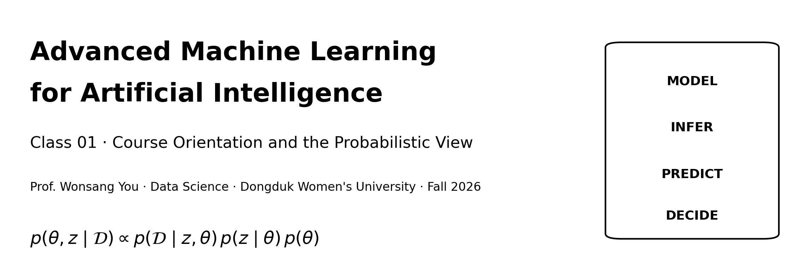
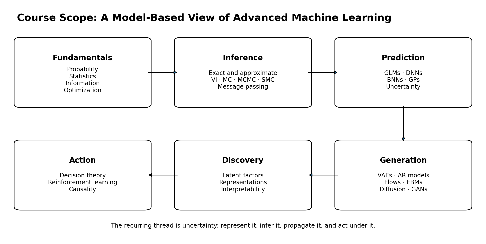
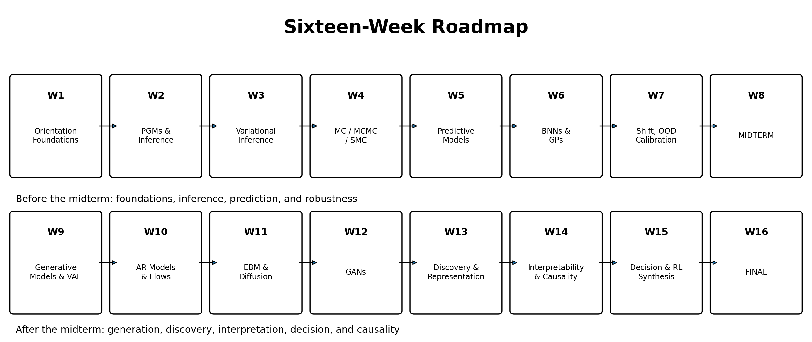
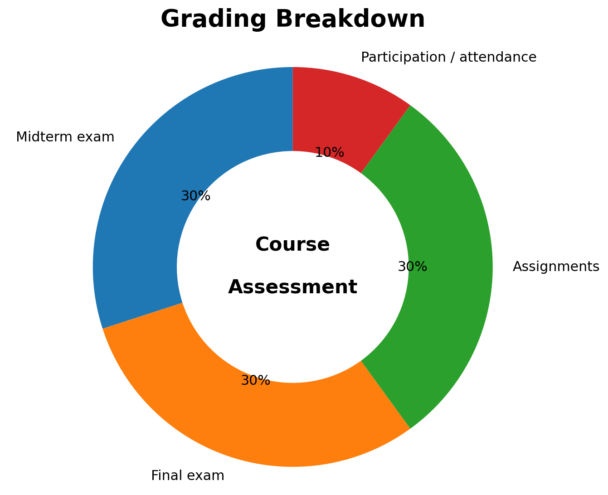
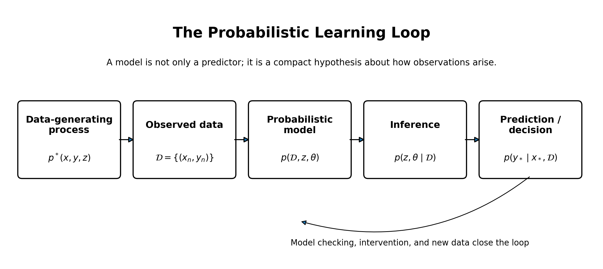
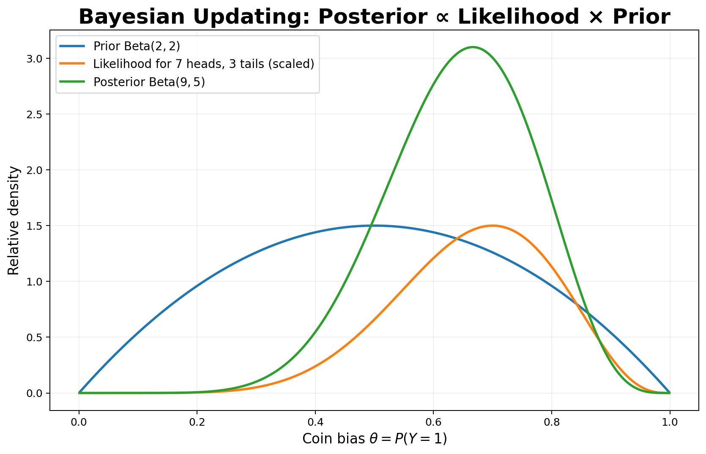
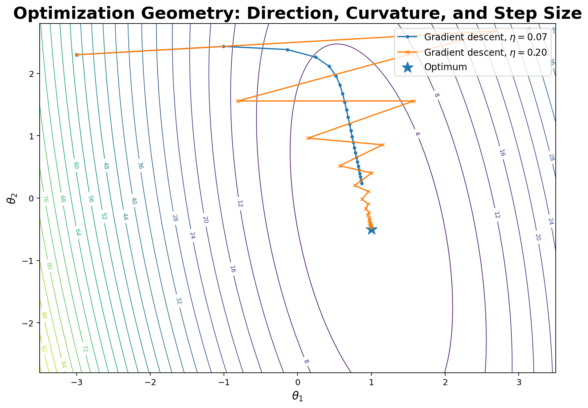
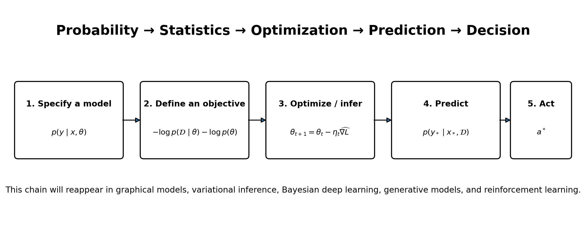

# Class 01 — Course Orientation and the Probabilistic View of Advanced Machine Learning

> **Advanced Machine Learning for Artificial Intelligence**  
> **Prof. Wonsang You, Data Science, Dongduk Women's University**  
> **Fall Semester, 2026 · DSC1002 · 3 credits**  
> **Regular meetings:** Tuesday and Thursday, 10:30–11:45  
> **Today's shortened meeting:** approximately 40 minutes

---

## Learning objectives

By the end of this class, you should be able to:

1. Explain the scope, structure, prerequisites, and assessment policy of this course.
2. Distinguish four broad goals of advanced machine learning: **prediction, generation, discovery, and action**.
3. Explain why uncertainty should be represented by probability distributions rather than only by point estimates.
4. Recall the mathematical roles of conditional probability, Bayes' rule, expectation, variance, likelihood, MLE, MAP, gradients, Hessians, and stochastic gradient descent.
5. Describe the recurring workflow that connects **probability, statistics, optimization, prediction, and decision making**.

## Today's 40-minute route

| Time | Topic | Main question |
|---:|---|---|
| 0–4 min | Welcome and course identity | What kind of course is this? |
| 4–9 min | Semester roadmap | What will we learn, and how do the topics connect? |
| 9–13 min | Grading and assignment policies | What is expected from students? |
| 13–21 min | Probabilistic perspective | Why is probability a unifying language for advanced ML? |
| 21–27 min | Probability review | How do we represent and update uncertainty? |
| 27–33 min | Statistics review | How do we learn model parameters from data? |
| 33–38 min | Optimization review | How do we solve the resulting learning problems? |
| 38–40 min | Synthesis and next steps | What should remain after today's class? |

---

# 1. Course at a glance

## Course purpose

This course studies advanced machine learning for artificial intelligence from a **probabilistic, model-based perspective**. Rather than treating machine learning only as fitting a function from inputs to outputs, we will study how to:

- represent uncertainty about data, latent variables, parameters, and predictions;
- infer hidden structure from observations;
- construct predictive and generative models;
- reason about distribution shift and out-of-distribution inputs;
- make decisions under uncertainty;
- connect statistical modeling, deep learning, reinforcement learning, and causality.

The course is theory-oriented, but Python-based assignments will require you to **derive, implement, test, and analyze** important algorithms.

## Expected background

Students are recommended to have prior exposure to:

- Python programming;
- linear algebra;
- probability and statistics;
- optimization;
- basic machine learning.

A laptop or equivalent personal computing device is required for coding assignments and possible in-class practice.

## Textbooks and resources

| Role | Resource | Use in this course |
|---|---|---|
| Main textbook | Kevin P. Murphy, *Probabilistic Machine Learning: Advanced Topics*, MIT Press, 2023 | Main source for advanced models and inference methods |
| Supplementary textbook | Kevin P. Murphy, *Probabilistic Machine Learning: An Introduction*, MIT Press, 2022 | Review of probability, statistics, linear algebra, optimization, and basic ML |
| Supplementary material | Kevin P. Murphy, *Supplementary Material for Probabilistic Machine Learning: Advanced Topics* | Optional deeper examples and extensions |
| Official code | [probml/pyprobml — Book 2 notebooks](https://github.com/probml/pyprobml/tree/master/notebooks/book2) | Reproducible Python/JAX demonstrations |
| Course repository | [lunalab-ai/advML](https://github.com/lunalab-ai/advML) | Course notebooks, assignments, and supporting files |

### Source alignment for Class 01

| Class topic | Textbook alignment | Optional notebook |
|---|---|---|
| Probabilistic view of advanced ML | Main textbook, Chapter 1, pp. 1–2 | [Book 2 notebook directory](https://github.com/probml/pyprobml/tree/master/notebooks/book2) |
| Probability review | Supplementary textbook, Chapter 2, especially §§2.1–2.3 | [Intro to probability — Colab](https://colab.research.google.com/github/probml/pyprobml/blob/master/notebooks/book1/02/prob.ipynb) |
| Statistics, MLE, MAP, regularization | Supplementary textbook, Chapter 4, especially §§4.1–4.5 | [Introduction to Bayesian statistics — Colab](https://colab.research.google.com/github/probml/pyprobml/blob/master/notebooks/book1/04/bayes_intro.ipynb) |
| Optimization, GD, and SGD | Supplementary textbook, Chapter 8, especially §§8.1–8.4 | [Steepest descent demo — Colab](https://colab.research.google.com/github/probml/pyprobml/blob/master/notebooks/book1/08/steepestDescentDemo.ipynb) · [Optimization with JAX — Colab](https://colab.research.google.com/github/probml/pyprobml/blob/master/notebooks/book1/08/opt_jax.ipynb) |

---

# 2. How the semester is organized

The main textbook is organized around six large blocks. The course follows the same conceptual progression, with some compression and reordering.

1. **Fundamentals:** probability, statistics, graphical models, information, and optimization.
2. **Inference:** exact and approximate inference, message passing, variational inference, Monte Carlo, MCMC, and SMC.
3. **Prediction:** generalized linear models, deep networks, Bayesian neural networks, Gaussian processes, calibration, and distribution shift.
4. **Generation:** VAEs, autoregressive models, normalizing flows, energy-based models, diffusion models, and GANs.
5. **Discovery:** latent factor models, representation learning, and interpretability.
6. **Action:** decision making under uncertainty, reinforcement learning, and causality.

## Weekly plan

| Week | Main topic |
|---:|---|
| 1 | Course overview; probabilistic perspective; review of probability, statistics, and optimization |
| 2 | Probabilistic graphical models; inference overview; conditional independence; message passing |
| 3 | Variational inference; ELBO; mean-field approximation; probabilistic optimization |
| 4 | Monte Carlo; importance sampling; MCMC; sequential Monte Carlo |
| 5 | Predictive models; generalized linear models; deep neural networks as probabilistic predictors |
| 6 | Bayesian neural networks; Gaussian processes; predictive uncertainty; function-space views |
| 7 | Beyond iid; distribution shift; calibration; out-of-distribution issues |
| 8 | **Midterm examination** |
| 9 | Generative models; latent variable models; variational autoencoders |
| 10 | Autoregressive models; normalizing flows; likelihood-based generation |
| 11 | Energy-based models; diffusion; score-based and denoising-based generation |
| 12 | GANs; adversarial learning; comparison of major generative model families |
| 13 | Latent factor models; discovery; representation learning |
| 14 | Interpretability; feature attribution; counterfactual explanations; basic causal inference |
| 15 | Decision making under uncertainty; reinforcement learning; course synthesis |
| 16 | **Final examination** |

---

# 3. Grading and academic policies

| Component | Weight | What it evaluates |
|---|---:|---|
| Midterm examination | 30% | Mathematical and conceptual understanding of the first half |
| Final examination | 30% | Integrated understanding of the second half and the whole course |
| Assignments | 30% | Derivation, implementation, experimentation, analysis, reading, and technical communication |
| Participation and attendance | 10% | Attendance, preparation, engagement, and contribution to class activities |

## Assignment policy

Assignments may include:

- mathematical derivations;
- implementation of algorithms;
- experimental design and analysis;
- short research-paper readings;
- concise concept summaries.

Late submission, plagiarism, or unauthorized copying of code may result in a penalty or a grade of zero. Assignment-specific requirements and submission procedures will be announced with each assignment.

## Attendance policy

- Two late arrivals count as one absence.
- Under university regulations, a student whose total absences exceed **one-fifth of the total class hours** receives an F grade.

> **Working principle:** Do not aim only to obtain a numerical result. You should be able to explain the model assumptions, derive the objective, justify the algorithm, inspect failure modes, and communicate what the experiment means.

---

# 4. Why a probabilistic perspective?

A standard predictive model is often written as a function

$$
\hat{y}=f(x;\theta).
$$

This representation is useful, but it leaves several important questions unanswered:

- How uncertain is the prediction?
- Is uncertainty caused by irreducible noise or by insufficient knowledge?
- What hidden variables could have generated the observation?
- How should multiple plausible models be combined?
- How should we choose an action when errors have different costs?
- What changes when the test distribution differs from the training distribution?

A probabilistic model answers such questions by describing a **distribution over possible values**, not only one value.

## 4.1 Unknown quantities become random variables

Examples of unknown quantities include:

- a future target $y_*$;
- a latent representation $z$;
- model parameters $\theta$;
- an unobserved state in a dynamical system;
- the causal effect of an intervention;
- the return obtained by an action.

A probability distribution encodes which values are plausible and how strongly they are supported.

## 4.2 Four broad task families

| Task | Typical probabilistic object | Core question |
|---|---|---|
| Prediction | $p(y\mid x)$ | What output is plausible for this input? |
| Generation | $p(x)$ or $p(x\mid c)$ | What observations could be generated, possibly under a condition $c$? |
| Discovery | $p(z,x)=p(z)p(x\mid z)$ and $p(z\mid x)$ | What hidden structure may explain the observations? |
| Action | $p(s',r\mid s,a)$ plus a utility or loss | Which action has the best expected consequence? |

## 4.3 A generic latent-variable model

Let $\theta$ be global model parameters, $z$ latent variables, and $\mathcal{D}$ observed data. A common factorization is

$$
p(\mathcal{D},z,\theta)=p(\mathcal{D}\mid z,\theta)\,p(z\mid\theta)\,p(\theta).
$$

After observing data, Bayes' rule gives

$$
p(z,\theta\mid\mathcal{D})
=\frac{p(\mathcal{D}\mid z,\theta)p(z\mid\theta)p(\theta)}{p(\mathcal{D})}.
$$

For a new input $x_*$, the posterior predictive distribution is obtained by averaging over parameter uncertainty:

$$
p(y_*\mid x_*,\mathcal{D})
=\int p(y_*\mid x_*,\theta)\,p(\theta\mid\mathcal{D})\,d\theta.
$$

A point-estimate method replaces $p(\theta\mid\mathcal{D})$ by one value $\hat\theta$. This is computationally convenient, but it may be overconfident when data are limited or the model is weakly identified.

## 4.4 Aleatoric and epistemic uncertainty

- **Aleatoric uncertainty** is intrinsic variability in the data-generating process. Even with the correct model and unlimited data, it may remain.
- **Epistemic uncertainty** reflects limited knowledge about the model, parameters, or hidden mechanism. It can often be reduced by collecting informative data or improving the model.

This distinction matters. Collecting more labels is useful when uncertainty is epistemic, but may not reduce irreducible aleatoric noise.

---

# 5. Review I — Probability

## 5.1 Probability space and random variables

A probability space is a triple $(\Omega,\mathcal{F},P)$:

- $\Omega$: sample space of possible outcomes;
- $\mathcal{F}$: collection of measurable events;
- $P$: probability measure satisfying non-negativity, normalization, and countable additivity.

A random variable $X:\Omega\rightarrow\mathcal{X}$ maps outcomes to values. Its distribution may be represented by a probability mass function for discrete variables or a probability density function for continuous variables.

## 5.2 Joint, marginal, and conditional distributions

For random variables $X$ and $Y$:

$$
p(x,y)=p(y\mid x)p(x)=p(x\mid y)p(y).
$$

Marginalization removes variables:

$$
p(x)=\sum_y p(x,y)
\quad\text{or}\quad
p(x)=\int p(x,y)\,dy.
$$

Conditional independence is written

$$
X\perp Y\mid Z
\quad\Longleftrightarrow\quad
p(x,y\mid z)=p(x\mid z)p(y\mid z).
$$

Conditional independence will become the main language of probabilistic graphical models.

## 5.3 Expectation and variance

For a continuous random variable,

$$
\mathbb{E}[X]=\int x\,p(x)\,dx,
\qquad
\operatorname{Var}(X)=\mathbb{E}\left[(X-\mathbb{E}[X])^2\right].
$$

Two useful identities are

$$
\mathbb{E}[aX+b]=a\mathbb{E}[X]+b,
$$

and

$$
\operatorname{Var}(X)=\mathbb{E}[X^2]-\mathbb{E}[X]^2.
$$

Expectation is not merely a descriptive statistic. It defines risks, expected utilities, Monte Carlo estimators, and many learning objectives.

## 5.4 Bayes' rule

$$
p(\theta\mid\mathcal{D})
=\frac{p(\mathcal{D}\mid\theta)p(\theta)}{p(\mathcal{D})}
\propto p(\mathcal{D}\mid\theta)p(\theta).
$$

- $p(\theta)$: prior;
- $p(\mathcal{D}\mid\theta)$: likelihood;
- $p(\theta\mid\mathcal{D})$: posterior;
- $p(\mathcal{D})$: marginal likelihood or evidence.

In the figure, a $\operatorname{Beta}(2,2)$ prior is updated with seven heads and three tails. The posterior is $\operatorname{Beta}(9,5)$. The update changes both the location and the concentration of our belief.

### Quick check

Suppose $H_1$ is a fair coin and $H_2$ is a coin with $P(\text{head})=0.8$. Let the prior probabilities be equal. After observing two heads,

$$
p(H_2\mid HH)
=\frac{0.8^2\cdot0.5}{0.8^2\cdot0.5+0.5^2\cdot0.5}
=\frac{0.64}{0.64+0.25}
\approx0.719.
$$

The posterior is not determined by the likelihood alone; it depends on both likelihood and prior.

---

# 6. Review II — Statistics

Statistics asks how to learn unknown quantities from finite data and how to quantify the resulting uncertainty.

Let

$$
\mathcal{D}=\{(x_n,y_n)\}_{n=1}^{N}.
$$

Under the iid assumption,

$$
p(\mathcal{D}\mid\theta)
=\prod_{n=1}^{N}p(y_n\mid x_n,\theta).
$$

Taking logarithms converts the product into a sum:

$$
\log p(\mathcal{D}\mid\theta)
=\sum_{n=1}^{N}\log p(y_n\mid x_n,\theta).
$$

## 6.1 Maximum likelihood estimation

$$
\hat\theta_{\mathrm{MLE}}
=\arg\max_{\theta}p(\mathcal{D}\mid\theta)
=\arg\min_{\theta}\left[-\sum_{n=1}^{N}\log p(y_n\mid x_n,\theta)\right].
$$

The minimized expression is the **negative log-likelihood (NLL)**. Many familiar losses are NLLs:

- squared error corresponds to a Gaussian observation model with fixed variance;
- binary cross-entropy corresponds to a Bernoulli model;
- multiclass cross-entropy corresponds to a categorical model.

## 6.2 Maximum a posteriori estimation and regularization

$$
\hat\theta_{\mathrm{MAP}}
=\arg\max_{\theta}\left[\log p(\mathcal{D}\mid\theta)+\log p(\theta)\right].
$$

Equivalently,

$$
\hat\theta_{\mathrm{MAP}}
=\arg\min_{\theta}\left[-\log p(\mathcal{D}\mid\theta)-\log p(\theta)\right].
$$

Therefore, a prior can be interpreted as a regularizer:

- Gaussian prior $p(\theta)\propto\exp(-\lambda\|\theta\|_2^2/2)$ gives an $\ell_2$ penalty;
- Laplace prior $p(\theta)\propto\exp(-\lambda\|\theta\|_1)$ gives an $\ell_1$ penalty.

## 6.3 Point estimation versus Bayesian inference

| Method | Representation of uncertainty | Typical computation |
|---|---|---|
| MLE | One parameter value | Optimize likelihood |
| MAP | One parameter value influenced by a prior | Optimize posterior density |
| Full Bayesian inference | Distribution $p(\theta\mid\mathcal{D})$ | Integrate or approximate the posterior |

Full Bayesian prediction averages over plausible parameter values. This is often more reliable in small-data regimes, but the required integral is usually intractable. Much of this course is therefore about **approximate inference**.

## 6.4 Generalization reminder

A model should not only minimize training loss. We care about its expected loss on future data:

$$
R(\theta)=\mathbb{E}_{(x,y)\sim p^*}\left[\ell(y,f(x;\theta))\right].
$$

Since the true data distribution $p^*$ is unknown, we estimate performance using validation and test data. Regularization, model selection, calibration, and distribution-shift analysis are all responses to the gap between training performance and future performance.

---

# 7. Review III — Optimization

Learning usually reduces to an optimization problem:

$$
\theta^*\in\arg\min_{\theta\in\Theta}L(\theta).
$$

## 7.1 Local and global optima

A global optimum has no worse objective value than any feasible point. A local optimum is only best within a neighborhood. Convexity is important because, for a convex objective, every local minimum is global.

A differentiable function $f$ is convex when

$$
f(\lambda x+(1-\lambda)y)
\leq \lambda f(x)+(1-\lambda)f(y),
\qquad 0\leq\lambda\leq1.
$$

Deep neural-network objectives are generally nonconvex, so optimization may encounter saddles, flat directions, ill-conditioning, and multiple equivalent solutions.

## 7.2 Gradient and Hessian

The gradient

$$
\nabla L(\theta)
$$

points in the direction of steepest local increase. Therefore, $-\nabla L(\theta)$ is a descent direction. The Hessian

$$
H(\theta)=\nabla^2 L(\theta)
$$

describes local curvature. At a twice-differentiable local minimum, a necessary condition is $\nabla L(\theta)=0$, and the Hessian is positive semidefinite.

## 7.3 Gradient descent

$$
\theta_{t+1}=\theta_t-\eta_t\nabla L(\theta_t),
$$

where $\eta_t>0$ is the step size or learning rate.

- If the learning rate is too small, convergence is slow.
- If it is too large, the iterates may oscillate or diverge.
- Curvature and conditioning determine how difficult the landscape is to traverse.

## 7.4 Stochastic gradient descent

For an empirical objective

$$
L(\theta)=\frac{1}{N}\sum_{n=1}^{N}\ell_n(\theta),
$$

SGD uses a minibatch $\mathcal{B}_t$:

$$
\widehat{\nabla L}(\theta_t)
=\frac{1}{|\mathcal{B}_t|}\sum_{n\in\mathcal{B}_t}\nabla\ell_n(\theta_t),
$$

and updates

$$
\theta_{t+1}=\theta_t-\eta_t\widehat{\nabla L}(\theta_t).
$$

The minibatch gradient is noisy but inexpensive. This tradeoff makes SGD practical for large datasets and deep models. Later, we will also meet optimization *inside inference*, such as ELBO maximization in variational inference, and sampling methods whose dynamics resemble noisy optimization.

---

# 8. One unifying example: Bayesian logistic regression

For binary classification,

$$
p(y_n=1\mid x_n,w)=\sigma(w^\top x_n),
\qquad
\sigma(a)=\frac{1}{1+e^{-a}}.
$$

The Bernoulli negative log-likelihood is binary cross-entropy:

$$
-\log p(\mathcal{D}\mid w)
=-\sum_{n=1}^{N}\left[y_n\log\sigma(w^\top x_n)+(1-y_n)\log(1-\sigma(w^\top x_n))\right].
$$

With a Gaussian prior $w\sim\mathcal{N}(0,\lambda^{-1}I)$, MAP estimation minimizes

$$
-\log p(\mathcal{D}\mid w)+\frac{\lambda}{2}\|w\|_2^2+\text{constant}.
$$

This single model connects today's three reviews:

1. **Probability:** Bernoulli likelihood and Gaussian prior.
2. **Statistics:** MLE, MAP, posterior, and predictive uncertainty.
3. **Optimization:** gradient-based minimization of the NLL or MAP objective.

In later weeks, the same structure becomes more difficult because the posterior is high-dimensional, multimodal, or analytically unavailable. Variational inference, Monte Carlo methods, MCMC, and sequential Monte Carlo are different strategies for coping with that difficulty.

---

# 9. Diagnostic self-check

You should be able to answer the following without extensive calculation.

1. What is the difference between $p(y\mid x)$ and $p(x\mid y)$?
2. Why does independence imply zero covariance, while zero covariance does not generally imply independence?
3. Why is minimizing cross-entropy often equivalent to maximum likelihood estimation?
4. How does a prior become a regularization term in MAP estimation?
5. What is the difference between aleatoric and epistemic uncertainty?
6. Why can a large learning rate cause divergence even for a convex objective?
7. What is lost when $p(\theta\mid\mathcal{D})$ is replaced by a point estimate $\hat\theta$?

### Compact answers

1. They condition in opposite directions and are related by Bayes' rule, not by symmetry.
2. Covariance captures only linear dependence; nonlinear dependence may remain.
3. Cross-entropy is the NLL for Bernoulli or categorical observation models.
4. The negative log-prior is added to the NLL.
5. Aleatoric uncertainty is intrinsic data variability; epistemic uncertainty reflects limited knowledge.
6. The update can overshoot along directions of high curvature and oscillate or diverge.
7. Parameter uncertainty and model averaging are discarded, often producing overconfident predictions.

---

# 10. Take-home messages

1. **Advanced machine learning is not a list of disconnected algorithms.** It is a set of modeling and inference tools connected by probability, statistics, optimization, and decision theory.
2. **A probabilistic model expresses assumptions about a data-generating process.** Those assumptions determine what can be inferred and how uncertainty is propagated.
3. **MLE, MAP, and Bayesian inference are related but not identical.** MLE and MAP produce point estimates; Bayesian inference retains a distribution over plausible parameters or latent variables.
4. **Optimization is the computational engine of learning.** The geometry of the objective and the quality of gradient estimates strongly affect what solution is reached.
5. **Throughout the semester, always ask four questions:** What is the model? What is observed and hidden? What inference or optimization problem must be solved? How will uncertainty affect prediction or action?

## Preparation for the next class

Read or skim:

- Main textbook, Chapter 4, especially §§4.1–4.2 on directed and undirected graphical models;
- Main textbook, Chapter 7, §§7.1–7.4 for the overview of inference algorithms;
- Main textbook, Chapter 9, §§9.1–9.3 for message passing on chains and trees.

Bring a laptop. We will begin using conditional independence and factorization to turn complex joint distributions into computable models.

---

## References and attribution

- Murphy, K. P. (2023). *Probabilistic Machine Learning: Advanced Topics*. MIT Press.
- Murphy, K. P. (2022). *Probabilistic Machine Learning: An Introduction*. MIT Press.
- Murphy, K. P. (2025). *Supplementary Material for Probabilistic Machine Learning: Advanced Topics*.
- Course policy and weekly sequence follow the official Fall 2026 syllabus for DSC1002.
- All diagrams on this page were created specifically for this course. No textbook figure has been modified or reproduced in this package.
