# Class 02 — Mathematical Foundations for Probabilistic Machine Learning

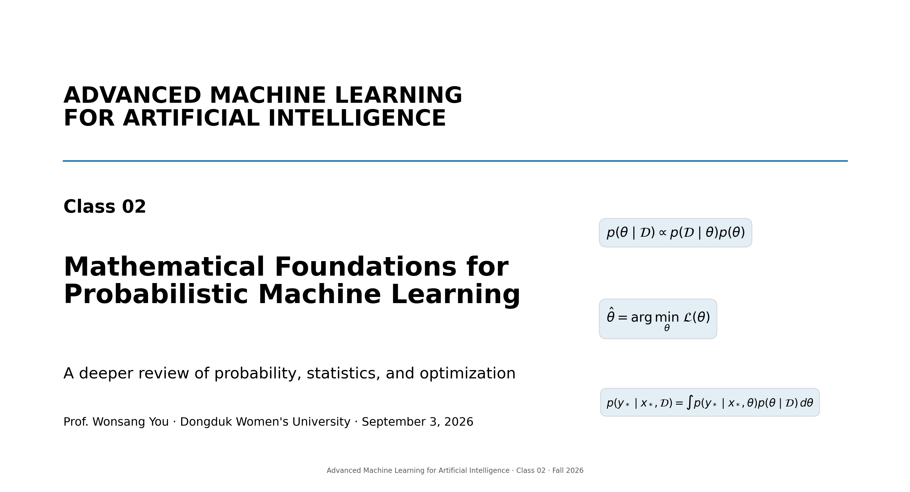

> **Advanced Machine Learning for Artificial Intelligence**  
> **Prof. Wonsang You, Data Science, Dongduk Women's University**  
> **Fall Semester, 2026 · DSC1002 · Week 1, Class 02**  
> **Thursday, September 3, 2026 · 10:30–11:45 · 75 minutes**

---

> **Session numbering:** Class 02 (w01b) was the first actual class. The semester started on Wednesday, so the schedule label Class 02 was retained; no separate Class 01 took place.

## Learning objectives

By the end of this class, you should be able to:

1. distinguish a sample space, event, random variable, probability mass function, probability density function, and cumulative distribution function;
2. manipulate joint, marginal, and conditional distributions and explain the difference between marginalization and conditioning;
3. state independence and conditional independence precisely and explain why conditional independence is essential for graphical models;
4. use expectation, variance, covariance, and the laws of total expectation and total variance;
5. explain Bayes' rule, including the role of the normalizing constant and the base-rate effect;
6. distinguish probability from likelihood and derive maximum-likelihood estimators for simple models;
7. connect negative log-likelihoods to familiar machine-learning loss functions;
8. compare MLE, MAP estimation, and full Bayesian inference, including what uncertainty each method retains or discards;
9. interpret gradients, Hessians, convexity, learning rates, conditioning, and stochastic gradients mathematically and geometrically;
10. synthesize probability, statistics, and optimization in Bayesian linear regression and its posterior predictive distribution.

# 1. One learning problem, three mathematical foundations

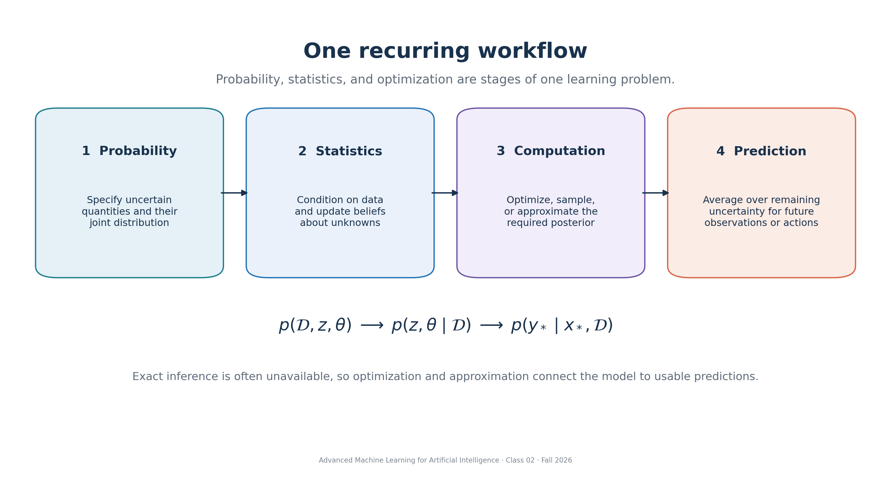

Probability, statistics, and optimization should not be treated as three unrelated prerequisite subjects.
They are different stages of the same learning problem.

1. **Probability** specifies a model for uncertain quantities.
2. **Statistics** uses observed data to infer unknown parameters, latent variables, or future outcomes.
3. **Optimization** computes point estimates or numerical approximations when exact inference is unavailable.
4. **Prediction and decision** propagate the resulting uncertainty to future observations or actions.

A recurring probabilistic workflow is

$$
\underbrace{p(\mathcal{D},\mathbf{z},\boldsymbol\theta)}_{\text{probabilistic model}}
\quad\longrightarrow\quad
\underbrace{p(\mathbf{z},\boldsymbol\theta\mid\mathcal{D})}_{\text{statistical inference}}
\quad\longrightarrow\quad
\underbrace{p(y_*\mid x_*,\mathcal{D})}_{\text{prediction}}.
$$

The middle distribution is often unavailable in closed form. We therefore solve an optimization problem, draw Monte Carlo samples, or construct another approximation. The rest of this course develops increasingly sophisticated ways to perform this step.

## 1.1 Two sources of predictive uncertainty

Following the terminology used in the supplementary textbook, it is useful to distinguish:

- **Aleatoric uncertainty:** intrinsic variability in the observation process. It remains even if the model parameters are known perfectly.
- **Epistemic uncertainty:** uncertainty caused by limited data, uncertain parameters, an incomplete model, or lack of knowledge. It may decrease as informative data are collected.

A simple decomposition will appear in Bayesian linear regression:

$$
\operatorname{Var}(Y_*\mid x_*,\mathcal{D})
=
\underbrace{\sigma^2}_{\text{observation noise}}
+
\underbrace{x_*^\top S_Nx_*}_{\text{parameter uncertainty}}.
$$

> **⚠ Common misconception.** A model output of “50%” does not by itself identify why the prediction is uncertain. The same probability can result from irreducible ambiguity, insufficient data, distribution shift, model misspecification, or a combination of these factors.

---

# 2. Probability foundations

## 2.1 Probability spaces, events, and random variables

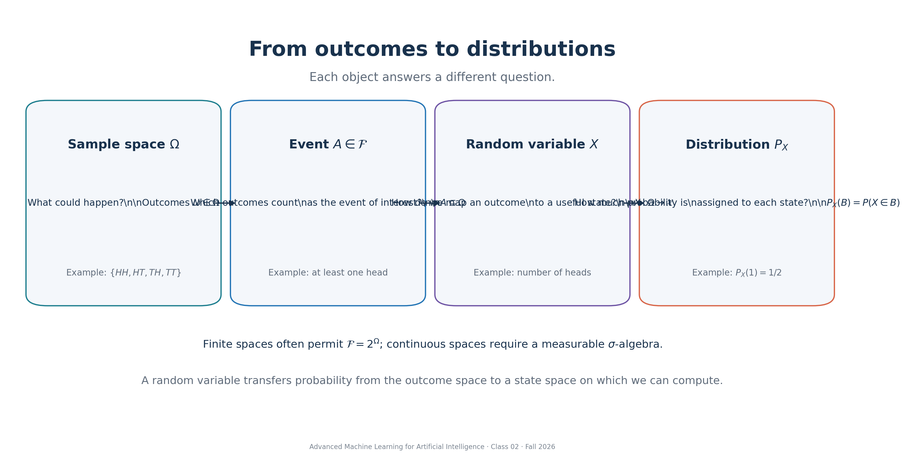

A probability model begins with a probability space

$$
(\Omega,\mathcal{F},P),
$$

where:

- $\Omega$ is the **sample space**, containing all possible elementary outcomes $\omega$;
- $\mathcal{F}$ is a **$\sigma$-algebra** of measurable events;
- $P:\mathcal{F}\to[0,1]$ is a probability measure satisfying the Kolmogorov axioms.

For finite $\Omega$, it is often possible to use the full power set $\mathcal{F}=2^\Omega$. For continuous spaces, not every subset can be assigned a probability consistently, so the measurable-event structure matters.

The axioms are:

1. **Non-negativity:** $P(A)\ge 0$ for every $A\in\mathcal{F}$.
2. **Normalization:** $P(\Omega)=1$.
3. **Countable additivity:** for pairwise disjoint events $A_1,A_2,\ldots$,

$$
P\left(\bigcup_{i=1}^{\infty}A_i\right)=\sum_{i=1}^{\infty}P(A_i).
$$

A random variable is a measurable mapping

$$
X:(\Omega,\mathcal{F})\to(\mathcal{X},\mathcal{B}),
$$

where $\mathcal{X}$ is the state space and $\mathcal{B}$ is its measurable-event structure. The distribution of $X$ is the pushforward measure

$$
P_X(B)=P(X\in B),\qquad B\in\mathcal{B}.
$$

This formal definition clarifies an important point: a random variable is not simply “a variable that randomly changes.” It is a function that converts elementary outcomes into quantities that are useful for reasoning, such as a class label, a temperature, a parameter vector, an image, or a sequence.

### Example: two coin flips

Let

$$
\Omega=\{HH,HT,TH,TT\}
$$

and let $X$ be the number of heads. Then

$$
X(HH)=2,\quad X(HT)=1,\quad X(TH)=1,\quad X(TT)=0.
$$

If the coin is fair and the flips are independent,

$$
p_X(0)=\frac14,\qquad p_X(1)=\frac12,\qquad p_X(2)=\frac14.
$$

---

## 2.2 PMF, PDF, and CDF

### Discrete random variables

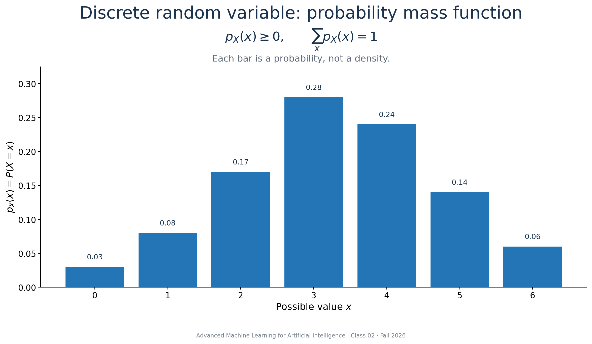

For a discrete random variable $X$, the probability mass function is

$$
p_X(x)=P(X=x),
$$

with

$$
p_X(x)\ge 0,
\qquad
\sum_{x\in\mathcal{X}}p_X(x)=1.
$$

Each PMF value is itself a probability.

### Continuous random variables

For a continuous random variable, a probability density function $p_X$ satisfies

$$
P(X\in A)=\int_A p_X(x)\,dx.
$$

The density must be nonnegative and integrate to one, but a density value is not itself a probability. In particular,

$$
P(X=x)=\int_x^x p_X(t)\,dt=0
$$

for any fixed point $x$, even when $p_X(x)$ is large.

The cumulative distribution function is

$$
F_X(x)=P(X\le x).
$$

It exists for every real-valued random variable, whether discrete, continuous, or mixed.

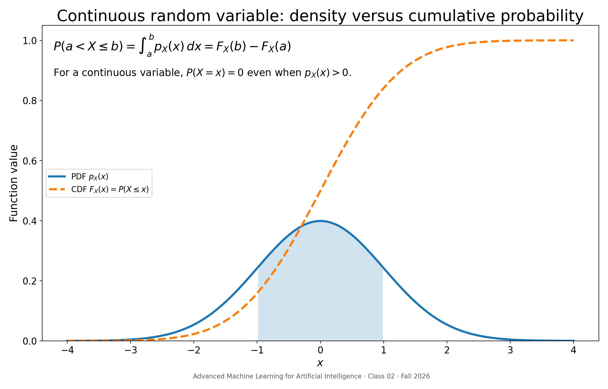

For $a<b$,

$$
P(a<X\le b)=F_X(b)-F_X(a).
$$

If $F_X$ is differentiable, then

$$
p_X(x)=\frac{d}{dx}F_X(x).
$$

> **✓ Checkpoint.** Can a probability density be larger than one? Yes. The integral over the whole state space must equal one; the height of the density is not constrained to be at most one.

---

## 2.3 Joint, marginal, and conditional distributions

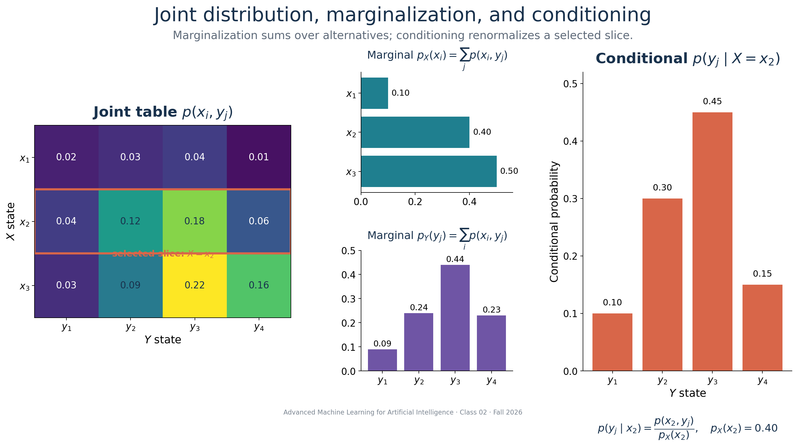

For two random variables $X$ and $Y$, the joint distribution describes uncertainty about the pair:

$$
p(x,y)=P(X=x,Y=y)
$$

in the discrete case, or the corresponding joint density in the continuous case.

### Marginalization

A marginal distribution removes an unobserved or unwanted variable by summing or integrating over all its possible values:

$$
p_X(x)=\sum_y p(x,y)
$$

or

$$
p_X(x)=\int p(x,y)\,dy.
$$

Marginalization is an averaging operation. It does not assert that $Y$ has a particular value.

### Conditioning

For $p_X(x)>0$, the conditional distribution is

$$
p(y\mid x)=\frac{p(x,y)}{p_X(x)}.
$$

Conditioning restricts attention to the subpopulation or event in which $X=x$ and then renormalizes.

### Product rule and chain rule

The product rule is

$$
p(x,y)=p(y\mid x)p(x)=p(x\mid y)p(y).
$$

For $n$ variables, repeated use of the product rule yields the chain rule:

$$
p(x_1,\ldots,x_n)
=
\prod_{i=1}^{n}p(x_i\mid x_1,\ldots,x_{i-1}).
$$

This identity is always valid. The practical power of a probabilistic model comes from assumptions that simplify the conditioning sets.

> **⚠ Common misconception.** Marginalization and conditioning both reduce the number of visible variables, but they are not interchangeable. Marginalization averages over unknown possibilities; conditioning treats a value as known.

---

## 2.4 Independence and conditional independence

Two random variables are independent, written $X\perp Y$, when

$$
p(x,y)=p(x)p(y)
$$

for all relevant values. Equivalently, whenever the conditional distribution is defined,

$$
p(x\mid y)=p(x).
$$

Conditional independence, written $X\perp Y\mid Z$, means

$$
p(x,y\mid z)=p(x\mid z)p(y\mid z)
$$

for every $z$ with positive probability or density support.

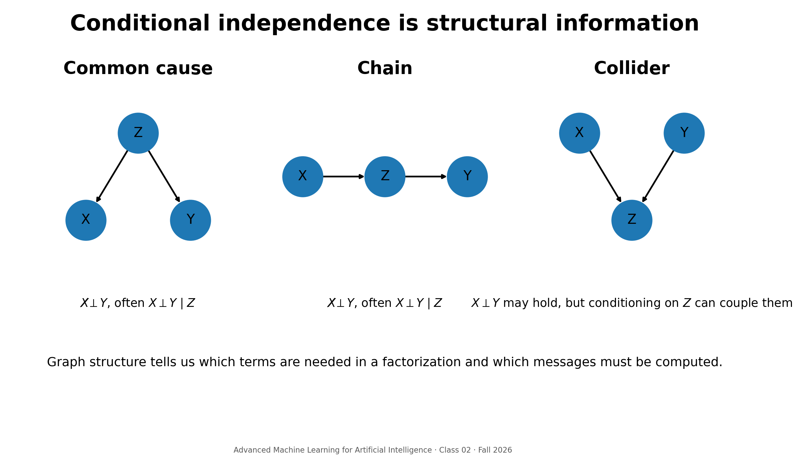

Conditional independence is not merely a statement that two empirical correlations are small. It is a property of a probability distribution and provides a factorization rule.

### Common cause

If $Z$ influences both $X$ and $Y$, then $X$ and $Y$ may be marginally dependent but conditionally independent:

$$
p(x,y,z)=p(z)p(x\mid z)p(y\mid z),
\qquad
X\perp Y\mid Z.
$$

### Chain

For $X\to Z\to Y$,

$$
p(x,z,y)=p(x)p(z\mid x)p(y\mid z),
$$

and $X\perp Y\mid Z$ under the model.

### Collider

For $X\to Z\leftarrow Y$, $X$ and $Y$ may be marginally independent, but conditioning on the common effect $Z$ can create dependence. This phenomenon is one reason that selecting or stratifying data based on an outcome can induce bias.

> **↗ Connection to Week 2.** A graphical model makes conditional-independence assumptions visible. These assumptions determine the factorization of a joint distribution and the computational structure of inference algorithms.

---

## 2.5 Expectation, variance, covariance, and total laws

For a scalar random variable $X$ and a function $g$,

$$
\mathbb{E}[g(X)]
=
\sum_x g(x)p(x)
$$

or

$$
\mathbb{E}[g(X)]
=
\int g(x)p(x)\,dx.
$$

Expectation is linear:

$$
\mathbb{E}[aX+bY+c]
=
a\mathbb{E}[X]+b\mathbb{E}[Y]+c,
$$

whether or not $X$ and $Y$ are independent.

The variance is

$$
\operatorname{Var}(X)
=
\mathbb{E}\left[(X-\mathbb{E}[X])^2\right]
=
\mathbb{E}[X^2]-\mathbb{E}[X]^2.
$$

The covariance is

$$
\operatorname{Cov}(X,Y)
=
\mathbb{E}\left[(X-\mathbb{E}[X])(Y-\mathbb{E}[Y])\right].
$$

For a random vector $\mathbf{X}\in\mathbb{R}^d$ with mean $\boldsymbol\mu$, the covariance matrix is

$$
\boldsymbol\Sigma
=
\mathbb{E}\left[(\mathbf{X}-\boldsymbol\mu)(\mathbf{X}-\boldsymbol\mu)^\top\right].
$$

It is symmetric and positive semidefinite:

$$
\mathbf{a}^\top\boldsymbol\Sigma\mathbf{a}
=
\operatorname{Var}(\mathbf{a}^\top\mathbf{X})
\ge 0.
$$

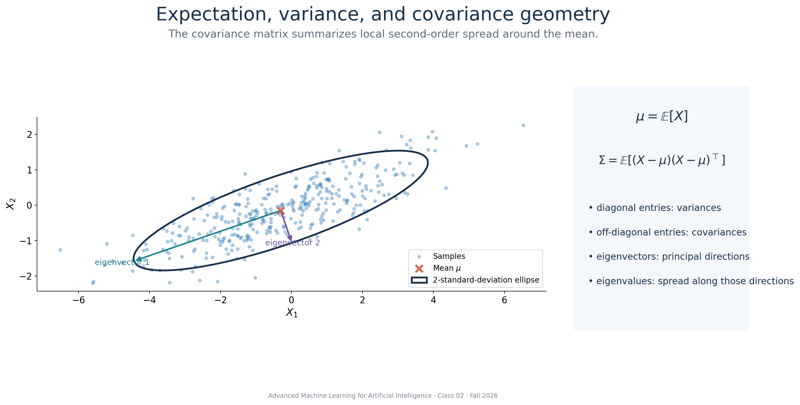

The eigenvectors of $\boldsymbol\Sigma$ define principal directions of variation, and the eigenvalues quantify the variance along those directions. For a multivariate Gaussian, contours of equal density are ellipsoids determined by the Mahalanobis distance

$$
(\mathbf{x}-\boldsymbol\mu)^\top
\boldsymbol\Sigma^{-1}
(\mathbf{x}-\boldsymbol\mu).
$$

### Law of total expectation

For random variables $X$ and $Y$,

$$
\mathbb{E}[X]
=
\mathbb{E}_Y\left[\mathbb{E}[X\mid Y]\right].
$$

In the discrete case,

$$
\begin{aligned}
\mathbb{E}_Y[\mathbb{E}[X\mid Y]]
&=\sum_y p(y)\sum_x x\,p(x\mid y)\\
&=\sum_x x\sum_y p(x,y)\\
&=\sum_x x\,p(x)\\
&=\mathbb{E}[X].
\end{aligned}
$$

### Law of total variance

$$
\operatorname{Var}(X)
=
\mathbb{E}_Y[\operatorname{Var}(X\mid Y)]
+
\operatorname{Var}_Y(\mathbb{E}[X\mid Y]).
$$

The first term is the expected variability that remains within each conditional distribution. The second term is the variability of the conditional means. This decomposition anticipates the distinction between variation that remains after a model state is known and variation caused by uncertainty about that state.

### A useful transformation rule

For $\mathbf{Y}=A\mathbf{X}+\mathbf{b}$,

$$
\mathbb{E}[\mathbf{Y}]=A\boldsymbol\mu+\mathbf{b},
\qquad
\operatorname{Cov}(\mathbf{Y})=A\boldsymbol\Sigma A^\top.
$$

This identity will recur in Gaussian models, Kalman filtering, variational approximations, and neural-network uncertainty propagation.

---

## 2.6 Bayes' rule and the base-rate effect

From the two factorizations of the joint distribution,

$$
p(h,d)=p(d\mid h)p(h)=p(h\mid d)p(d),
$$

we obtain Bayes' rule:

$$
p(h\mid d)
=
\frac{p(d\mid h)p(h)}{p(d)}.
$$

For a discrete hypothesis space,

$$
p(d)=\sum_{h'}p(d\mid h')p(h').
$$

For a continuous parameter,

$$
p(d)=\int p(d\mid\theta)p(\theta)\,d\theta.
$$

The denominator is the **marginal likelihood** or **evidence**. It has two roles:

1. it normalizes the posterior so that it integrates or sums to one;
2. it measures how well the complete model predicts the observed data after averaging over the prior.

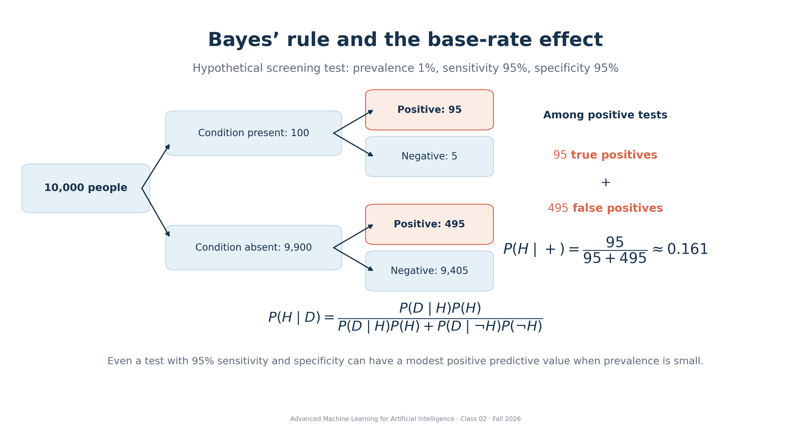

### Worked example: a hypothetical screening test

Suppose a condition has prevalence $1\%$. A test has sensitivity $95\%$ and specificity $95\%$.
Among 10,000 people:

- 100 have the condition, of whom 95 test positive;
- 9,900 do not have the condition, of whom 495 test positive.

Therefore,

$$
P(\text{condition}\mid +)
=
\frac{95}{95+495}
\approx 0.161.
$$

A positive result raises the probability from $1\%$ to about $16.1\%$, but it does not imply a $95\%$ posterior probability. Sensitivity is $P(+\mid\text{condition})$, whereas the desired posterior is $P(\text{condition}\mid +)$.

> **✓ Checkpoint.** Which quantity changes when the base rate changes: the sensitivity, the specificity, or the posterior positive probability? The posterior changes, even if the test characteristics remain fixed.

---

## 2.7 Multivariate Gaussian conditioning

A multivariate Gaussian is written

$$
\begin{bmatrix}
\mathbf{X}_a\\
\mathbf{X}_b
\end{bmatrix}
\sim
\mathcal{N}\left(
\begin{bmatrix}
\boldsymbol\mu_a\\
\boldsymbol\mu_b
\end{bmatrix},
\begin{bmatrix}
\Sigma_{aa} & \Sigma_{ab}\\
\Sigma_{ba} & \Sigma_{bb}
\end{bmatrix}
\right).
$$

The marginal distribution of $\mathbf{X}_a$ is

$$
\mathbf{X}_a\sim\mathcal{N}(\boldsymbol\mu_a,\Sigma_{aa}).
$$

The conditional distribution is also Gaussian:

$$
\mathbf{X}_a\mid \mathbf{X}_b=\mathbf{x}_b
\sim
\mathcal{N}(\boldsymbol\mu_{a\mid b},\Sigma_{a\mid b}),
$$

where

$$
\boldsymbol\mu_{a\mid b}
=
\boldsymbol\mu_a
+
\Sigma_{ab}\Sigma_{bb}^{-1}
(\mathbf{x}_b-\boldsymbol\mu_b),
$$

and

$$
\Sigma_{a\mid b}
=
\Sigma_{aa}
-
\Sigma_{ab}\Sigma_{bb}^{-1}\Sigma_{ba}.
$$

The conditional mean shifts linearly according to the observed deviation $\mathbf{x}_b-\boldsymbol\mu_b$. The conditional covariance is smaller than or equal to the marginal covariance in the positive-semidefinite order because observing $\mathbf{X}_b$ reduces uncertainty about correlated components of $\mathbf{X}_a$.

This formula is the algebraic prototype for Gaussian inference, missing-data imputation, sensor fusion, Gaussian processes, and Kalman filtering.

---

# 3. Statistical learning and inference

## 3.1 Probability is not likelihood

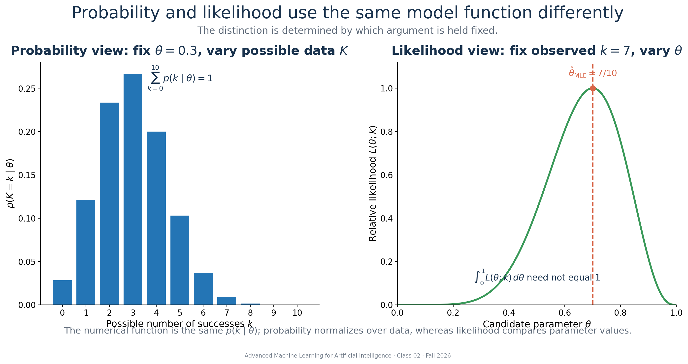

Suppose a model specifies $p(\mathcal{D}\mid\theta)$.

- In a **probability** calculation, $\theta$ is fixed and the possible data vary. The function is normalized over the data space.
- In a **likelihood** calculation, the observed dataset $\mathcal{D}$ is fixed and $\theta$ varies. The likelihood ranks parameter values by how well they explain the observed data.

The likelihood function is

$$
L(\theta;\mathcal{D})=p(\mathcal{D}\mid\theta).
$$

It is generally not a probability distribution over $\theta$:

$$
\int L(\theta;\mathcal{D})\,d\theta
$$

need not equal one. A posterior becomes a probability distribution over $\theta$ only after multiplying by a prior and normalizing.

> **⚠ Common misconception.** “The probability of the parameter given the data” is not the same as “the probability of the data given the parameter.” Bayes' rule connects them, but they answer different questions.

---

## 3.2 IID factorization and log-likelihood

Let

$$
\mathcal{D}=\{(x_n,y_n)\}_{n=1}^{N}.
$$

Under an independent and identically distributed assumption,

$$
p(\mathcal{D}\mid\theta)
=
\prod_{n=1}^{N}p(y_n\mid x_n,\theta).
$$

Taking logarithms converts the product into a sum:

$$
\ell(\theta)
=
\log p(\mathcal{D}\mid\theta)
=
\sum_{n=1}^{N}\log p(y_n\mid x_n,\theta).
$$

This has three major consequences:

1. numerical underflow is reduced;
2. gradients decompose into per-example contributions;
3. minibatch stochastic gradients become possible.

The iid assumption is not merely a computational convenience. It is a strong structural statement about the joint distribution. Later in the course, we will study temporal dependence, grouped data, latent variables, and distribution shift, all of which modify this factorization.

---

## 3.3 Maximum likelihood estimation

The maximum-likelihood estimator is

$$
\hat\theta_{\mathrm{MLE}}
\in
\arg\max_\theta p(\mathcal{D}\mid\theta)
=
\arg\max_\theta \ell(\theta).
$$

Equivalently,

$$
\hat\theta_{\mathrm{MLE}}
\in
\arg\min_\theta
\left[-\ell(\theta)\right].
$$

The negative log-likelihood is therefore an optimization objective.

### Worked derivation 1: Bernoulli MLE

Let $y_n\in\{0,1\}$ and

$$
y_n\mid\theta\sim\operatorname{Bernoulli}(\theta).
$$

Then

$$
p(\mathcal{D}\mid\theta)
=
\prod_{n=1}^{N}\theta^{y_n}(1-\theta)^{1-y_n}.
$$

Let $S=\sum_n y_n$. Then

$$
\ell(\theta)
=
S\log\theta+(N-S)\log(1-\theta).
$$

Differentiate:

$$
\frac{d\ell}{d\theta}
=
\frac{S}{\theta}-\frac{N-S}{1-\theta}.
$$

Setting the derivative to zero gives

$$
S(1-\theta)-(N-S)\theta=0,
$$

so

$$
\boxed{
\hat\theta_{\mathrm{MLE}}
=
\frac{S}{N}
=
\frac1N\sum_{n=1}^{N}y_n
}.
$$

The second derivative is

$$
\frac{d^2\ell}{d\theta^2}
=-\frac{S}{\theta^2}-\frac{N-S}{(1-\theta)^2}<0,
$$

so the interior stationary point is a maximum.

### Worked derivation 2: Gaussian mean MLE

Assume

$$
y_n\mid\mu\sim\mathcal{N}(\mu,\sigma^2)
$$

independently, with known $\sigma^2$. Ignoring terms independent of $\mu$,

$$
\ell(\mu)
=
-\frac{1}{2\sigma^2}
\sum_{n=1}^{N}(y_n-\mu)^2+C.
$$

Therefore maximizing the likelihood is equivalent to minimizing the sum of squared deviations. Differentiating,

$$
\frac{d\ell}{d\mu}
=
\frac{1}{\sigma^2}
\sum_{n=1}^{N}(y_n-\mu).
$$

Setting this to zero yields

$$
\boxed{
\hat\mu_{\mathrm{MLE}}
=
\frac1N\sum_{n=1}^{N}y_n
}.
$$

The sample mean is therefore not only a descriptive statistic; it is the MLE under a specific Gaussian observation model.

---

## 3.4 Familiar loss functions as negative log-likelihoods

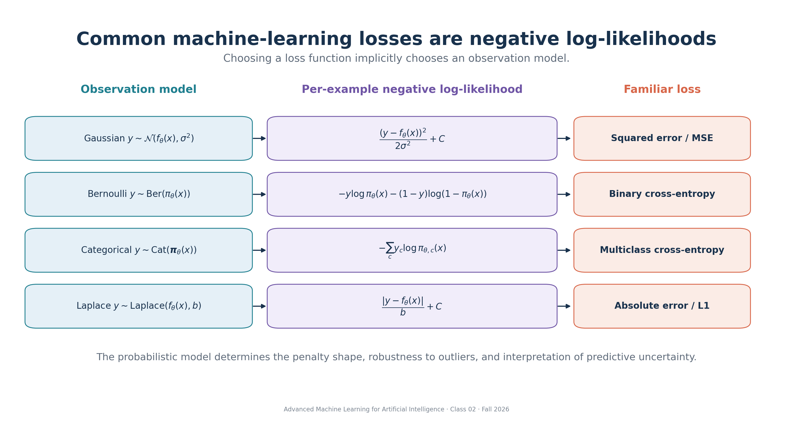

A loss function encodes assumptions about the conditional distribution of the target.

### Gaussian observation model

If

$$
y\mid x,\theta
\sim
\mathcal{N}(f_\theta(x),\sigma^2),
$$

then

$$
-\log p(y\mid x,\theta)
=
\frac{(y-f_\theta(x))^2}{2\sigma^2}+C.
$$

Thus fixed-variance Gaussian MLE is equivalent to squared-error minimization.

### Bernoulli observation model

If

$$
y\mid x,\theta
\sim
\operatorname{Bernoulli}(\pi_\theta(x)),
$$

then

$$
-\log p(y\mid x,\theta)
=
-y\log\pi_\theta(x)
-(1-y)\log(1-\pi_\theta(x)).
$$

This is binary cross-entropy.

### Categorical observation model

For one-hot $\mathbf{y}$ and class probabilities $\boldsymbol\pi_\theta(x)$,

$$
-\log p(\mathbf{y}\mid x,\theta)
=
-\sum_{c=1}^{C}y_c\log\pi_{\theta,c}(x),
$$

which is multiclass cross-entropy.

### Laplace observation model

If

$$
y\mid x,\theta
\sim
\operatorname{Laplace}(f_\theta(x),b),
$$

then

$$
-\log p(y\mid x,\theta)
=
\frac{|y-f_\theta(x)|}{b}+C.
$$

This gives an absolute-error objective and is more robust to large residuals than a Gaussian model.

> **▶ Core concept.** Choosing a loss is equivalent to choosing a probabilistic story about the target and its noise, even when that story is left implicit.

---

## 3.5 MAP estimation and regularization

Bayesian inference begins with a prior $p(\theta)$ and computes

$$
p(\theta\mid\mathcal{D})
=
\frac{p(\mathcal{D}\mid\theta)p(\theta)}{p(\mathcal{D})}.
$$

The maximum a posteriori estimator is

$$
\hat\theta_{\mathrm{MAP}}
\in
\arg\max_\theta p(\theta\mid\mathcal{D}).
$$

Since the evidence does not depend on $\theta$,

$$
\hat\theta_{\mathrm{MAP}}
\in
\arg\min_\theta
\left[
-\log p(\mathcal{D}\mid\theta)
-
\log p(\theta)
\right].
$$

The negative log-prior acts as a regularizer.

### Gaussian prior and $\ell_2$ regularization

If

$$
p(\theta)=\mathcal{N}(\theta\mid\mathbf{0},\tau^2I),
$$

then

$$
-\log p(\theta)
=
\frac{1}{2\tau^2}\|\theta\|_2^2+C.
$$

Therefore MAP estimation adds a quadratic penalty.

### Laplace prior and $\ell_1$ regularization

If the components are independent with

$$
p(\theta_j)\propto\exp\left(-\frac{|\theta_j|}{b}\right),
$$

then

$$
-\log p(\theta)
=
\frac1b\|\theta\|_1+C.
$$

MAP estimation therefore adds an $\ell_1$ penalty, which can yield sparse solutions.

> **⚠ Important limitation.** MAP uses a prior but still collapses the posterior to one point. After optimization, uncertainty about alternative parameter values is discarded.

---

## 3.6 Full Bayesian inference and posterior prediction

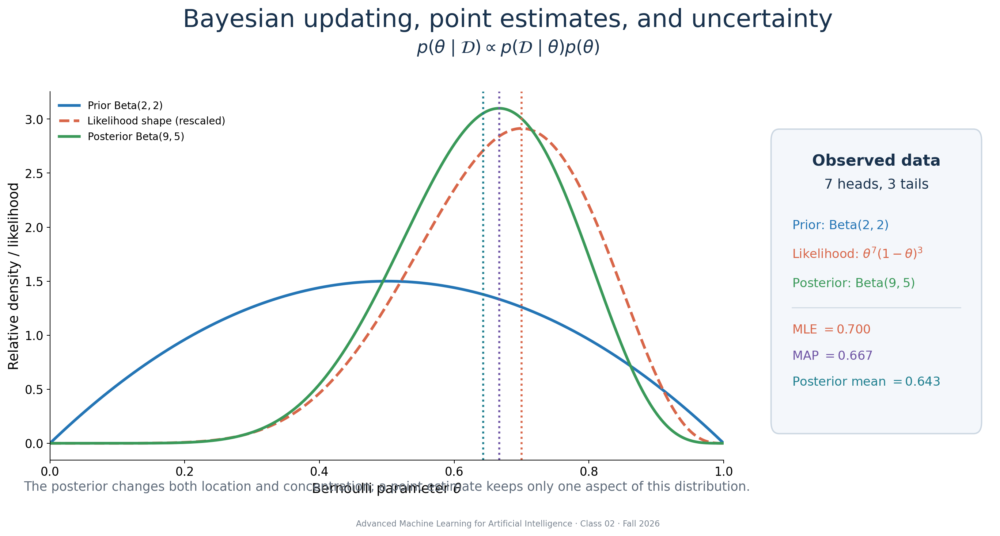

For a Bernoulli model with prior

$$
\theta\sim\operatorname{Beta}(\alpha,\beta)
$$

and data containing $S$ successes and $F$ failures,

$$
\theta\mid\mathcal{D}
\sim
\operatorname{Beta}(\alpha+S,\beta+F).
$$

For the figure above, $\alpha=\beta=2$, $S=7$, and $F=3$, so

$$
\theta\mid\mathcal{D}\sim\operatorname{Beta}(9,5).
$$

Three summaries differ:

$$
\hat\theta_{\mathrm{MLE}}=\frac{7}{10}=0.7,

\hat\theta_{\mathrm{MAP}}
=
\frac{9-1}{9+5-2}
=
\frac23,
$$

and

$$
\mathbb{E}[\theta\mid\mathcal{D}]
=
\frac{9}{14}
\approx 0.643.
$$

The full posterior contains much more information than any one of these values.

### Posterior predictive distribution

For a future target $y_*$,

$$
p(y_*\mid x_*,\mathcal{D})
=
\int p(y_*\mid x_*,\theta)
 p(\theta\mid\mathcal{D})\,d\theta.
$$

This operation is Bayesian model averaging over parameter values. It propagates parameter uncertainty into predictive uncertainty.

A plug-in approximation replaces the posterior by a point mass at $\hat\theta$:

$$
p(\theta\mid\mathcal{D})
\approx
\delta(\theta-\hat\theta),
$$

which gives

$$
p(y_*\mid x_*,\mathcal{D})
\approx
p(y_*\mid x_*,\hat\theta).
$$

The approximation is computationally convenient but can be overconfident, especially with small datasets or weakly identified parameters.

### MLE, MAP, and Bayes at a glance

| Method | Mathematical object returned | Prior used? | Parameter uncertainty retained? | Typical computation |
|---|---|---:|---:|---|
| MLE | $\hat\theta_{\mathrm{MLE}}$ | No | No | Optimize likelihood |
| MAP | $\hat\theta_{\mathrm{MAP}}$ | Yes | No | Optimize posterior density |
| Full Bayes | $p(\theta\mid\mathcal{D})$ | Yes | Yes | Exact integration, VI, MCMC, SMC, or another approximation |
| Posterior predictive | $p(y_*\mid x_*,\mathcal{D})$ | Through posterior | Yes, propagated to predictions | Integrate or average predictions |

---

## 3.7 Frequentist and Bayesian uncertainty statements

The two frameworks condition on different objects.

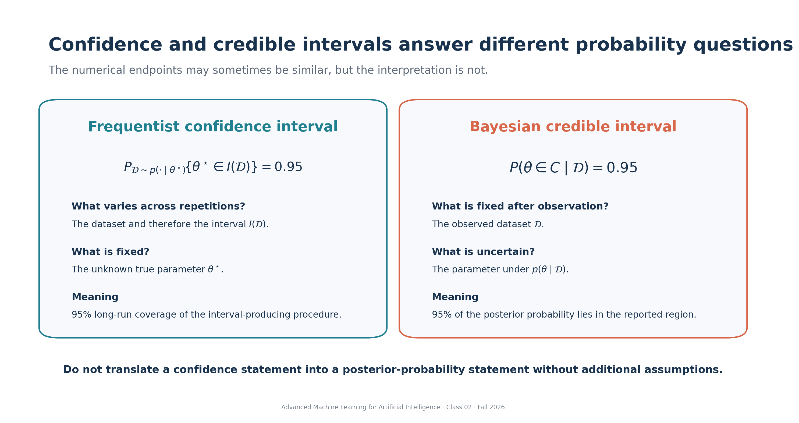

### Frequentist view

- The unknown parameter $\theta$ is fixed.
- Repeated datasets are random.
- An estimator $\hat\theta(\mathcal{D})$ has a sampling distribution.
- A $95\%$ confidence procedure has long-run coverage $95\%$ under repeated sampling.

A particular confidence interval is not usually interpreted as assigning $95\%$ probability to a fixed parameter after the interval has been computed.

### Bayesian view

- The observed dataset is treated as fixed after observation.
- Uncertainty about $\theta$ is represented by $p(\theta\mid\mathcal{D})$.
- A $95\%$ credible interval $C$ satisfies

$$
P(\theta\in C\mid\mathcal{D})=0.95.
$$

The frameworks can sometimes produce numerically similar intervals, especially in regular large-sample settings, but their interpretations are different.

---

## 3.8 Empirical risk, population risk, and generalization

The empirical risk of a predictor $f$ is

$$
\widehat R_N(f)
=
\frac1N\sum_{n=1}^{N}\ell(y_n,f(x_n)).
$$

The desired population risk is

$$
R(f)
=
\mathbb{E}_{(X,Y)\sim p^*}
[\ell(Y,f(X))],
$$

where $p^*$ denotes the unknown data-generating distribution.

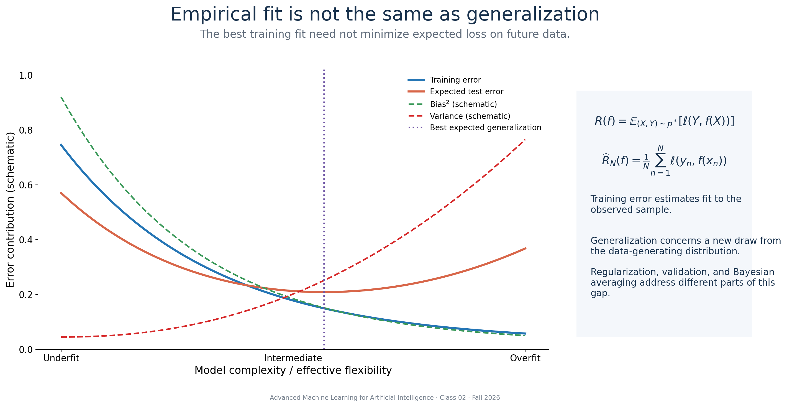

A model can minimize training error yet generalize poorly. The expected squared prediction error can be decomposed schematically as

$$
\mathbb{E}\left[(Y-\hat f(X))^2\right]
=
\underbrace{\sigma^2}_{\text{irreducible noise}}
+
\underbrace{\operatorname{Bias}[\hat f(X)]^2}_{\text{systematic error}}
+
\underbrace{\operatorname{Var}[\hat f(X)]}_{\text{sensitivity to the training set}}.
$$

Regularization, validation, early stopping, Bayesian averaging, and hierarchical modeling all address generalization in different ways. None eliminates the need to inspect the modeling assumptions and the data-generating process.

---

# 4. Optimization foundations

## 4.1 Anatomy of an optimization problem

A general optimization problem is

$$
\theta^*
\in
\arg\min_{\theta\in\Theta}L(\theta),
$$

where:

- $L$ is the objective function;
- $\theta$ is the decision variable or model parameter;
- $\Theta$ is the feasible set;
- constraints may restrict which values are allowed.

The symbol $\arg\min$ denotes the set of minimizers, not the minimum objective value. If the minimum is unique, we may write the single solution as $\theta^*$.

A point $\theta^*$ is a local minimizer if there exists a neighborhood in which

$$
L(\theta^*)\le L(\theta).
$$

It is a global minimizer if the inequality holds for all $\theta\in\Theta$.

---

## 4.2 Convexity

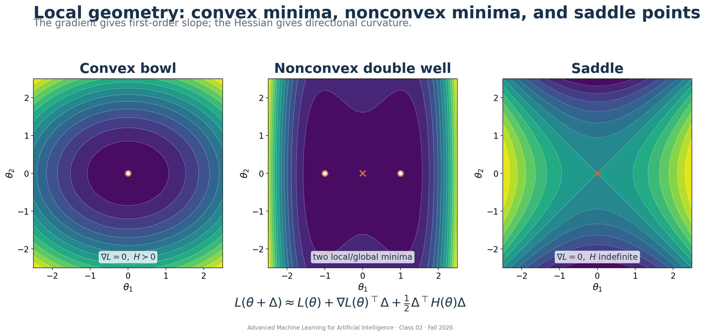

A set $\Theta$ is convex if

$$
\lambda\theta_1+(1-\lambda)\theta_2\in\Theta
$$

for every $\theta_1,\theta_2\in\Theta$ and $\lambda\in[0,1]$.

A function $L$ is convex when

$$
L(\lambda\theta_1+(1-\lambda)\theta_2)
\le
\lambda L(\theta_1)+(1-\lambda)L(\theta_2).
$$

If $L$ is differentiable, convexity is equivalent to the first-order lower bound

$$
L(\theta_2)
\ge
L(\theta_1)
+
\nabla L(\theta_1)^\top(\theta_2-\theta_1).
$$

For a twice-differentiable function on a convex domain,

$$
L\text{ is convex}
\quad\Longleftrightarrow\quad
\nabla^2L(\theta)\succeq 0
$$

for all $\theta$ in the domain.

In a convex optimization problem, every local minimum is global. Neural-network training is generally nonconvex, but nonconvexity does not imply that useful solutions cannot be found. The geometry may contain saddle points, flat directions, symmetries, and connected low-loss regions.

---

## 4.3 Gradient, directional derivative, and Hessian

For $L:\mathbb{R}^d\to\mathbb{R}$, the gradient is

$$
\nabla L(\theta)
=
\begin{bmatrix}
\partial L/\partial\theta_1\\
\vdots\\
\partial L/\partial\theta_d
\end{bmatrix}.
$$

The directional derivative in direction $\mathbf{v}$ is

$$
D_{\mathbf{v}}L(\theta)
=
\lim_{\epsilon\to0}
\frac{L(\theta+\epsilon\mathbf{v})-L(\theta)}{\epsilon}
=
\nabla L(\theta)^\top\mathbf{v}.
$$

For $\|\mathbf{v}\|_2=1$, the Cauchy-Schwarz inequality gives

$$
\nabla L(\theta)^\top\mathbf{v}
\ge
-\|\nabla L(\theta)\|_2,
$$

with equality at

$$
\mathbf{v}
=
-\frac{\nabla L(\theta)}{\|\nabla L(\theta)\|_2}.
$$

Thus the negative gradient is the direction of steepest local decrease under the Euclidean norm.

The second-order Taylor approximation is

$$
L(\theta+\Delta)
=
L(\theta)
+
\nabla L(\theta)^\top\Delta
+
\frac12\Delta^\top H(\theta)\Delta
+o(\|\Delta\|_2^2),
$$

where

$$
H(\theta)=\nabla^2L(\theta)
$$

is the Hessian. Its eigenvectors identify principal curvature directions, and its eigenvalues indicate curvature magnitude and sign.

- all eigenvalues positive: locally bowl-shaped;
- mixed signs: saddle-like;
- near-zero eigenvalues: flat or weakly identified directions.

---

## 4.4 Gradient descent and learning-rate stability

Gradient descent uses

$$
\theta_{t+1}
=
\theta_t-\eta_t\nabla L(\theta_t),
$$

where $\eta_t>0$ is the step size or learning rate.

For a one-dimensional quadratic

$$
L(w)=\frac12\lambda w^2,
$$

we have

$$
w_{t+1}
=(1-\eta\lambda)w_t.
$$

Convergence requires

$$
|1-\eta\lambda|<1,
$$

or

$$
0<\eta<\frac{2}{\lambda}.
$$

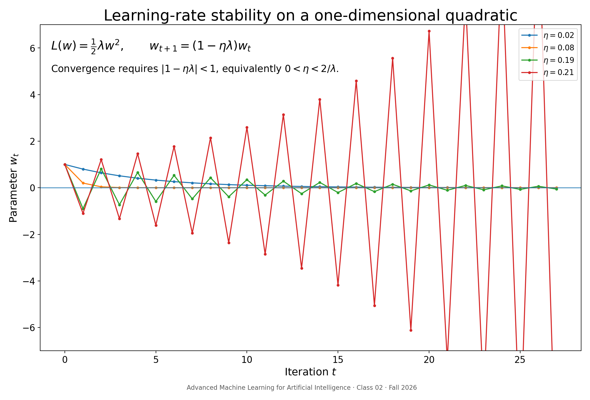

This simple example explains four regimes:

1. **Very small $\eta$:** stable but slow.
2. **Moderate $\eta$:** rapid convergence.
3. **Large but stable $\eta$:** oscillation in the parameter while the magnitude decreases.
4. **Too large $\eta$:** divergence.

For a differentiable function with $L_g$-Lipschitz gradient,

$$
\|\nabla L(u)-\nabla L(v)\|_2
\le
L_g\|u-v\|_2,
$$

the descent lemma implies

$$
L(\theta-\eta\nabla L(\theta))
\le
L(\theta)
-
\eta\left(1-\frac{L_g\eta}{2}\right)
\|\nabla L(\theta)\|_2^2.
$$

Hence $0<\eta<2/L_g$ guarantees a local decrease under these assumptions.

---

## 4.5 Curvature, condition number, and preconditioning

Consider a positive-definite quadratic

$$
L(\theta)
=
\frac12\theta^\top H\theta-\mathbf{b}^\top\theta.
$$

Let the eigenvalues of $H$ satisfy

$$
0<\lambda_{\min}\le\lambda_{\max}.
$$

The condition number is

$$
\kappa(H)
=
\frac{\lambda_{\max}}{\lambda_{\min}}.
$$

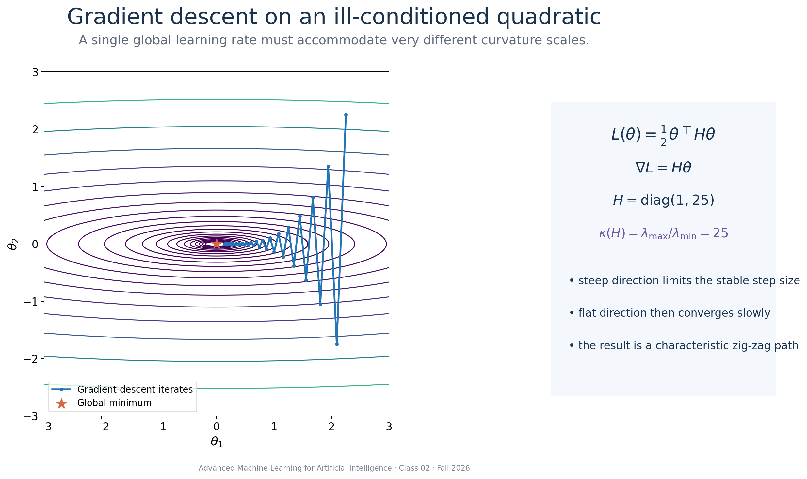

A large condition number produces elongated contours. A learning rate small enough to remain stable in the high-curvature direction is unnecessarily small in the low-curvature direction, causing slow zig-zagging.

A preconditioned update is

$$
\theta_{t+1}
=
\theta_t-
\eta M_t^{-1}\nabla L(\theta_t),
$$

where $M_t$ rescales directions. If $M_t$ approximates the Hessian, the transformed problem can become better conditioned.

### Newton's method

Using the quadratic Taylor model, the stationary point in $\Delta$ satisfies

$$
\nabla L(\theta)+H(\theta)\Delta=0.
$$

Thus

$$
\Delta_{\mathrm{Newton}}
=-H(\theta)^{-1}\nabla L(\theta),
$$

and

$$
\theta_{t+1}
=
\theta_t-H(\theta_t)^{-1}\nabla L(\theta_t).
$$

Newton's method can converge rapidly near a well-behaved optimum, but forming and inverting a full Hessian is expensive in high dimensions and may be unstable when the Hessian is indefinite. Quasi-Newton and trust-region methods address some of these difficulties.

---

## 4.6 Stochastic gradient descent

For a finite-sum objective,

$$
L(\theta)
=
\frac1N\sum_{n=1}^{N}\ell_n(\theta),
$$

the full gradient is

$$
\nabla L(\theta)
=
\frac1N\sum_{n=1}^{N}\nabla\ell_n(\theta).
$$

For a minibatch $\mathcal{B}$ sampled uniformly,

$$
\widehat{g}_{\mathcal{B}}(\theta)
=
\frac1{|\mathcal{B}|}
\sum_{n\in\mathcal{B}}\nabla\ell_n(\theta).
$$

Under standard sampling schemes,

$$
\mathbb{E}_{\mathcal{B}}
[\widehat{g}_{\mathcal{B}}(\theta)]
=
\nabla L(\theta).
$$

The estimator is unbiased, but noisy. For independent samples, its covariance decreases approximately in proportion to $1/|\mathcal{B}|$.

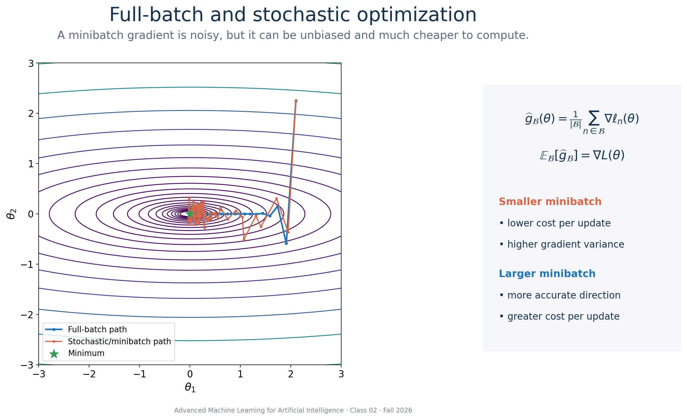

The update is

$$
\theta_{t+1}
=
\theta_t-
\eta_t\widehat{g}_{\mathcal{B}_t}(\theta_t).
$$

The batch-size trade-off is:

- small batches: cheap updates, higher gradient variance, more frequent parameter changes;
- large batches: expensive updates, lower variance, better hardware utilization;
- full batch: exact finite-sum gradient, but potentially slow per update.

### Momentum

A simple momentum method is

$$
\mathbf{v}_{t+1}
=
\beta\mathbf{v}_t+
\widehat{g}_{\mathcal{B}_t}(\theta_t),

\theta_{t+1}
=
\theta_t-
\eta\mathbf{v}_{t+1}.
$$

Momentum averages directions over time, accelerates persistent motion, and damps some oscillation. It does not remove the need to choose a stable learning rate.

> **▶ Core concept.** Optimization noise is not automatically an error. It is a computational design choice with consequences for cost, variance, exploration, and convergence.

---

# 5. Unifying example: Bayesian linear regression

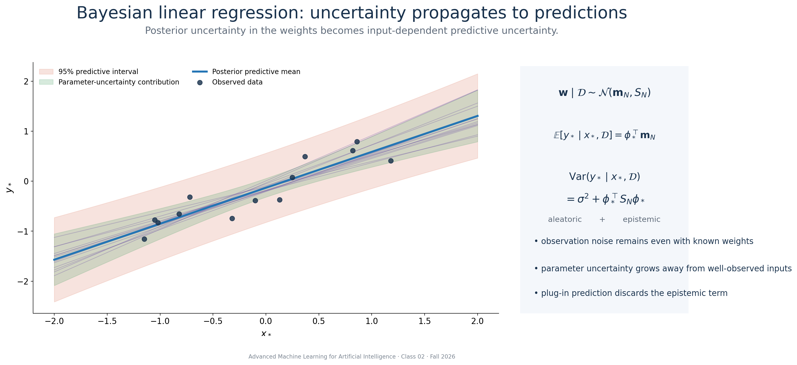

Bayesian linear regression combines every idea discussed today.

## 5.1 Probabilistic model

Let $X\in\mathbb{R}^{N\times D}$ be a design matrix, $\mathbf{w}\in\mathbb{R}^{D}$ be a parameter vector, and $\mathbf{y}\in\mathbb{R}^{N}$ be observed targets.

Assume

$$
\mathbf{y}=X\mathbf{w}+\boldsymbol\epsilon,
\qquad
\boldsymbol\epsilon\sim\mathcal{N}(\mathbf{0},\sigma^2I_N).
$$

Therefore,

$$
p(\mathbf{y}\mid X,\mathbf{w})
=
\mathcal{N}(\mathbf{y}\mid X\mathbf{w},\sigma^2I_N).
$$

Place a Gaussian prior on the parameters:

$$
p(\mathbf{w})
=
\mathcal{N}(\mathbf{w}\mid\mathbf{m}_0,S_0).
$$

## 5.2 Likelihood and least squares

Ignoring constants independent of $\mathbf{w}$,

$$
-\log p(\mathbf{y}\mid X,\mathbf{w})
=
\frac{1}{2\sigma^2}
\|\mathbf{y}-X\mathbf{w}\|_2^2+C.
$$

Thus maximum likelihood is least squares.

## 5.3 MAP and ridge regression

The negative log-posterior is

$$
-\log p(\mathbf{w}\mid X,\mathbf{y})
=
\frac{1}{2\sigma^2}
\|\mathbf{y}-X\mathbf{w}\|_2^2
+
\frac12
(\mathbf{w}-\mathbf{m}_0)^\top
S_0^{-1}
(\mathbf{w}-\mathbf{m}_0)
+C.
$$

If $\mathbf{m}_0=\mathbf{0}$ and $S_0=\tau^2I$, then

$$
\mathbf{w}_{\mathrm{MAP}}
=
\arg\min_{\mathbf{w}}
\left[
\|\mathbf{y}-X\mathbf{w}\|_2^2
+
\frac{\sigma^2}{\tau^2}\|\mathbf{w}\|_2^2
\right].
$$

This is ridge regression with regularization strength

$$
\lambda=\frac{\sigma^2}{\tau^2}.
$$

A stronger prior concentration, meaning smaller $\tau^2$, produces stronger regularization.

## 5.4 Gradient and Hessian

For

$$
L(\mathbf{w})
=
\frac{1}{2\sigma^2}
\|\mathbf{y}-X\mathbf{w}\|_2^2
+
\frac12
(\mathbf{w}-\mathbf{m}_0)^\top
S_0^{-1}
(\mathbf{w}-\mathbf{m}_0),
$$

we have

$$
\nabla L(\mathbf{w})
=
\frac{1}{\sigma^2}
X^\top(X\mathbf{w}-\mathbf{y})
+
S_0^{-1}(\mathbf{w}-\mathbf{m}_0),
$$

and

$$
H
=
\frac{1}{\sigma^2}X^\top X+S_0^{-1}.
$$

The Hessian is positive definite when the prior covariance is positive definite, so the MAP objective is strictly convex and has a unique global minimum.

## 5.5 Posterior distribution

Completing the square gives

$$
p(\mathbf{w}\mid X,\mathbf{y})
=
\mathcal{N}(\mathbf{w}\mid\mathbf{m}_N,S_N),
$$

where the posterior precision is

$$
S_N^{-1}
=
S_0^{-1}
+
\frac{1}{\sigma^2}X^\top X,
$$

and the posterior mean is

$$
\mathbf{m}_N
=
S_N\left(
S_0^{-1}\mathbf{m}_0
+
\frac{1}{\sigma^2}X^\top\mathbf{y}
\right).
$$

This expression has an information-addition interpretation:

$$
\underbrace{S_N^{-1}}_{\text{posterior precision}}
=
\underbrace{S_0^{-1}}_{\text{prior precision}}
+
\underbrace{\frac{1}{\sigma^2}X^\top X}_{\text{data information}}.
$$

For a Gaussian posterior, the posterior mean and MAP estimate coincide. The full posterior additionally retains covariance $S_N$.

## 5.6 Posterior predictive distribution

For a new feature vector $\mathbf{x}_*$,

$$
y_*\mid\mathbf{x}_*,\mathbf{w}
\sim
\mathcal{N}(\mathbf{x}_*^\top\mathbf{w},\sigma^2).
$$

Integrating over the posterior,

$$
\begin{aligned}
p(y_*\mid\mathbf{x}_*,\mathcal{D})
&=
\int
p(y_*\mid\mathbf{x}_*,\mathbf{w})
 p(\mathbf{w}\mid\mathcal{D})
 \,d\mathbf{w}\\
&=
\mathcal{N}\left(
 y_*\mid
 \mathbf{x}_*^\top\mathbf{m}_N,
 \sigma^2+
 \mathbf{x}_*^\top S_N\mathbf{x}_*
\right).
\end{aligned}
$$

The predictive variance separates into

$$
\underbrace{\sigma^2}_{\text{aleatoric uncertainty}}
+
\underbrace{\mathbf{x}_*^\top S_N\mathbf{x}_*}_{\text{epistemic uncertainty}}.
$$

The epistemic term is typically larger for inputs far from the region represented in the training data. A plug-in predictor using only $\hat{\mathbf{w}}$ omits this term and therefore understates uncertainty.

---

# 6. Bridge to graphical models and inference

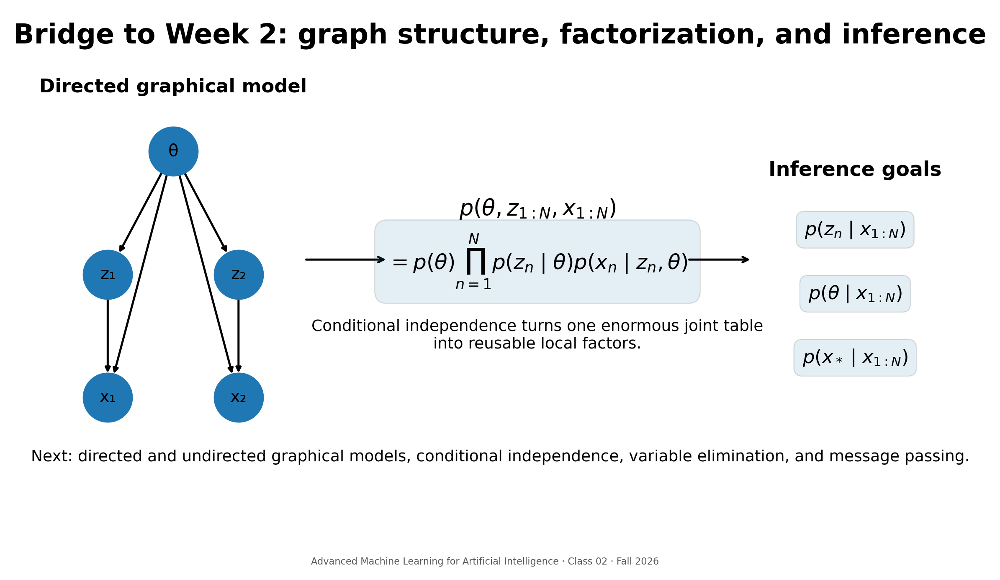

The next class begins with probabilistic graphical models. A graph is useful because it represents the factorization of a joint distribution.

For a model with global parameter $\theta$, local latent variables $z_n$, and observations $x_n$,

$$
p(\theta,z_{1:N},x_{1:N})
=
p(\theta)
\prod_{n=1}^{N}
 p(z_n\mid\theta)
 p(x_n\mid z_n,\theta).
$$

The graph and factorization jointly answer four questions:

1. Which variables are observed and which are latent?
2. Which conditional-independence statements are assumed?
3. Which marginal or posterior distribution is required?
4. Which sums, integrals, or optimizations must be computed?

The central computational challenge is usually one of the following:

$$
p(z_n\mid x_{1:N}),
\qquad
p(\theta\mid x_{1:N}),
\qquad
p(x_*\mid x_{1:N}),
$$

or a MAP counterpart. Variable elimination and message passing exploit the factorization to avoid enumerating the full joint state space.

---

# 7. Retrieval check

Answer these without looking back at the page.

1. Why is a likelihood not generally a probability distribution over parameters?
2. What is the mathematical difference between marginalizing $Y$ and conditioning on $Y=y$?
3. Give one situation in which $X$ and $Y$ are marginally dependent but conditionally independent given $Z$.
4. State the law of total variance and interpret its two terms.
5. For a Bernoulli model, why does the MLE equal the observed success frequency?
6. How does a Gaussian prior become an $\ell_2$ regularizer in MAP estimation?
7. What information does the Hessian provide that the gradient does not?
8. For $L(w)=\frac12\lambda w^2$, what learning-rate range guarantees convergence of gradient descent?
9. Why is a minibatch gradient useful even though it is noisy?
10. In Bayesian linear regression, which part of predictive variance is epistemic?

---

# 8. Take-home messages

1. A probability model defines uncertain quantities and their joint structure; statistics inverts that model using observed data.
2. Marginalization averages over unknown possibilities, whereas conditioning treats information as observed.
3. Conditional independence is a factorization statement and is the foundation of graphical-model computation.
4. Likelihood is a function of parameters with data fixed; a posterior becomes a probability distribution over parameters only after including a prior and normalization.
5. Common losses are negative log-likelihoods and therefore encode assumptions about the target distribution and noise.
6. MLE and MAP produce point estimates. Full Bayesian inference retains a distribution over parameters and propagates it into predictions.
7. Gradients describe local slope; Hessians describe local curvature. Learning rate and conditioning determine whether gradient methods are stable and efficient.
8. Stochastic gradients trade exactness per step for lower computational cost and scalable learning.
9. Bayesian linear regression provides a complete example in which probability, statistics, regularization, optimization, and uncertainty decomposition agree mathematically.
10. Next week's graphical models make probabilistic structure visible and turn factorization into algorithms.

---

# 9. Textbook and code mapping

## Required review

| Topic in this class | Supplementary textbook alignment |
|---|---|
| Probability interpretations, uncertainty, random variables, independence, moments, Bayes' rule | Murphy, *Probabilistic Machine Learning: An Introduction*, Chapter 2, especially §§2.1–2.3 |
| Joint distributions, covariance, multivariate Gaussian, Gaussian conditioning and sensor fusion | Chapter 3, especially §§3.1–3.3 |
| MLE, empirical risk, regularization, Bayesian and frequentist statistics | Chapter 4, especially §§4.1–4.7 |
| Local/global and convex/nonconvex optimization, first- and second-order methods, SGD | Chapter 8, especially §§8.1–8.4 |
| Bayesian linear regression and posterior prediction | Chapter 11, §11.7 |

## Connection to the main textbook

| Upcoming course topic | Main textbook alignment |
|---|---|
| Probability and Bayesian statistics | Murphy, *Probabilistic Machine Learning: Advanced Topics*, Chapters 2–3 |
| Graphical models | Chapter 4 |
| Optimization and approximate inference | Chapters 6–7 |
| Message passing | Chapter 9 |

## Official notebooks and code directories

- [Book 1 probability notebooks](https://github.com/probml/pyprobml/tree/master/notebooks/book1/02)
- [Book 1 statistics notebooks](https://github.com/probml/pyprobml/tree/master/notebooks/book1/04)
- [Book 1 optimization notebooks](https://github.com/probml/pyprobml/tree/master/notebooks/book1/08)
- [Book 1 linear-regression notebooks](https://github.com/probml/pyprobml/tree/master/notebooks/book1/11)
- [Book 2 notebooks](https://github.com/probml/pyprobml/tree/master/notebooks/book2)
- [Course repository: lunalab-ai/advML](https://github.com/lunalab-ai/advML)

Suggested demonstrations:

| Concept | Official Colab notebook | Suggested use |
|---|---|---|
| Basic probability objects | [prob.ipynb](https://colab.research.google.com/github/probml/pyprobml/blob/master/notebooks/book1/02/prob.ipynb) | Optional review of elementary probability calculations |
| Bayesian updating | [bayes_intro.ipynb](https://colab.research.google.com/github/probml/pyprobml/blob/master/notebooks/book1/04/bayes_intro.ipynb) | Prior–likelihood–posterior demonstration |
| Beta–binomial posterior | [beta_binom_post_plot.ipynb](https://colab.research.google.com/github/probml/pyprobml/blob/master/notebooks/book1/04/beta_binom_post_plot.ipynb) | Visualize posterior concentration as data accumulate |
| Bias–variance and model complexity | [biasVarModelComplexity3.ipynb](https://colab.research.google.com/github/probml/pyprobml/blob/master/notebooks/book1/04/biasVarModelComplexity3.ipynb) | Connect empirical fit to generalization |
| Steepest descent | [steepestDescentDemo.ipynb](https://colab.research.google.com/github/probml/pyprobml/blob/master/notebooks/book1/08/steepestDescentDemo.ipynb) | Inspect local descent directions |
| Conditioning and convergence | [lineSearchConditionNum.ipynb](https://colab.research.google.com/github/probml/pyprobml/blob/master/notebooks/book1/08/lineSearchConditionNum.ipynb) | Compare well- and ill-conditioned objectives |
| Stochastic optimization | [lms_demo.ipynb](https://colab.research.google.com/github/probml/pyprobml/blob/master/notebooks/book1/08/lms_demo.ipynb) | Explore noisy online updates |
| Optimization with JAX | [opt_jax.ipynb](https://colab.research.google.com/github/probml/pyprobml/blob/master/notebooks/book1/08/opt_jax.ipynb) | Optional automatic-differentiation implementation |
| Bayesian linear regression | [linreg_2d_bayes_demo.ipynb](https://colab.research.google.com/github/probml/pyprobml/blob/master/notebooks/book1/11/linreg_2d_bayes_demo.ipynb) | Visualize sequential posterior and predictive uncertainty |

---

## Visual attribution

All diagrams and plots embedded in this page are original instructional visualizations prepared for this class. Their mathematical content and terminology follow the textbook sections mapped above; no scanned textbook page is embedded in the Notion package.

---

## Preparation for Class 03

Before the next class, review:

- the meaning of conditional independence;
- the chain rule for joint distributions;
- marginalization and conditioning;
- the distinction between sum-product and max-product goals;
- the main textbook's introduction to directed and undirected graphical models.

> **Next class:** Probabilistic graphical models, an overview of inference algorithms, conditional independence, and the basic idea of message passing.

## Reading the optional code and figures

The figures explain different operations. In the Bayesian update plot, the horizontal axis is an unknown parameter and the posterior combines prior information with observed data. In an optimization contour plot, the axes are parameter coordinates and successive points are algorithm iterates; a visually smooth path is not a posterior distribution. State what is fixed before interpreting either image.

The optional [beta-binomial notebook](https://github.com/probml/pyprobml/blob/master/notebooks/book1/04/beta_binom_post_plot.ipynb) defines `make_graph(data, save_name)`. `data` is a dictionary with prior `a,b`, likelihood `n_0,n_1`, and posterior `a,b`; `save_name` is an output filename. It plots curves and saves a figure, returning no numerical posterior. The caller must supply the consistent posterior parameters `a+n_1,b+n_0`; changing counts alone does not update the supplied posterior. JAX, Matplotlib and probml_utils are required. Likelihood uses a second vertical axis and need not integrate to one over the parameter.

The optional [steepest-descent notebook](https://github.com/probml/pyprobml/blob/master/notebooks/book1/08/steepestDescentDemo.ipynb) defines `gradient_descent(x0, f, f_prime, hessian, stepsize=None)`. `x0` is a two-coordinate starting point, `f` a scalar objective, `f_prime` its two-entry gradient, and `stepsize` either a fixed scalar or None for SciPy line search. It returns three lists of visited x coordinates, y coordinates and objective values. The passed `hessian` is unused by this routine. The implementation sets the step to zero if line search fails, so an unchanged point alone does not prove convergence. Its plot title says exact line search, but the code calls a Wolfe-condition line search. Create the `figures` directory before its saving cells. These are upstream optional examples, not a claim that every upstream dependency or version has been executed in this course environment.

These usage notes come from the locally preserved upstream notebooks inspected on 2026-09-09. Follow the current upstream setup when running them, and record the actual revision. The course's W2 finite-model package provides a smaller, separately validated inference exercise.
