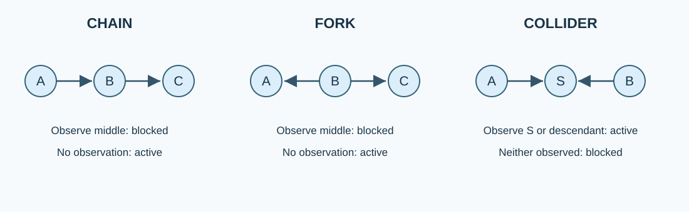
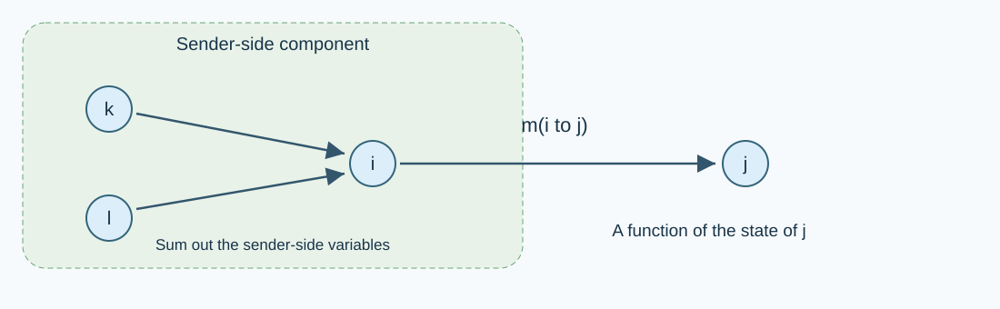
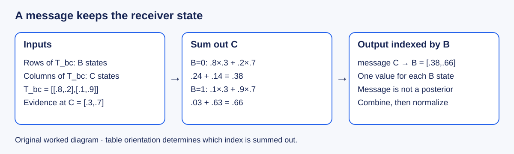

# W2 · Graphical Models, Conditional Independence, and Message Passing

Advanced Machine Learning for Artificial Intelligence · Fall 2026 · Prof. Wonsang You

**Meeting:** Tuesday, September 8, 2026, 13:00–15:00 (Asia/Seoul). From this week onward, we meet once per week for two continuous hours.

## The question that organizes this lesson

How can a collection of small local probability tables answer a question about a large joint distribution?

**Take-home message:** Conditional independence gives us a factorization. Distributing sums over that factorization gives us reusable intermediate functions called messages. On a tree these messages recover exact marginals; on a graph with cycles, the same local updates can converge to an inaccurate answer.

By the end, you should be able to specify an inference query, justify a conditional independence statement, derive a message by eliminating variables, and distinguish a computational stopping rule from evidence of statistical accuracy.

## Reading map and preparation

The main reference is Kevin P. Murphy, *Probabilistic Machine Learning: Advanced Topics*, MIT Press, 2023; page numbers here refer to the supplied online edition dated December 10, 2025.

| Topic | Main reading | Purpose |
|---|---|---|
| Graphical models and conditional independence | Chapter 4: §§4.2.1, 4.2.4, 4.3.6, 4.6.1 | The assumptions needed before inference |
| Inference algorithms | Chapter 7: §§7.2–7.5 | A map of goals, methods and diagnostics |
| Chain and tree message passing | Chapter 9: §§9.2–9.3 | Core derivation and computation |
| Cycles and elimination order | Chapter 9: §§9.4–9.5 | Limits of local propagation and tractability |
| Gaussian filtering and smoothing | Chapter 8: §8.1 | Optional bridge to continuous states |

Chapters 7–9 alone do not contain the main introduction to graphical models: that material is in Chapter 4. We do not attempt a complete treatment of Kalman filtering, variational inference or MCMC in this lesson. Review conditional probability, marginalization, matrix multiplication and Bayes' rule from Class 02 as needed.

**Practice:** [Open the W2 lab in Colab](https://colab.research.google.com/github/lunalab-ai/advML/blob/main/notebooks/student/w2-message-passing.ipynb). Choose a CPU runtime, save a copy in Drive, and run cells from the top. The first cell prepares the supporting code automatically. The examples use explicit finite tables and seeded synthetic models; no dataset account, GPU, file upload or private course folder is needed. Read the prediction prompts before running their associated experiments.

## 1. A model is not yet an inference algorithm

Let $X=(X_1,\ldots,X_n)$ be random variables. A probabilistic graphical model specifies a joint distribution using a graph and local functions. The graph expresses structural assumptions; the numerical parameters determine the particular distribution within that family. Missing edges can encode conditional independences, but an existing edge does not guarantee dependence for every possible parameter choice.

For a directed acyclic graph (DAG), the joint factorizes as

$$
p(x_1,\ldots,x_n)=\prod_{i=1}^{n}p(x_i\mid x_{\mathrm{pa}(i)}).
$$

Each conditional probability table is normalized over its child for every fixed parent configuration. A topological ordering lets us sample parents before children. This sampling order does not restrict the direction of inference: observing an effect can change our posterior belief about a cause. A DAG is a probability representation; a causal interpretation requires additional assumptions about interventions and the data-generating process.

For an undirected pairwise model, write

$$
p(x)=\frac{1}{Z}\prod_i\phi_i(x_i)\prod_{(i,j)\in E}\psi_{ij}(x_i,x_j),
\qquad
Z=\sum_x\prod_i\phi_i(x_i)\prod_{(i,j)\in E}\psi_{ij}(x_i,x_j).
$$

Potentials are nonnegative compatibility functions. They do not need to sum to one, even row by row. We require a finite, positive normalizer. A factor graph makes the factorization explicit: circles are variables, squares are factors, and an edge connects a factor to each variable in its scope. For example, a conditional table $p(c\mid a,b)$ is one three-variable factor; treating it as two pairwise factors would generally change the model.

**Why factorize?** An unrestricted distribution on $n$ binary variables has $2^n-1$ free parameters. A directed binary chain needs one initial probability and two conditional probabilities per transition, or $1+2(n-1)$ parameters. Compact representation is valuable, but compactness alone does not ensure cheap inference on an arbitrary graph.

An inference query must identify observed variables $E=e$, query variables $Q$, and nuisance variables $H$:

$$
p(x_Q\mid e)=\frac{\sum_{x_H}p(x_Q,x_H,e)}{\sum_{x_Q,x_H}p(x_Q,x_H,e)}.
$$

Conditioning fixes an observed value; marginalization sums over an unknown value. Dropping a factor is neither operation. Learning estimates or infers model parameters from data; in Bayesian learning, parameter uncertainty is itself an inference problem.

## 2. Conditional independence: three motifs, one precise rule

For conditions with positive probability,

$$
X\perp Y\mid Z
\quad\Longleftrightarrow\quad
p(x,y\mid z)=p(x\mid z)p(y\mid z)
$$

for every supported $x,y,z$. This is a property of the entire conditional distribution, not just a small sample correlation. Zero covariance does not imply independence outside special families such as jointly Gaussian variables.

*Figure 1. Original teaching diagram of standard d-separation motifs; definitions follow Murphy, §4.2.4. The statements refer to the displayed path and must be checked across all paths in a larger graph.*

### Chain: $A\rightarrow B\rightarrow C$

The factorization is $p(a)p(b\mid a)p(c\mid b)$. For $p(b)>0$,

$$
p(a,c\mid b)=\frac{p(a)p(b\mid a)p(c\mid b)}{p(b)}
=p(a\mid b)p(c\mid b).
$$

Thus $A\perp C\mid B$. Without observing $B$, the sum over $b$ usually couples the endpoints. Knowing the present state separates past and future in a first-order Markov model; observing only a noisy measurement of the present state does not generally do so.

### Fork: $A\leftarrow B\rightarrow C$

The factorization is $p(b)p(a\mid b)p(c\mid b)$. Conditioning on $B$ separates the children. Marginal dependence can arise because they share a varying cause. Mixing conditionally independent distributions need not yield marginal independence.

### Collider: $A\rightarrow S\leftarrow B$

For this isolated motif, the roots are independent: $p(a,b)=p(a)p(b)$. After observing $S=s$,

$$
p(a,b\mid s)\propto p(a)p(b)p(s\mid a,b).
$$

The likelihood term generally couples the roots. Conditioning on a collider, or on one of its descendants, can therefore induce dependence. It does not guarantee nonzero dependence for every degenerate or specially tuned set of parameters.

**A numerical selection example.** Let $A\sim\mathrm{Bernoulli}(0.2)$ and $B\sim\mathrm{Bernoulli}(0.3)$ independently, and let $S=1$ when at least one is one. These are invented teaching probabilities, not measurements from a real population. Then

$$
p(S=1)=1-(0.8)(0.7)=0.44,
\quad p(A=1\mid S=1)=\frac{0.2}{0.44}\approx0.455.
$$

If we additionally learn $B=1$, the selection event provides no further information about $A$, so $p(A=1\mid S=1,B=1)=0.2$. The second cause explains the selection, reducing the need for the first cause. The notebook reconstructs the complete joint table and checks this exactly.

### From motifs to d-separation

Consider paths without regard to arrow direction. A path is active given an observed set $Z$ if every non-collider on it is outside $Z$, and every collider is itself in $Z$ or has a descendant in $Z$. Two sets are d-separated if every connecting path is blocked. In any distribution that factorizes over the DAG, d-separation implies conditional independence. Failure of d-separation means the graph does not guarantee independence; it is not a proof of dependence for every parameter setting.

For an undirected graph, ordinary separation suffices: removing the conditioned nodes must disconnect the two sets. A DAG's Markov blanket consists of parents, children and co-parents; an undirected node's blanket is its neighbors. Strict positivity is needed for some equivalences between undirected Markov properties and factorization; do not invoke those equivalences blindly when deterministic zero-probability constraints are present.

**Pause and predict.** In $A\rightarrow S\leftarrow B$ and $S\rightarrow D$, are $A$ and $B$ d-separated (i) with no observations, (ii) given $D$, and (iii) given $S$? Explain the status of the collider on the path, rather than following arrow direction as if it were a road map.

## 3. What kind of answer do we need?

| Method or query | What it produces | Main limitation or diagnostic |
|---|---|---|
| Enumeration | Exact sums over all assignments | Exponential number of states; useful as a small oracle |
| Variable elimination / junction trees | Exact answers using intermediate factors | Cost depends on induced width and elimination order |
| Sum-product on a tree | Exact one-node marginals | Requires an acyclic factor structure for the usual guarantee |
| Joint MAP / max-product with traceback | Most probable complete configuration | A configuration is not an uncertainty distribution |
| Laplace approximation | A local Gaussian around a mode | Curvature, skewness, boundaries and missed modes |
| Variational inference | An optimized approximation within a chosen family | Approximation-family restrictions and optimization error |
| MCMC | Correlated samples targeting the posterior | Finite-run mixing, autocorrelation and unexplored modes |
| SMC | Weighted particles across a sequence of targets | Weight degeneracy and resampling variability |
| Loopy belief propagation | Iterative approximate local beliefs | May fail to converge; convergence need not imply accuracy |

**Marginal modes are not joint MAP.** Consider the joint table with rows $A=0,1$ and columns $B=0,1$:

$$
p(A,B)=\begin{pmatrix}0.34&0.06\\0.31&0.29\end{pmatrix}.
$$

The most probable complete configuration is $(0,0)$. The most probable value of $A$ after summing over $B$ is $1$, and the most probable value of $B$ is $0$. Selecting each marginal mode yields $(1,0)$, a different answer. The queries optimize different losses. Maximizing some variables while summing others is often called marginal MAP; always state the actual operators because terminology varies.

For a smooth continuous posterior with an interior mode $\hat\theta$ and positive-definite negative-log-posterior Hessian $H$, Laplace uses $q(\theta)=\mathcal N(\hat\theta,H^{-1})$. Variational inference instead chooses $q$ by optimizing an objective such as $\mathrm{KL}(q\Vert p)$; it is not simply a Hessian calculation. MCMC provides samples, not an automatic finite-time certificate of correctness. We will study these methods in later weeks.

## 4. A message is a cached marginalization

Take a pairwise tree and remove the edge $(i,j)$. This separates the tree into two components. Define $m_{i\rightarrow j}(x_j)$ by summing all variables on the $i$ side, including $x_i$, while retaining the boundary value $x_j$. The message is therefore a function of the **recipient's** state.

*Figure 2. Original diagram. Everything in the sender-side component is summarized by a vector indexed by the boundary variable; the recipient's incoming message is excluded.*

Distributing products and sums gives

$$
m_{i\rightarrow j}(x_j)=\sum_{x_i}\phi_i(x_i)\psi_{ij}(x_i,x_j)
\prod_{k\in\mathcal N(i)\setminus\{j\}}m_{k\rightarrow i}(x_i).
$$

The exclusion of $j$ prevents sending its own evidence immediately back to it. At a leaf the product over incoming neighbors is empty and equals one. At the destination, all components are combined:

$$
b_i(x_i)=\frac{1}{Z_i}\phi_i(x_i)\prod_{k\in\mathcal N(i)}m_{k\rightarrow i}(x_i).
$$

Collect from leaves toward any chosen root, then distribute from the root to the leaves. Each directed edge carries one message, so there are $2|E|$ messages. The two components created by every cut are disjoint; this is why the local summaries combine without duplicating evidence. Induction from leaves proves exactness. Normalizing a message by a positive scalar does not change the final normalized marginals, but those scalars matter if we also want the partition function or evidence probability.

For dense $K\times K$ pairwise tables, one message's matrix contraction costs $O(K^2)$. On a bounded-degree tree the whole computation costs $O(nK^2)$. A high-degree implementation must also account for neighbor-product work; caching can avoid repeating it. For a general graph, an elimination order of width $w$ creates tables with up to $K^{w+1}$ entries. A sparse graph with cycles may still be expensive. On a star, eliminating leaves first is cheap; eliminating the center first creates a factor over every leaf.

### Work one message by hand

Use a three-variable directed chain $A\rightarrow B\rightarrow C$ with prior $[0.6,0.4]$ and transition tables

$$
T_{AB}=\begin{pmatrix}0.9&0.1\\0.2&0.8\end{pmatrix},
\qquad T_{BC}=\begin{pmatrix}0.8&0.2\\0.1&0.9\end{pmatrix}.
$$

Rows are source states and columns destination states. An observed sensor report has likelihood $L(C)=[0.3,0.7]$. This is a likelihood for a fixed observation, not a posterior over $C$.

The left message to $B$ is $[0.6,0.4]T_{AB}=[0.62,0.38]$. The right message is $T_{BC}[0.3,0.7]^\top=[0.38,0.66]^\top$. Combine them elementwise:

$$
\tilde b_B=[0.62\cdot0.38,\;0.38\cdot0.66]=[0.2356,0.2508].
$$

The evidence probability is $0.4864$, and the normalized posterior is $b_B=[0.484375,0.515625]$. A backward message need not be a normalized distribution over its index. The lab verifies these numbers by an independent sum over all eight assignments.

For general factor graphs, the same principle yields a variable-to-factor product of incoming messages, and a factor-to-variable sum over every other variable in that factor. The size of a message is small only when the factor scopes and separator states are manageable.

## 5. HMMs connect the equations to sequential inference

For a hidden Markov model with states $z_t$ and observations $y_t$,

$$
p(z_{1:T},y_{1:T})=p(z_1)\prod_{t=2}^T p(z_t\mid z_{t-1})\prod_{t=1}^T p(y_t\mid z_t).
$$

Let $A_{ij}=p(z_t=j\mid z_{t-1}=i)$ and $\lambda_t(j)=p(y_t\mid z_t=j)$. Following Murphy's normalized forward convention, set $\alpha_t(j)=p(z_t=j\mid y_{1:t})$. Then

$$
\alpha_t=\operatorname{normalize}\left(\lambda_t\odot A^\top\alpha_{t-1}\right),
\qquad \alpha_1=\operatorname{normalize}(\lambda_1\odot\pi).
$$

Here vectors are columns; a NumPy row-vector implementation uses `alpha @ A`. The backward likelihood satisfies

$$
\beta_t=A(\lambda_{t+1}\odot\beta_{t+1}),\qquad\beta_T=\mathbf 1,
\qquad p(z_t\mid y_{1:T})\propto\alpha_t\odot\beta_t.
$$

Filtering conditions on data available through $t$; smoothing also conditions on future observations. A real-time system must not evaluate a smoother as if it were an online filter. The terminal backward message is one because there are no future observations. Multiplying the same local likelihood into both passes without adjusting the convention counts it twice.

Products of many small probabilities underflow. The implementation uses log potentials and log-sum-exp; subtracting the largest log value before exponentiating stabilizes each reduction. Normalization cannot rescue an all-zero event: impossible evidence should produce an explicit error, not a fabricated uniform posterior.

**Bridge to Chapter 8.** In linear-Gaussian state-space models, analogous messages are Gaussian functions summarized by means/covariances or information parameters. Kalman filtering and smoothing exploit this closure. Nonlinear Gaussian approximations need additional justification; Gaussian noise by itself does not make every nonlinear model exactly tractable.

## 6. Lab: establish truth before experimenting with approximations

The [student notebook](https://github.com/lunalab-ai/advML/blob/main/notebooks/student/w2-message-passing.ipynb) follows six steps:

1. Build the collider joint distribution and check selection-induced dependence.
2. Reproduce the three-node numerical derivation and compare tree BP with enumeration.
3. Predict the axis of a message, complete a small contraction, and diagnose a transposed update. The main demo remains runnable if an exercise is unfinished.
4. Verify filtering versus smoothing on a short synthetic observation sequence.
5. Close a chain into a cycle and compare approximate beliefs against the exact small-model oracle.
6. Inspect an error-versus-residual plot and record one claim the plot supports and one it does not.

The shared [supporting module](https://github.com/lunalab-ai/advML/blob/main/src/advml_pgm.py) provides `PairwiseModel`, `enumerate_exact`, `tree_sum_product`, `loopy_sum_product`, `ising_model`, and `max_marginal_tv`. It uses log potentials and documents state conventions. The notebook fetches a fixed reviewed revision and checks the file hash. The full official textbook source tree is a reference, not a runtime dependency for this small lab.

On a cyclic graph, repeated local updates reuse information along paths that can revisit earlier nodes. A stable message vector is only a fixed point of the update rule. It need not equal the posterior marginal. We measure maximum one-node total variation error,

$$
e=\max_i\frac12\sum_k\left|b_i(k)-p_i(k)\right|,
$$

separately from the largest change between successive normalized messages. Small one-node error also does not prove that all joint correlations are correct. Damping mixes the previous message with the newly proposed one; our API's `damping` parameter is the **old-message weight**. It can improve stability, but does not make arbitrary loopy BP exact.

## 7. Requested project: inference claims under stress

The [W2 project specification and 10-point rubric](https://github.com/lunalab-ai/advML/blob/main/course/notion/w2/w2-project.md) asks you to construct a failure case, derive an exact correction by conditioning a cycle, and design a justified extension with held-out tests. Start from the [project Colab](https://colab.research.google.com/github/lunalab-ai/advML/blob/main/notebooks/student/w2-project-starter.ipynb). The deadline is the one displayed in the SmartClass assignment entry.

There is no single target accuracy score that replaces an explanation. A well-supported negative result is useful; an attractive plot without a defined query, reference distribution and computation budget is not sufficient.

## Checkpoint questions

1. What must be specified before the expression “perform inference” defines a mathematical task?
2. Why does observing the middle node block a chain but potentially activate a collider?
3. Does failure of d-separation prove dependence for every parameter choice?
4. Why is a message from i to j indexed by the state of j?
5. In the worked chain, why is the product [0.2356, 0.2508] not yet a posterior distribution?
6. Can independently chosen marginal modes differ from joint MAP?
7. What is the difference between filtering and smoothing, and why does it matter for evaluation?
8. What can a small loopy-BP message residual establish, and what can it not establish?

Attempt these before opening the [separate quiz explanations](https://github.com/lunalab-ai/advML/blob/main/course/handouts/w2-quiz.md).

## References and provenance

- Murphy, K. P. *Probabilistic Machine Learning: Advanced Topics*. MIT Press, 2023. [Official book and reading resources](https://probml.github.io/pml-book/book2.html). Definitions and standard algorithms above follow the sections in the reading map; the numerical examples, diagrams, course code and project are independently authored teaching material.
- [Official pyprobml Book 2 notebook collection](https://github.com/probml/pyprobml/tree/master/notebooks/book2). The three-node joint/oracle design was informed by inspection of `09/ugm_inf_autodiff.ipynb`; its JAX autodiff extension is optional background, not required in this lab. `08/kf_tracking_script.ipynb` motivates the Gaussian bridge. Official examples may have different dependencies and some entries redirect to other repositories.
- [CMU 10-708: Exact Inference](https://www.cs.cmu.edu/~epxing/Class/10708-19/notes/lecture-04/) provides an additional account of variable elimination and tree methods. Use explicitly normalized query formulas as given here.
- [Murphy's graphical-model introduction](https://www.cs.ubc.ca/~murphyk/Bayes/bnintro.html) provides additional conceptual examples and literature pointers.

External references were consulted on September 8, 2026. No original textbook PDF or solution-manual content is redistributed with this lesson.

## Code definitions and further study

[API: arguments, results and examples](https://github.com/lunalab-ai/advML/blob/2026-fall-w2-explained/src/API.md)

- [PairwiseModel](https://github.com/lunalab-ai/advML/blob/2026-fall-w2-explained/src/advml_pgm.py#L43): Finite undirected model represented by log potentials, not fitted parameters.
- [enumerate_exact](https://github.com/lunalab-ai/advML/blob/2026-fall-w2-explained/src/advml_pgm.py#L124): Enumerate the complete joint as an independent small-model oracle.
- [tree_sum_product](https://github.com/lunalab-ai/advML/blob/2026-fall-w2-explained/src/advml_pgm.py#L149): Run exact two-pass log-domain sum-product on a connected tree.
- [loopy_sum_product](https://github.com/lunalab-ai/advML/blob/2026-fall-w2-explained/src/advml_pgm.py#L202): Run synchronous approximate sum-product with probability-space damping.
- [max_marginal_tv](https://github.com/lunalab-ai/advML/blob/2026-fall-w2-explained/src/advml_pgm.py#L259): Return max_i 0.5*sum_k(abs(p[i,k]-q[i,k])) as a float.

Original worked diagram · table orientation determines which index is summed out.
