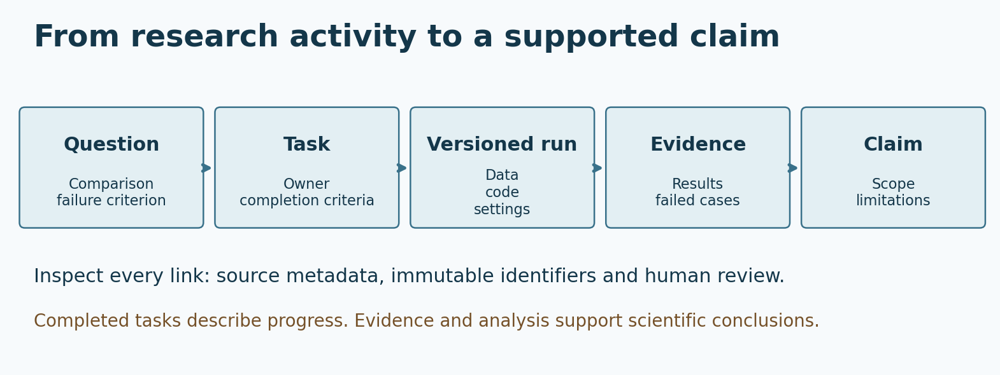

# Research Collaboration and Evidence-Based ML Research with LUNA

> Advanced Machine Learning for Artificial Intelligence · Week 3 · Tuesday, September 15, 2026

This study guide reconstructs the platform introduction and research-methodology discussion held in Week 3, using the instructor's meeting summary. It is not a verbatim transcript. The synthetic experiment and notebook below are **additional learning activities**, not experiments reported as having been performed in that meeting.

**Schedule correction.** Variational inference, ELBO, mean-field approximation and optimization move to **Week 4, Tuesday, September 22, 13:00–15:00 (Asia/Seoul)**. The earlier VI release remains a historical version. Use the current Week 4 links for that lesson.

**Learning outcomes.** Form a testable ML question; connect research records to their sources; distinguish collection, task completion and scientific evidence; compare paired experiments; write a qualified research claim; and build a small evidence-audit application.

## 1. What Week 3 introduced

The class introduced the [LUNA research collaboration platform](https://lunalab-ai.com/) and a workflow connecting research projects, materials, task tracking, meetings, progress reports and AI-assisted consultation. Discussion covered meaningful project names, material metadata, GitHub issues and projects, document folders, literature organization, calendar records and communication.

Some integrations and account permissions were still being checked during the demonstration. Treat those observations as the state of that meeting, not a promise that every account or connector behaves identically now. Interface availability depends on assigned projects, role and configuration. The [platform start guide](https://lunalab-ai.com/workspace/help/) is the appropriate place to check current navigation; it may require sign-in.

The most useful scientific lesson was a limitation: an AI consultation could not infer research readiness from a collection of references and incomplete records. References may identify a topic without documenting a hypothesis, completed experiment or supported conclusion. Asking for the missing evidence is a useful response.

## 2. Begin with a question that can fail

“Develop an advanced model” names an activity. It does not specify a scientific question. A stronger question identifies a population or data regime, a comparison, an outcome and a condition under which the proposed explanation would be weakened.

**Running example — an original teaching scenario.** Does a diagonal posterior approximation underestimate uncertainty as dependence increases? Compare the approximation with an exact reference in a controlled synthetic model. Keep observations, model parameters and evaluation points fixed while changing the inference method. Record the covariance error and computational cost. A result from this model supports a claim about this regime; it does not demonstrate superiority on all real datasets.

Separate four objects:

| Object | Example | What it establishes |
|---|---|---|
| Question | Does increasing dependence change approximation error? | A target for investigation |
| Hypothesis | Restricted covariance causes a residual error even after optimization | A proposed explanation |
| Experiment | Compare exact and approximate inference under controlled dependence | A way to test that explanation |
| Claim | A specified effect was observed under named conditions | A statement requiring traceable evidence |

Before running code, write the baseline, metric direction, controlled variables and failure criterion. If lower error is better, decide that convention before comparing numbers. Distinguish testing an inference algorithm from changing the probabilistic model itself. This distinction becomes central in Week 4.

## 3. Build a chain from question to evidence



A useful chain is: **question → experiment task → versioned implementation and data → run record → result artifact → claim with limitations → next decision**. Every arrow should be inspectable. A link to a repository homepage does not identify the implementation of one run; a screenshot of a score does not identify its data split.

Consider an issue titled “Measure uncertainty error against the exact Gaussian reference.” Its completion criteria might require the run configuration, code revision, metrics table, a figure, and an interpretation of failed cases. A completed issue records that the workflow criteria were met. A reviewer still needs to examine whether the experiment tests the proposed explanation.

[GitHub Projects](https://docs.github.com/en/issues/planning-and-tracking-with-projects/learning-about-projects/about-projects) provides views over issues and pull requests, including tables, boards and roadmaps. Use that organization to make research actions visible. Scientific validity comes from the experiment and its review, not the board column.

**Discussion prompt.** A project has 20 closed issues and a polished dashboard, but no held-out evaluation. What can a progress report safely claim, and what remains unknown?

## 4. Metadata determines whether evidence can be found

In the meeting, materials needed meaningful descriptions and associations. A document can exist yet be absent from the intended project view because its project, category or participant association is missing. That is a discovery or access problem; it is not proof that the research was never performed.

For each material, record a descriptive title, source link, project, author or responsible person, date, category and relevant tags. Add a short memo explaining its role: background literature, design decision, raw result, interpretation or meeting decision. Use a scientific project name such as “Calibration under posterior dependence,” rather than “Main development.”

Keep the original as the authoritative record. A collected copy should identify its source and collection time. If two systems disagree, inspect the source version, permissions, connection scope and collection status before drawing conclusions. Never paste a password or access token into a report, issue, notebook or AI conversation.

The platform's start guide recommends beginning with a small authorized source, performing one collection, checking the result and comparing it with the original. Treat collection and automatic reporting as separate operations. A successful collection does not prove that a later report used the latest version or that its interpretation is correct.

**Minimal diagnostic sequence.** Confirm the original exists and is accessible to the intended account; confirm the project association; inspect the connector's selected scope; inspect the most recent collection status; compare one collected item with its original; then ask an administrator about unresolved permission or connector failures. Do not respond by granting everyone administrative access.

## 5. Design a reproducible experiment record

A useful run record is small enough to fill in and specific enough to rerun. The following is an illustrative schema, not an export from the platform:

```json
{
  "question": "Does method B reduce error in the chosen synthetic regime?",
  "dataset_version": "synthetic-v1",
  "split_id": "held-out-simulation-v1",
  "code_revision": "immutable revision identifier",
  "environment": "Python and package versions",
  "metric": "error (lower is better)",
  "seed": 7,
  "configuration": {"model": "fixed", "budget": "matched"},
  "artifact": "run-007-results.csv",
  "limitations": "Synthetic setting; external validity not tested"
}
```

For real studies, specify how data were obtained, cleaned and split, which information was used for tuning, and how the final evaluation was protected. Recording a seed does not repair leakage. A code revision does not by itself identify a dataset. A successful rerun reproduces a computation; it does not prove that the computation answers the intended question.

Change one scientific factor at a time when testing a causal explanation for an algorithmic difference. Match computational budgets where relevant, retain unsuccessful trials, and distinguish exploratory choices from a later confirmatory evaluation. If you change the metric after seeing the results, disclose that choice.

### Paired comparisons

When two methods use the same evaluation conditions, compare their errors within each matched run. Let $e_{A,i}$ and $e_{B,i}$ be errors for run $i$, with lower values better. Define:

$$
d_i=e_{A,i}-e_{B,i},\qquad \bar d=\frac{1}{n}\sum_{i=1}^{n}d_i.
$$

A positive difference favors B for that run. Inspect the full differences, not only their mean. Matching by row position is unsafe if files were sorted differently; join by the run identifier and verify the identifiers are unique. Across-seed dispersion is not automatically a measure of uncertainty over future real datasets, and a small synthetic example does not establish statistical significance.

## 6. Write reports that expose the reasoning

A report should help another researcher decide what to inspect or do next. Use the following original template:

1. **Question and previous decision:** what uncertainty are we trying to resolve?
2. **Work and evidence:** what changed, and which run, code and source artifacts support that statement?
3. **Result and interpretation:** what was observed, and which explanation is still tentative?
4. **Limitations and blockers:** what was not tested, failed, or could not be accessed?
5. **Next decision:** what follow-up would discriminate between competing explanations, and who will do it?

“Implemented the baseline” is useful work information. “The proposed method generalizes better” requires evaluation evidence. A negative result can be valuable when it rules out an explanation or reveals a failure regime. Record it with the same care as a favorable result.

For meetings, separate observations, decisions and action items. Link an action to an owner and a date in the appropriate project. A meeting summary is a navigation aid; verify important technical claims against original notes, code or results. Literature tools such as Zotero help organize references, but a collection of papers is not a substitute for a synthesized research question.

## 7. Use AI consultation as a review aid

Give the assistant the question, the proposed claim, selected evidence links or excerpts, and known limitations. Ask it to identify unsupported steps and needed checks. If the evidence is inaccessible or incomplete, require that it say so.

**Example request.** “Here is the claim and the paired-run table. Identify statements supported by these observations, statements requiring additional experiments, and possible leakage or provenance gaps. Cite the supplied evidence for each finding. Do not invent missing results.”

Distinguish a human-authored record, an automatically collected record, an AI-generated summary and a human decision. They have different origins and responsibilities. A fluent summary can misread a metric direction or omit a failed run. Verify important conclusions and retain the original evidence.

The [NeurIPS Paper Checklist](https://neurips.cc/public/guides/PaperChecklist) is a useful reminder to align research claims with supporting evidence and to explain limitations. Our classroom audit is narrower: it checks selected metadata and numerical comparisons. Passing it does not certify a paper's correctness, novelty or readiness for submission.

## 8. Additional practice: build an evidence-audit app

Open the **Week 3 research-methodology Colab** from the course page. The notebook creates fictional paired error measurements automatically. No private project data, account, token or platform connection is needed. It is a teaching app, not an extension that writes to LUNA.

First predict whether the two methods will differ. Inspect the records, match runs by seed, compute paired differences and identify what the numbers cannot establish. Then remove a provenance field and observe which warning appears. Finally assemble a Gradio interface that accepts a JSON record, runs the audit and displays the findings.

**E1 — Direction and pairing.** Complete the paired mean calculation using the defined sign convention. Explain why independently sorting each method by error destroys the pairing.

**E2 — Debug the record.** A result has a numeric score and a seed but lacks its data version and code revision. Identify the missing information and write a concrete retrieval request. Do not invent plausible identifiers.

**E3 — Repair the claim.** Rewrite “B is universally better than A” using only the synthetic paired observations and their limitations. State one experiment that could challenge your interpretation.

**E4 — Build and test the interface.** Wire the input, audit function and JSON output. Test complete metadata, incomplete metadata and malformed JSON. Check that an input error is explained without showing a false success.

The completed demonstration remains runnable if you leave an exercise unfinished. These are formative exercises; no new graded assignment is introduced. In Colab, launching an interactive app may create a temporary sharing endpoint. It expires with the runtime; the notebook remains the stable entry point.

## 9. Checkpoint questions

1. Why does closing a research issue not establish a scientific claim?
2. What should you check when a document is missing from a project view?
3. Why compare methods using matched run identifiers?
4. What does a metadata audit fail to prove?
5. When is an AI assistant right to withhold a research-readiness judgment?
6. How will this workflow support the Week 4 variational-inference experiment?

## 10. Bridge to Week 4

Week 4 will give this workflow a precise probabilistic target. We will derive the ELBO, compare mean-field approximations with an exact Gaussian reference, and distinguish **approximation error** from **optimization error**. A converged optimization trace is a process result; whether the approximation captures the desired uncertainty is a separate scientific question.

Bring the same habits: name the model and inference method separately, retain the exact reference, record settings, inspect failure cases and qualify the conclusion. The scheduled VI lecture is September 22; the actual Week 3 topic remains research collaboration and methodology.

## References and source boundaries

- The instructor-provided September 15 meeting summary grounds the retrospective. Personal work assignments and raw meeting records are not reproduced in this student guide.
- [LUNA Research Platform](https://lunalab-ai.com/) and [Start Guide](https://lunalab-ai.com/workspace/help/), inspected September 18. The guide was updated September 17, after the class; it supports current usage advice, not a claim about every historical screen.
- [GitHub: About Projects](https://docs.github.com/en/issues/planning-and-tracking-with-projects/learning-about-projects/about-projects), inspected September 18.
- [NeurIPS Paper Checklist](https://neurips.cc/public/guides/PaperChecklist), inspected September 18.
- The experiment schema, numerical fixture, audit app and diagram are original teaching additions. The Murphy Chapter 10 reading belongs to Week 4; it is not represented as the subject taught in Week 3.
