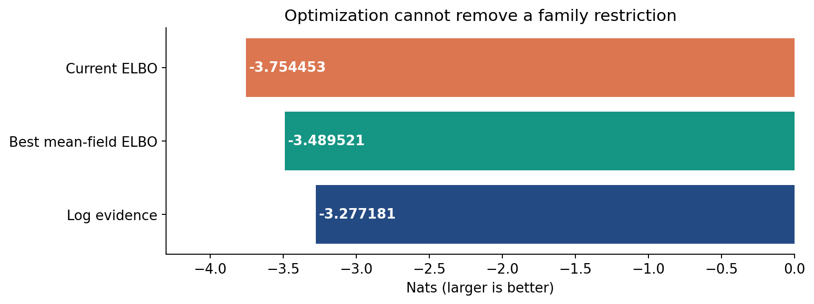
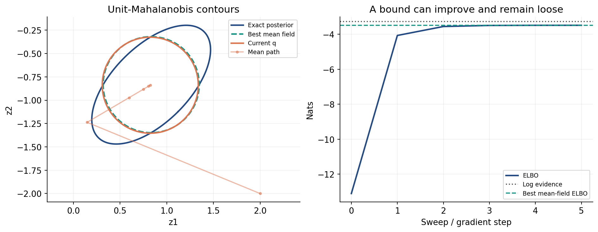
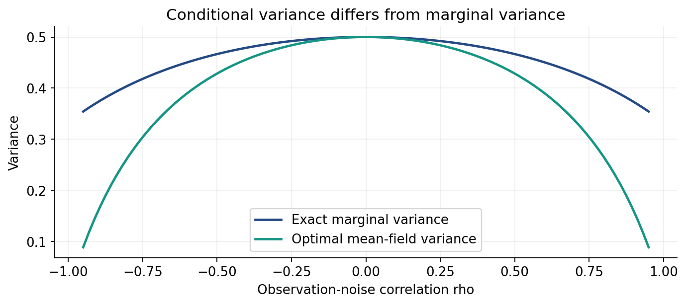
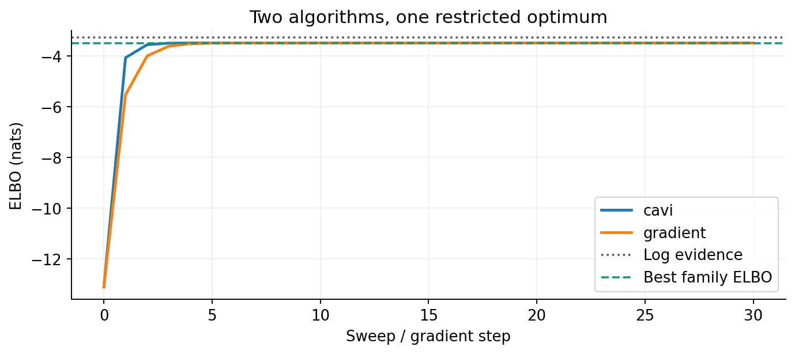
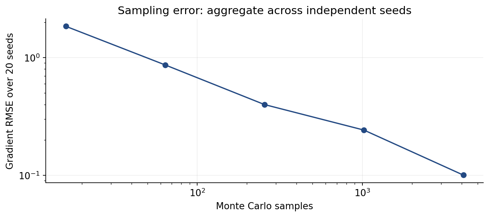
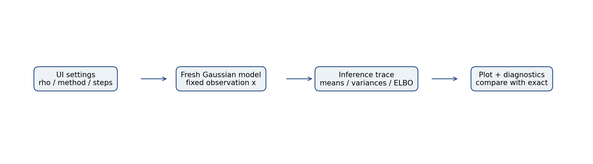

# Variational Inference: ELBO, Mean Field, and Optimization

> Advanced Machine Learning for Artificial Intelligence · Dongduk Women's University · Professor Wonsang You · 2026-2  
> Week 3 · Thursday, September 17, 2026 · 120-minute lesson

**Learning outcomes.** Derive the ELBO identity; distinguish model and variational parameters; derive and implement mean-field coordinate updates; compare deterministic and stochastic gradients; diagnose approximation versus optimization error; assemble an interactive inference explorer.

**Reading.** Murphy, *Probabilistic Machine Learning: Advanced Topics*, online edition dated December 10, 2025: `10.1.1–10.1.2 (printed pp. 439–442), `10.2.1 (pp. 445–451), `10.3.1–10.3.2 (pp. 455–459); `10.4.1 (p. 471) for the stochastic-gradient bridge. These are printed page numbers; the locally supplied PDF places them 34 pages later. The lesson develops original examples and derivations rather than reproducing textbook pages.

**Prerequisites.** Bayes' rule, multivariate Gaussian mean/covariance/precision, expectations, KL divergence, partial derivatives, and W2 graphical-model factorization.

## 1. Inference becomes optimization

We observe $x$ and ask for a distribution over unobserved $z$. The model parameters $\theta$ are fixed during the inference problem:

$$
p_\theta(z\mid x)=\frac{p_\theta(x,z)}{p_\theta(x)},\qquad
p_\theta(x)=\int p_\theta(x,z)\,dz.
$$

Evaluating a joint density at one point can be easy even when its integral is expensive. Variational inference chooses a tractable family $\mathcal Q=\{q_\phi(z)\}$ and adjusts $\phi$ so that a member approximates the posterior. Model parameters describe the data-generating assumptions; variational parameters describe our approximation. They are not interchangeable.

Our worked family is $q_\phi(z)=\mathcal N(z;m,\operatorname{diag}(v))$, where $m\in\mathbb R^2$ and $v_j>0$. We optimize unconstrained log standard deviations $a_j=\log\sqrt{v_j}$, so $v_j=e^{2a_j}$. There is no dataset fitting in this example: one synthetic observation and one fixed noise covariance define the target.

**Prediction L1.** If an ELBO is negative, does that establish that its implementation is wrong? Keep your answer until the numerical example.

## 2. Deriving the evidence lower bound

Assume the relevant expectations are finite and $q$ puts no mass where the posterior is zero. Expanding reverse KL gives

$$
\begin{aligned}
\operatorname{KL}(q\Vert p_\theta(z\mid x))
&=\mathbb E_q[\log q(z)-\log p_\theta(x,z)+\log p_\theta(x)]\\
&=\log p_\theta(x)-\mathcal L(q),\\
\mathcal L(q)&=\mathbb E_q[\log p_\theta(x,z)]+H(q).
\end{aligned}
$$

Thus $\log p_\theta(x)=\mathcal L(q)+\operatorname{KL}(q\Vert p_\theta(z\mid x))$ and $\mathcal L(q)\leq\log p_\theta(x)$. The evidence is constant with respect to $\phi$, which makes ELBO maximization equivalent to reverse-KL minimization for this fixed model. Equality requires $q$ to equal the posterior almost everywhere.

Jensen gives a second route when the importance-ratio representation is valid:

$$
\log\int q(z)\frac{p_\theta(x,z)}{q(z)}\,dz
\ \geq\ \mathbb E_q\log\frac{p_\theta(x,z)}{q(z)}.
$$

For that displayed integral to equal the complete evidence, $q$ must cover the joint's relevant support. The KL identity is the more direct check for our full-support Gaussian family. Do not silently divide by zero in a discrete implementation.

Factoring the joint supplies the often-used form

$$
\mathcal L(q)=\mathbb E_q[\log p_\theta(x\mid z)]
-\operatorname{KL}(q(z)\Vert p_\theta(z)).
$$

The first term rewards explaining the observation. The second penalizes departure from the prior. Entropy prevents replacing a distribution by an unjustified point estimate. None of these statements says the ELBO is positive: its value is a log-density quantity measured here in nats.

Figure 1. Two distinct gaps are visible. Increasing iterations can reduce the optimization gap; it cannot enlarge a fixed family. All values come from the independently implemented synthetic model below.

## 3. An exact reference before an approximation

Use the original conjugate model

$$
z\sim\mathcal N(0,I),\quad x\mid z\sim\mathcal N(z,S),\quad
S=\begin{pmatrix}1&\rho\\\rho&1\end{pmatrix},\quad |\rho|<1,\quad
x=(1,-1)^\top.
$$

Here $\rho$ is **observation-noise correlation**, not posterior correlation. Completing the square in
$-\frac12 z^\top z-\frac12(x-z)^\top S^{-1}(x-z)$ gives

$$
P=I+S^{-1},\qquad C=P^{-1},\qquad
\mu=C S^{-1}x=(I+S)^{-1}x.
$$

The exact posterior is $\mathcal N(\mu,C)$, while the marginal observation distribution is $\mathcal N(0,I+S)$. This gives an independently calculable log evidence:

$$
\log p(x)=-\log(2\pi)-\tfrac12\log|I+S|
-\tfrac12x^\top(I+S)^{-1}x.
$$

At $\rho=0.8$,

$$
\mu=(5/6,-5/6)^\top,\quad
P=\frac19\begin{pmatrix}34&-20\\-20&34\end{pmatrix},\quad
C=\frac1{42}\begin{pmatrix}17&10\\10&17\end{pmatrix}.
$$

The posterior correlation is $10/17\approx0.588235$. Its marginal variances are $17/42\approx0.404762$. A calculation that reports 0.8 as posterior correlation has mixed up model input and inference output.

**Prediction L2.** Can a diagonal approximation have the exact posterior mean and still be a poor representation of uncertainty?

Figure 2. These are unit-Mahalanobis contours, not 68% joint credible regions. Rotation represents covariance. An axis-aligned approximation cannot reproduce it even after its center converges.

## 4. Mean-field approximation and coordinate ascent

Mean field restricts $q(z)=\prod_{j=1}^d q_j(z_j)$. This is an assumption about the approximation, not a discovery that the target variables are independent. Holding all factors except $q_j$ fixed, define

$$
f_j(z_j)=\mathbb E_{q_{-j}}[\log p(x,z)],\qquad
q_j^\star(z_j)=\frac{\exp f_j(z_j)}
{\int\exp f_j(t)\,dt}.
$$

The part of the ELBO depending on $q_j$ is $\mathbb E_{q_j}f_j+H(q_j)$, which is a constant minus $\operatorname{KL}(q_j\Vert q_j^\star)$. If the normalizer exists, replacing the factor by $q_j^\star$ cannot decrease the exact ELBO. This is coordinate ascent variational inference (CAVI). Expectations may still be intractable in a nonconjugate model.

For the Gaussian target, keep only the terms involving $z_j$. Completing this smaller square gives

$$
v_j\leftarrow P_{jj}^{-1},\qquad
m_j\leftarrow\mu_j-\frac1{P_{jj}}\sum_{k\ne j}P_{jk}(m_k-\mu_k).
$$

Our implementation updates coordinate 0, then coordinate 1 using the **newest** mean. One recorded sweep includes both updates. Simultaneous updates are a different algorithm and should not inherit a sequential-CAVI guarantee without analysis.

Starting from $m=(2,-2)$ at $\rho=.8$, the first coordinate becomes $5/34\approx.147059$, and the second becomes approximately $-1.237024$. After both updates the variances equal $9/34$. Repeated sweeps converge to $\mu$ in this positive-definite Gaussian example.

The optimum in the diagonal Gaussian family is

$$
m^\star=\mu,\qquad v_j^\star=1/P_{jj}.
$$

At our settings, $v_j^\star=9/34\approx.264706$, less than the true marginal variance $.404762$. For a Gaussian, $1/P_{jj}$ is a conditional variance; it need not equal the marginal variance $C_{jj}$. The optimized reverse-KL projection therefore underestimates these marginal variances. This precise result does not justify claiming every variational family always underestimates every uncertainty measure.

Figure 3. At $\rho=0$, the posterior factorizes and the gap vanishes. Away from zero, missing dependence matters. The horizontal axis is noise correlation.

Reverse KL averages under $q$, so placing mass in a region of tiny target density is costly. This helps explain some mode-seeking behavior in multimodal problems; our unimodal Gaussian example isolates covariance loss without invoking missing modes. Minimizing forward KL over diagonal Gaussians instead matches the target marginal variances, which answers a different optimization problem.

## 5. ELBO computation and gradient optimization

The lab computes the ELBO directly, rather than defining it as evidence minus KL:

$$
\begin{aligned}
\mathbb E_q\log p(z)
&=-\log(2\pi)-\tfrac12(m^\top m+\operatorname{tr}V),\\
\mathbb E_q\log p(x\mid z)
&=-\log(2\pi)-\tfrac12\log|S|\\
&\quad-\tfrac12[(x-m)^\top S^{-1}(x-m)+\operatorname{tr}(S^{-1}V)],\\
H(q)&=\log(2\pi e)+\tfrac12\log|V|,\qquad V=\operatorname{diag}(v).
\end{aligned}
$$

An independent Gaussian-KL formula checks the identity:

$$
\operatorname{KL}(q\Vert p)
=\tfrac12[\operatorname{tr}(PV)+(m-\mu)^\top P(m-\mu)
-2+\log|C|-\log|V|].
$$

Keeping normalization constants is essential for checking an absolute ELBO or comparing it to evidence. Constants may be dropped only for a fixed-parameter optimization whose derivatives do not depend on them.

With $a_j=\log\sigma_j$, direct differentiation gives

$$
\nabla_m\mathcal L=-P(m-\mu),\qquad
\frac{\partial\mathcal L}{\partial a_j}=1-P_{jj}e^{2a_j}.
$$

Ascent uses $\phi\leftarrow\phi+\eta\nabla_\phi\mathcal L$. A negative sign performs descent on this objective. A large positive step can also overshoot; the supplied deterministic optimizer halves its proposed step until an Armijo ascent condition holds. The displayed learning rate is the initial proposal, not necessarily the accepted step.

For this positive-definite Gaussian, the objective is strictly concave in $(m,a)$, so the finite stationary point is the unique optimum in this family. General probabilistic models need not have this property. A flat ELBO trace alone does not certify global optimality or posterior accuracy.

Figure 4. Both algorithms approach the same family optimum. At $\rho=.8$, log evidence is $-3.277181$, best ELBO is $-3.489521$, and irreducible reverse KL is $.212340$ nats. Negative ELBO values are expected here.

**Prediction L3.** A student increases the iteration count from 30 to 300 and the ELBO stays at $-3.489521$. Which gap remains, and what kind of change could reduce it?

## 6. Reparameterization: differentiating through a sample

For more complicated models, analytic expectations may not be available. Write a diagonal Gaussian sample as

$$
\epsilon\sim\mathcal N(0,I),\qquad z=m+\sigma\odot\epsilon.
$$

The base noise distribution does not depend on the parameters. Under suitable differentiability and integrability conditions, gradients can move inside its expectation. In our model the score with respect to the latent sample is
$g_z=\nabla_z\log p(x,z)=-P(z-\mu)$. Using analytic entropy, an $N$-sample estimator is

$$
\widehat{\nabla_m\mathcal L}=\frac1N\sum_n g_{z^{(n)}},\qquad
\widehat{\nabla_a\mathcal L}=\frac1N\sum_n
g_{z^{(n)}}\odot\sigma\odot\epsilon^{(n)}+\mathbf1.
$$

The $+\mathbf1$ is the entropy derivative, not a tuning constant. The module uses a local random generator; changing its seed affects the estimate without changing the target posterior. Here we can compare the estimate with the analytic gradient, making this a controlled test before using a harder model.

Figure 5. Root mean squared gradient error is aggregated over 20 independent seeds for each sample count. More samples reduce typical error, but a particular realization need not improve monotonically. This plot measures gradient-estimation error, not posterior approximation error.

**Prediction L4.** Does one lower sampled ELBO after a stochastic update prove the derivation is wrong? Separate Monte Carlo noise, a poor step size, and an actual formula error.

## 7. A bridge back to graphical models

In W2 the binary Ising model used spins $s_i\in\{-1,+1\}$ and unnormalized density

$$
\widetilde p(s)=\exp\left(\sum_i h_i s_i+\sum_{(i,j)}J_{ij}s_i s_j\right).
$$

With a product approximation and means $m_i=\mathbb E_q s_i$, a coordinate update is

$$
m_i\leftarrow\tanh\left(h_i+\sum_{j\in N(i)}J_{ij}m_j\right).
$$

To derive it, hold $s_i$ fixed, take expectations of neighbor spins in the log density, normalize the two possible states, and subtract their probabilities. Mean field substitutes expected neighbors; belief propagation instead communicates functions of neighboring states. Their fixed points and approximation properties are not interchangeable.

The objective $\mathbb E_q\log\widetilde p(s)+H(q)$ lower-bounds $\log Z$. A partition-function bound is not automatically a log-evidence bound. To describe evidence, specify how observed values restrict the joint and retain the required normalizing constants. Strong coupling can create multiple mean-field fixed points, unlike our strictly concave Gaussian example.

## 8. Lab: build an inference explorer

[Open the CPU Colab](https://colab.research.google.com/github/lunalab-ai/advML/blob/2026-fall-w3/notebooks/student/w3-variational-inference.ipynb). Save a copy, run the setup, and predict before executing each experiment. No dataset upload or GPU is needed. Unfinished exercise cells can be skipped without breaking later demonstrations.

The notebook verifies supporting code against a fixed SHA-256. Its public algorithms implement the methods derived above. Your extension is to design an additional diagnostic and connect it to an app callback.

| Exercise | Do before inspecting output | Evidence to discuss |
|---|---|---|
| E1: identity | Fill evidence minus ELBO and compare with independent KL | Numerical agreement and units |
| E2: variance | Calculate diagonal-family and true marginal variances | Why the precision diagonal matters |
| E3: CAVI | Carry out one sequential sweep by hand | Which updated mean enters coordinate 1 |
| E4: debug ascent | Repair the wrong sign in a proposed mean update | Objective before and after a small step |
| E5: Monte Carlo | Predict error as sample count changes | Aggregate errors across seeds |
| E6: diagnose | Compare 0 and 30 sweeps at noise correlations 0 and .8 | Optimization gap versus approximation gap |
| E7: build an app | Add a variance-retention diagnostic to your own callback | Two settings, correct labels, visible plot and JSON |

The completed demonstration maps four inputs—noise correlation, method, iteration count and initial gradient step size—to a posterior plot and diagnostics. Gradio binds inputs to the callback in list order. Each click creates a fresh model; it does not continue training the previous display. The rate affects only gradient ascent. The notebook also supplies a smaller exercise scaffold with two inputs; create a diagnostic showing each approximate variance as a fraction of its exact marginal variance.

Figure 6. Inputs build a model, inference produces a trace, and diagnostics/plotting expose the result. A UI success message is not mathematical verification: use the exact reference and runtime checks.

`build_vi_app()` returns an unlaunched application. In Colab its launch creates a temporary sharing URL tied to the active runtime. The permanent starting point is the notebook link above. After use, stop the runtime. The module's `vi_view(rho, method, steps, learning_rate=.25)` returns a Matplotlib Figure and a JSON-compatible dictionary; it does not save files.

[Full function contracts and source links](https://github.com/lunalab-ai/advML/blob/2026-fall-w3/src/W3-API.md) explain argument shapes, return shapes, defaults and side effects. Read these before changing the callback. The notebook includes these contracts before first use.

## Checkpoint quiz

1. Why can ELBO maximization avoid evaluating the evidence during fixed-model inference?

2. Does mean field assert posterior independence?

3. Why is the optimal Gaussian mean-field variance 1/Pjj rather than Cjj?

4. What is guaranteed by an exact sequential CAVI update?

5. Why does the log-standard-deviation gradient contain a +1?

6. Can increasing iterations eliminate every ELBO gap?

7. What distinguishes the W2 Ising variational objective from a log-evidence bound?

## References and provenance

- [Murphy: official Advanced Topics book page](https://probml.github.io/pml-book/book2.html), Chapter 10, sections listed above. Main textbook, locally reviewed edition.
- [Blei, Kucukelbir and McAuliffe (2017), Variational Inference: A Review for Statisticians](https://www.cs.columbia.edu/~blei/papers/BleiKucukelbirMcAuliffe2017.pdf), `2.4 for the coordinate-update derivation.
- [Official pyprobml Chapter 10 notebooks](https://github.com/probml/pyprobml/tree/master/notebooks/book2/10): gaussian_2d_vi, kl_pq_gauss, and unigauss_vb_demo informed the choice to compare an approximation with an exact small-model reference. Their research software stack is not required by this independently written NumPy lab.
- [Gradio 6.27.0 package documentation](https://pypi.org/project/gradio/6.27.0/) for application construction and runtime sharing.

All six figures are original plots generated from this lesson's synthetic model. No textbook scans or upstream notebook outputs are redistributed. The lecture, quiz, executable demonstrations and private exercise explanations use the same notation and model.
