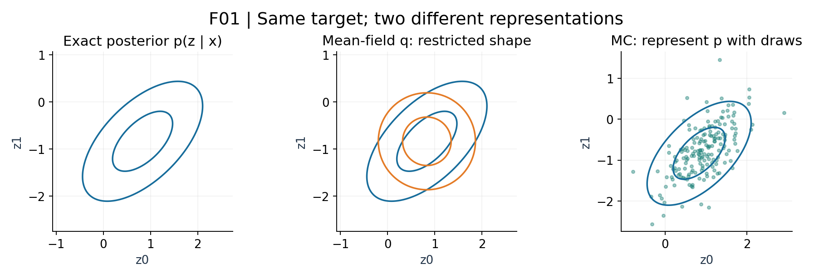
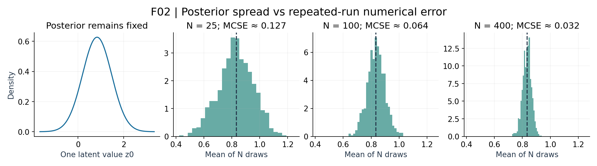

# Inference Repair

## Distributions, expectations, and numerical error

Advanced Machine Learning · Week 5 companion · September 29, 2026

Use this short note before the main lesson if last week's notation obscured the meaning. The goal is to separate four objects that often look similar on a slide: a model, a posterior distribution, a numerical answer, and the error in that answer.

## 1. What is fixed, and what is uncertain?

In a model $p(x,z)$, $x$ is observed and $z$ is unknown. Once we condition on the observed $x$, posterior inference studies $p(z\mid x)$. A sampler generates hypothetical values of the unknown $z$ under that distribution. It does not manufacture additional observations of $x$.

| Object | Example | What changes it? |
|---|---|---|
| Observed data | The given vector $x=(1,-1)$ | A different dataset |
| Target posterior | $p(z\mid x)$ | Data or model assumptions |
| Approximation | A mean-field density or a collection of draws | Inference method and settings |
| Reported quantity | $\mathbb E[z_0]$, variance, or a tail probability | The question function $f$ |
| Numerical error | Estimated expectation minus exact expectation | Finite computation, proposal, mixing, and random seed |

**R1 — pause and explain.** If we run a sampler ten times longer with the same data and model, which rows change and which remain fixed?

## 2. Expectation is a weighted answer to a question

Imagine a discrete posterior:

| Latent value $z$ | 0 | 1 | 3 |
|---|---|---|---|
| Posterior probability | 0.2 | 0.5 | 0.3 |

The mean is a probability-weighted average:

$$
\mathbb E[z]=0(0.2)+1(0.5)+3(0.3)=1.4.
$$

The mean need not be a possible value of the random variable. It is a summary of the distribution, not necessarily its most probable state. Here the most probable state is 1, while the mean is 1.4.

To ask a different question, change the function inside the expectation:

$$
\mathbb E[z^2]=0^2(0.2)+1^2(0.5)+3^2(0.3)=3.2,
$$

$$
\operatorname{Var}(z)=\mathbb E[z^2]-(\mathbb E[z])^2
=3.2-1.4^2=1.24.
$$

For an event, use an indicator. $\mathbb E[\mathbf 1(z>1)]=0.3$ is the probability that the event occurs. A numerical method may estimate the mean well and still estimate a rare event poorly.

Four iid posterior draws might be $(0,1,1,3)$. Their average is 1.25, not exactly 1.4. This discrepancy is ordinary sampling error. It does not mean the posterior probabilities in the table have changed.

**R2 — pause and explain.** Why is squaring the mean different from averaging the squared values?

## 3. Density height is not probability mass

For a continuous variable, the density $p(z)$ is a height. Probability over an interval is an area:

$$
\Pr(a<z<b)=\int_a^b p(z)\,dz.
$$

A density can exceed one while its total area remains one. A single continuous point has zero probability under a density model. When we evaluate a density at a proposed point, we are evaluating a local height used by an algorithm; we are not saying that the exact point has that much probability.

Bayes' rule divides the joint density by a normalizer:

$$
p(z\mid x)=\frac{p(x,z)}{p(x)},
\qquad p(x)=\int p(x,z)\,dz.
$$

The denominator makes the posterior integrate to one. For continuous $x$, evidence is a density value, not automatically a probability between zero and one. Some inference algorithms cancel this denominator in ratios; that does not make every expectation trivial.

## 4. Why VI and Monte Carlo answer related questions differently

In W4, VI searched within a chosen family $q_\phi$. The ELBO identity says:

$$
\log p(x)=\mathcal L(\phi)+
D_{\mathrm{KL}}\!\left(q_\phi(z)\,\|\,p(z\mid x)\right).
$$

The evidence is fixed while the variational parameters change. Improving the ELBO reduces reverse KL, but it cannot remove restrictions built into the family. A mean-field approximation can find the correct center and still miss covariance.

Monte Carlo instead approximates integrals with sample averages or weighted averages. With a valid sampling procedure, enough effective exploration can approximate many expectations without choosing a diagonal-Gaussian approximation family. Practical errors remain: finite samples, poor importance proposals, slow MCMC mixing, and particle degeneracy.

These are different error mechanisms:

| Mechanism | Example | A useful intervention |
|---|---|---|
| Approximation restriction | Mean-field omits posterior covariance | Enrich the approximation family |
| Optimization error | VI has not reached a good family member | Improve optimization or initialization |
| Monte Carlo error | A finite average fluctuates | Increase effective information and assess MCSE |
| Exploration failure | Every chain misses a mode | Improve transitions and initialization; inspect multiple diagnostics |

## 5. Posterior SD and MCSE answer different questions

The left panel asks, “How uncertain is the latent value?” The right panels ask, “How much would our estimated mean vary if we repeated this calculation?” Those are different random objects.

For the W4 posterior, the SD of $z_0$ is $\sqrt{17/42}\approx0.636$. With independent samples, the MCSE of the mean is:

$$
\mathrm{MCSE}(\widehat\mu)=\frac{0.636}{\sqrt N}.
$$

At $N=100$ it is about 0.064; at $N=400$ it is about 0.032. The posterior SD remains 0.636 because we have not changed the data or model. With correlated MCMC draws, this iid calculation must be adjusted for dependence.

**R3 — pause and explain.** Does a narrow Monte Carlo error bar imply that the latent state itself is almost known?

## Return to the main lesson with these distinctions

Before each experiment, name the target distribution, the function being averaged, how the samples or particles were obtained, and what uncertainty a displayed band measures. Then use the [main lesson](w5-monte-carlo-inference.md) and [Lab A](https://colab.research.google.com/github/lunalab-ai/advML/blob/2026-fall-w5/notebooks/student/w5-a-monte-carlo.ipynb).

Source: Murphy, *Probabilistic Machine Learning: Advanced Topics*, Chapters 7, 10, and 11; original discrete and Gaussian teaching examples. The Gaussian model and VI contrast reuse the course's W4 definitions. Figures are original numerical course visualizations.
