# Monte Carlo Inference

## Importance Sampling, MCMC, and Sequential Monte Carlo

Advanced Machine Learning for Artificial Intelligence · Week 5 · September 29, 2026  
Dongduk Women's University · Professor Wonsang You

**The central question:** How can we calculate with a posterior distribution when exact integration is difficult?

This lesson connects last week's variational inference to sample-based inference. We will explain a method, calculate a small example, inspect a failure, and then test it against a known answer. The known answer is a benchmark for learning; most real inference problems do not provide such an oracle.

**Start here.** If density, expectation, variance, or the ELBO still feels unclear, read the separate [Inference Repair note](w5-inference-repair.md). Open [Lab A: fixed-target inference](https://colab.research.google.com/github/lunalab-ai/advML/blob/2026-fall-w5/notebooks/student/w5-a-monte-carlo.ipynb), then [Lab B: sequential inference and the app](https://colab.research.google.com/github/lunalab-ai/advML/blob/2026-fall-w5/notebooks/student/w5-b-sequential-monte-carlo.ipynb). Use a CPU runtime; synthetic data and shared code are prepared automatically.

By the end, you should be able to derive the estimators and transition rules below, distinguish their assumptions, diagnose misleading results, and explain an experiment using both numerical evidence and a picture. Record experiments in the [comparison worksheet](w5-experiment-record.md). Definitions, shapes, defaults, and GitHub implementation links are in the [shared code guide](w5-code-guide.md).

## Reading map: Chapter 7 is the overview

The main textbook is Kevin P. Murphy, *Probabilistic Machine Learning: Advanced Topics*. Page numbers below refer to the supplied online edition dated December 10, 2025; its PDF page number is the printed page plus 34. The textbook provides the theory; the common Gaussian example, experiments, and most figures here are original course teaching additions.

| Role | Main reading | Printed pages |
|---|---|---|
| Bridge from VI to sampling | 7.4.4–7.4.6 | 352–355 |
| MC integration and accuracy | 11.1–11.2 | 483–485 |
| Direct and self-normalized IS | 11.5.1–11.5.3 | 491–492 |
| Metropolis–Hastings and basic Gibbs | 12.2; 12.3.1–12.3.2 | 500–506 |
| MCMC diagnostics | Selected 12.6.2–12.6.3 | 526–529 |
| SMC, bootstrap filtering, resampling | 13.1–13.2 | 543–553 |

HMC/NUTS, annealed importance sampling, static-target SMC, and advanced proposal design are optional follow-up topics. They are not prerequisites for the core experiments.

## 1. Repair the bridge: a distribution is not an expectation

Let $z$ denote unknown quantities and $x$ the observed data. Define the unnormalized posterior $\widetilde p(z)=p(x,z)$ and normalizer $Z=p(x)$. An inference question often asks for an expectation of a particular function $f$:

**E01 — target and question**

$$
p(z\mid x)=\frac{\widetilde p(z)}{Z},
\qquad Z=\int \widetilde p(z)\,dz,
\qquad \mu_f=\mathbb E_p[f(z)]=\int f(z)p(z\mid x)\,dz.
$$

Choosing $f(z)=z_0$ asks for a posterior mean. Choosing $f(z)=z_0^2$ asks for a second moment. Choosing $f(z)=\mathbf 1(z_0>2)$ asks for a posterior probability. One collection of samples can answer several questions, but the numerical accuracy need not be the same for every question.

In VI, we optimize a tractable distribution $q_\phi$ and then calculate under it. Even after perfect optimization, a restricted family may miss features of $p$. In Monte Carlo, a weighted or unweighted collection of points represents expectations. Finite samples introduce numerical error; poor exploration can introduce severe practical error. More optimization steps and more Monte Carlo draws address different problems.

**Read F01 from left to right.** Blue contours represent the same target throughout. Orange contours show a restricted mean-field approximation; they cannot reproduce the tilt. Green points are actual draws, not a second parametric density. Contours have Mahalanobis radii 1 and 2; they are not labelled 68% and 95% joint probability regions.

We reuse the W4 model $z\sim\mathcal N(0,I)$ and $x\mid z\sim\mathcal N(z,S)$, with $x=(1,-1)^\top$ and $S_{12}=S_{21}=0.8$. Its exact posterior is:

**E02 — common reference**

$$
\mu=\begin{bmatrix}5/6\\-5/6\end{bmatrix},
\qquad
C=\begin{bmatrix}17/42&5/21\\5/21&17/42\end{bmatrix}.
$$

Thus $\mathbb E[z_0]=0.83333$, $\operatorname{Var}(z_0)=0.40476$, and $\mathbb E[z_0^2]=1.09921$. The W4 mean-field optimum has the correct mean here but diagonal variance $9/34=0.26471$. Matching the mean alone therefore does not establish distributional accuracy. The input parameter 0.8 is observation-noise correlation, not posterior correlation.

## 2. IID Monte Carlo: average the question over draws

Suppose $z^{(1)},\ldots,z^{(N)}$ are independent draws from the target. Replace an integral by an average:

**E03 — estimator and accuracy**

$$
\widehat\mu_f=\frac1N\sum_{i=1}^N f(z^{(i)}),
\qquad
\mathbb E[\widehat\mu_f]=\mu_f,
\qquad
\operatorname{Var}(\widehat\mu_f)=\frac{\sigma_f^2}{N},
\quad \sigma_f^2=\operatorname{Var}_p(f(z)).
$$

The mean identity uses linearity of expectation. For the variance, expand the variance of the sum: independence makes cross-covariances zero, leaving $N$ copies of $\sigma_f^2$, divided by $N^2$. Finite expectation gives the usual law-of-large-numbers setting; a finite second moment is needed for this variance formula and the usual iid central-limit theorem.

Estimate the standard error with $s_f/\sqrt N$, where $s_f$ is the sample standard deviation of the function values. Under suitable conditions, this describes repeated-run numerical uncertainty. It does not quantify model misspecification, bias from a wrong sampler, or uncertainty in choosing a model.

**F02 separates two widths.** The posterior SD of $z_0$ remains about 0.636. With 25, 100, and 400 independent draws, the theoretical MCSE of its mean is about 0.127, 0.064, and 0.032. Drawing more samples makes our calculation more precise; it does not provide new observed data or make the posterior intrinsically narrower.

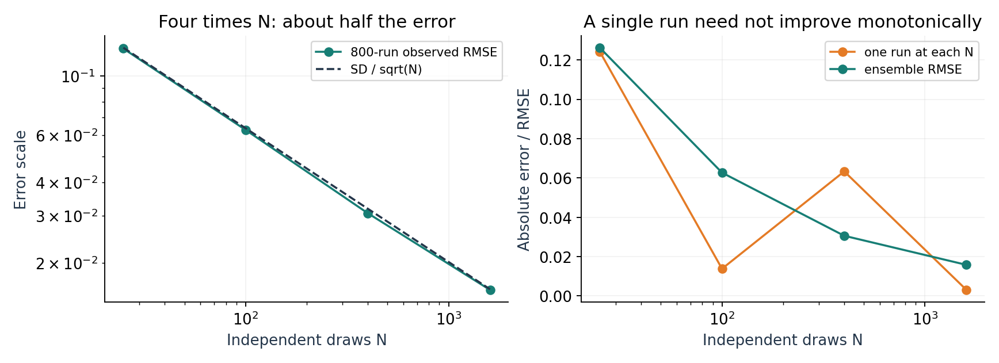

**F03 explains the square-root cost.** Approximately halving MCSE requires four times as many independent draws. A particular larger run may be less accurate than a smaller run. We assess the trend over repeated seeds rather than demanding monotonic improvement from every realization. Although the exponent $N^{-1/2}$ does not explicitly contain dimension, the variance constant, sampling difficulty, and computational cost can deteriorate drastically in high dimensions.

**CP01. Why can posterior SD stay the same while MCSE decreases?**

**Lab A1.** Predict the effect of replacing $N$ by $4N$, then run the repeated-seed experiment. Compare ensemble RMSE with a single realization.

## 3. Importance sampling: correct where we looked

Sometimes it is easier to draw from a proposal $q$ than from the target $p$. The proposal determines where we look; the importance ratio corrects how much each location contributes.

**E04 — change of measure**

$$
\mu_f=\int f(z)\frac{p(z)}{q(z)}q(z)\,dz
=\mathbb E_q[w(z)f(z)],
\qquad w(z)=\frac{p(z)}{q(z)}.
$$

The proposal must put positive density wherever the target contributes to the required integral. For general posterior expectations and normalization, require target support to be covered by proposal support. Ratios evaluated only at observed samples cannot reveal a region that was never sampled.

When normalized $p$ is available, direct IS is $N^{-1}\sum_i w_i f(z^{(i)})$. It is unbiased when the expectation is well-defined. Useful finite-variance accuracy additionally needs $\mathbb E_q[w^2f^2]<\infty$. A proposal with lighter tails than the target can satisfy support coverage while still giving infinite estimator variance.

When only $\widetilde p$ is available, form $\widetilde w_i=\widetilde p(z^{(i)})/q(z^{(i)})$. Normalize those weights:

**E05 — self-normalized IS**

$$
W_i=\frac{\widetilde w_i}{\sum_j\widetilde w_j},
\qquad
\widehat\mu_f^{\mathrm{SNIS}}
=\sum_i W_i f(z^{(i)})
=\frac{N^{-1}\sum_i\widetilde w_i f(z^{(i)})}
       {N^{-1}\sum_i\widetilde w_i}.
$$

Both averages converge to quantities containing the same $Z$, so their ratio is consistent under appropriate support and integrability assumptions, with $0<Z<\infty$. A ratio of unbiased random estimates is generally **not unbiased at finite $N$**. Scaling every unnormalized weight by the same positive constant changes neither $W_i$ nor SNIS.

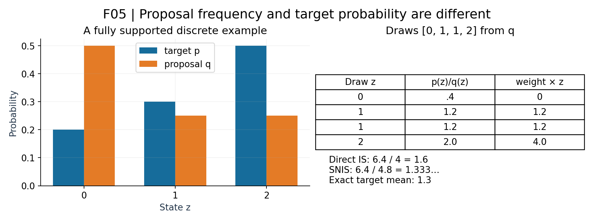

**Worked calculation.** The target probabilities for states 0, 1, 2 are $(0.2,0.3,0.5)$; the proposal probabilities are $(0.5,0.25,0.25)$. For proposal draws $(0,1,1,2)$, ratios are $(0.4,1.2,1.2,2.0)$. The weighted numerator is 6.4. Direct IS divides by four and gives 1.6; SNIS divides by total weight 4.8 and gives $1.333\ldots$. The exact expectation is 1.3. This one draw illustrates distinct estimators; it does not establish their bias by itself.

**CP02. Why is full support necessary but insufficient for reliable importance sampling?**

**CP03. Why does cancellation of the normalizing constant not make finite-sample SNIS unbiased?**

## 4. Weight concentration: a diagnostic with blind spots

**E06 — weight ESS**

$$
N_{\mathrm{eff}}^{\mathrm{weight}}=\frac{1}{\sum_i W_i^2}.
$$

Uniform weights give $N$; one dominant weight gives approximately 1. This measures concentration of the observed weights. It is a useful alarm, not the number of truly independent posterior draws and not a universal estimator-accuracy guarantee. It does not incorporate the particular function $f$.

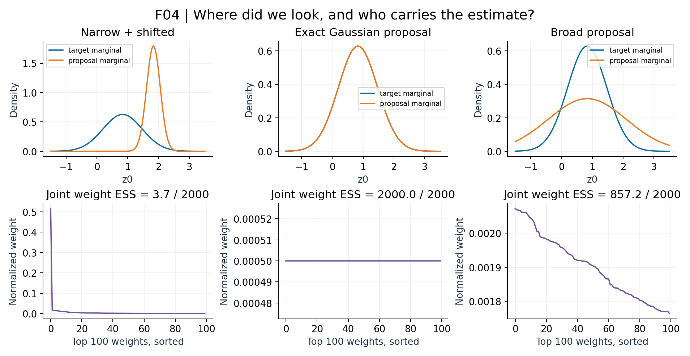

**Read the top and bottom together.** The top row shows the first-coordinate marginals of the target and proposal. The bottom uses weights from the full two-dimensional calculation. The exact Gaussian proposal has equal weights; a shifted narrow proposal can leave almost the whole estimate to a few points. A very broad proposal covers more territory but wastes many draws in low-target-density regions.

Proposal quality depends on the requested integral. A good proposal for estimating a central mean may be poor for a rare-event probability. Merely matching the target's center is insufficient. In the Gaussian case, extremely narrow Gaussian proposals can have problematic second moments even though both distributions have support on all real coordinates.

Compute weights in the log domain. Set $\ell_i=\log\widetilde p(z^{(i)})-\log q(z^{(i)})$, subtract $\operatorname{logsumexp}(\ell)$, then exponentiate. This avoids overflow from multiplying or exponentiating very large densities. All invalid or zero-mass weights must trigger an error; silently replacing them with uniform weights changes the calculation.

**Lab A2.** Calculate a small SNIS example, then repair an unstable normalization function. Change proposal scale or shift separately, compare the expectation error and weight ESS, and explain why neither a visually plausible scatterplot nor a large ESS is enough.

## 5. Metropolis–Hastings: correct movement, including staying still

MCMC constructs dependent draws by repeatedly applying a transition kernel. The target is fixed while the computational iteration advances. Starting from $z$, propose $z'\sim q(z'\mid z)$ and accept with:

**E07 — general MH acceptance**

$$
\alpha(z,z')=\min\left\{1,
\frac{\widetilde p(z')q(z\mid z')}
     {\widetilde p(z)q(z'\mid z)}
\right\}.
$$

The same unknown $Z$ appears in numerator and denominator and cancels. For a symmetric random-walk proposal, the proposal densities also cancel. They cannot be omitted for a general asymmetric proposal. Our code compares log densities and $\log U$, avoiding unnecessary exponentiation.

**E08 — detailed balance for off-diagonal moves**

$$
p(z)q(z'\mid z)\alpha(z,z')
=\min\{p(z)q(z'\mid z),p(z')q(z\mid z')\}
=p(z')q(z\mid z')\alpha(z',z).
$$

The left and right probability flows match. Add the probability of staying at the current state to make the kernel integrate to one; detailed balance then establishes invariance of $p$. Invariance does not by itself establish convergence from arbitrary starts. Irreducibility, aperiodicity, suitable recurrence/ergodicity conditions, and the observable's integrability matter; a useful finite run must also explore sufficiently.

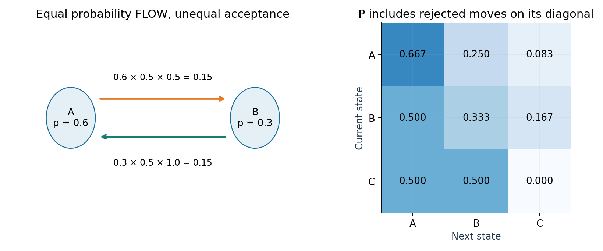

**Worked calculation.** Let target masses be $(0.6,0.3,0.1)$ and propose either other state with probability 0.5. The A-to-B acceptance is $0.3/0.6=0.5$; the B-to-A acceptance is 1. The flows are both 0.15. State A has a large self-transition probability, $2/3$, because its rejected proposals must remain in the chain.

**CP04. Which quantities cancel in the MH ratio, and when do proposal densities cancel?**

## 6. A rejection is a valid recorded state

The algorithm is short, but one missing line changes its meaning:

1. Propose a candidate from the current state.
2. Calculate the log acceptance ratio.
3. If accepted, replace the current state.
4. Record the current state **whether accepted or rejected**.

For example, if a symmetric proposal gives a density ratio 0.25 and the uniform draw is 0.70, reject the candidate and record the old state again. Those repetitions represent residence time in high-probability regions.

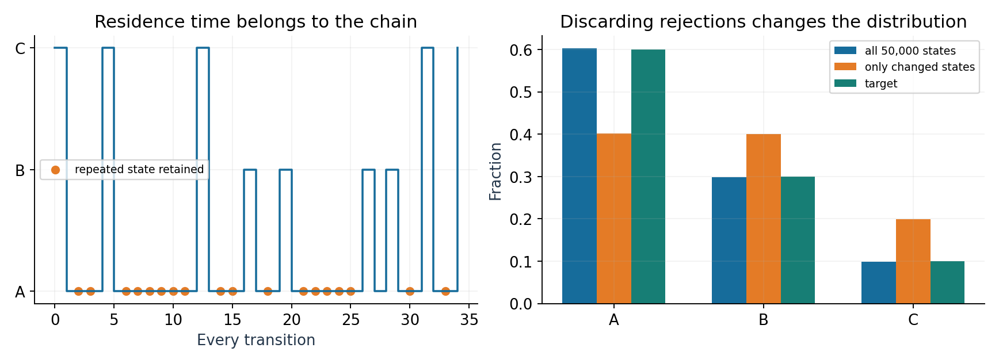

**F07 is a real finite-state simulation.** All recorded states approach target masses $(0.6,0.3,0.1)$. Keeping only changed states instead approaches $(0.4,0.4,0.2)$ for this example. It is a different jump-chain distribution; storing fewer rows is not a harmless optimization.

**CP05. Why does discarding rejected MH proposals bias the empirical distribution?**

**Lab A3.** Find the missing record operation in a buggy MH loop. Check the exact transition matrix independently using $p^\top P=p^\top$ and balanced flows.

## 7. Gibbs sampling: random conditional updates

For the Gaussian target with precision $P=C^{-1}$, the full conditional for coordinate $j$ is:

**E09 — Gaussian full conditional**

$$
z_j\mid z_{-j}\sim
\mathcal N\left(
\mu_j-\frac{1}{P_{jj}}\sum_{k\ne j}P_{jk}(z_k-\mu_k),
\frac{1}{P_{jj}}
\right).
$$

To see why, hold other coordinates fixed in the quadratic log density. The terms involving $z_j$ form a univariate quadratic with precision $P_{jj}$; completing the square gives the mean above. Update coordinate 0, then use its newly drawn value when updating coordinate 1. One full sweep updates both coordinates.

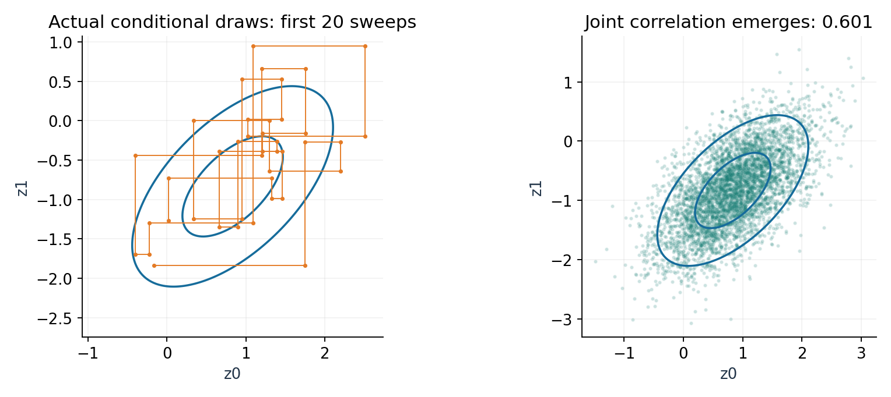

**Read the corners.** A horizontal step changes coordinate 0 while coordinate 1 is fixed; the next vertical step changes coordinate 1 conditional on that new value. Each step includes random variation. The resulting joint draws remain correlated even though each update samples only one coordinate.

W4 CAVI updates an approximating factor using expectations over other factors. Gibbs draws a random coordinate conditional on current values of other coordinates. Replacing a Gibbs draw with its conditional mean removes its conditional variance and does not produce the target joint distribution. Each exact conditional update leaves the joint target invariant; composing coordinate updates preserves invariance, although a fixed-order sweep need not itself be reversible.

**CP07. Why is a Gibbs conditional draw different from a CAVI mean update?**

## 8. Diagnose exploration, not just acceptance

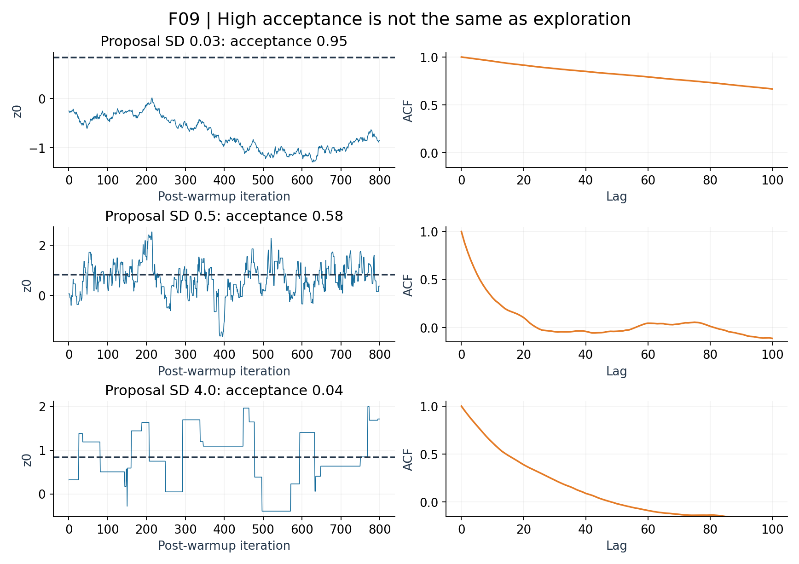

A tiny proposal often accepts, but moves only a short distance. A huge proposal often rejects, creating long flat segments. A useful scale balances movement and acceptance for the specific geometry; no acceptance-rate target alone proves good inference.

For a stationary scalar observable with variance $\sigma_f^2$, a finite-length correlated average has:

**E10 — correlation changes Monte Carlo variance**

$$
\operatorname{Var}(\widehat\mu_f)
=\frac{\sigma_f^2}{N}
\left[1+2\sum_{k=1}^{N-1}\left(1-\frac{k}{N}\right)\rho_f(k)\right].
$$

Under an appropriate Markov-chain CLT and summable correlation behavior, the limiting bracket motivates autocorrelation ESS $N/\tau_f$. This is function-specific: use draws of $f(z)$, not an unrelated parameter. Negative correlation can sometimes yield an ESS above the number of draws.

We use four dispersed chains and ArviZ's rank-normalized split/folded $\widehat R$, bulk/tail ESS, and mean MCSE. Keep the array shape as chains by draws; flattening first loses between-chain information. A value above about 1.01 calls for investigation, while a near-one value alone does not certify convergence. Inspect traces, modes, warmup sensitivity, and accuracy of the quantities you actually report. See the [Stan posterior-analysis guidance](https://mc-stan.org/docs/reference-manual/analysis.html) and [ArviZ diagnostic API](https://python.arviz.org/en/v0.22.0/api/generated/arviz.rhat.html).

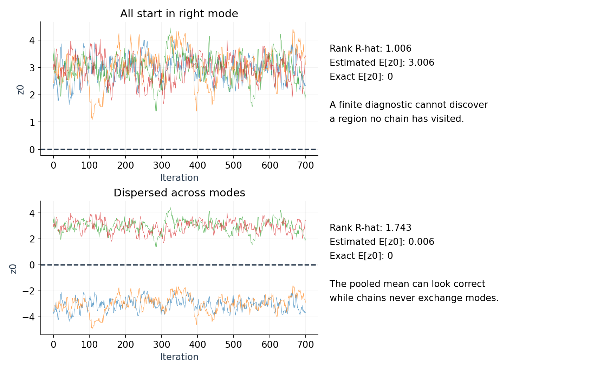

**F10 is the counterexample.** The equal mixture has exact mean zero. Four chains initialized in the right mode can agree with each other while all miss the left mode. Starting across both modes reveals a different warning, but initialization is not a substitute for transitions that move adequately.

**CP06. Why does an invariant target not guarantee that a short MCMC run is accurate?**

**CP08. Why are weight ESS and MCMC ESS not interchangeable?**

**CP12. How can a near-one R-hat coexist with a badly wrong posterior mean?**

**Lab A4–A6.** Change one proposal scale at a time; compare mean error, second-moment error, trace, ACF, ESS, MCSE, and computation counts. Try the optional missed-mode case after the Gaussian core. Compare VI's fixed approximation error with sampling error, without treating an iid oracle as a generally available competitor.

## 9. Sequential Monte Carlo: now the target changes

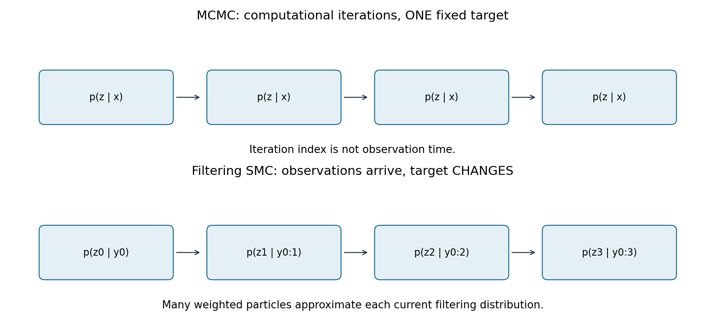

MCMC repeatedly explores one fixed posterior. In filtering, new observations arrive and the posterior of the current latent state changes. SMC is a broader family that tracks a sequence of distributions using weighted particles; state-space filtering is our core instance.

Our synthetic model is:

**E11 — tracking model**

$$
z_0\sim\mathcal N(0,1),\qquad
z_t=a z_{t-1}+\epsilon_t,\quad \epsilon_t\sim\mathcal N(0,q^2),
\qquad y_t=z_t+\eta_t,\quad \eta_t\sim\mathcal N(0,r^2).
$$

The default values are $a=0.9$, process SD $q=0.35$, and observation SD $r=0.5$. Independent noises and the model assumptions define an exact Kalman filtering reference. The algorithm sees $y$, not the latent truth used for evaluation.

Filtering estimates $p(z_t\mid y_{0:t})$. Smoothing would condition on later observations too. Our particle and Kalman calculations are both filters, so their comparison uses the same information.

## 10. Derive the sequential importance weights

The unnormalized density of a latent path factors as:

**E12 — one new model factor**

$$
\gamma_t(z_{0:t})
=\gamma_{t-1}(z_{0:t-1})\,p(z_t\mid z_{t-1})\,p(y_t\mid z_t).
$$

If the proposal extends the previous path using $q_t(z_t\mid z_{0:t-1},y_{0:t})$, divide target-path density by proposal-path density. The old ratio becomes the previous weight:

**E13 — SIS recursion**

$$
\widetilde w_t^{(i)}
=\widetilde w_{t-1}^{(i)}\,
\frac{p(y_t\mid z_t^{(i)})p(z_t^{(i)}\mid z_{t-1}^{(i)})}
     {q_t(z_t^{(i)}\mid z_{0:t-1}^{(i)},y_{0:t})}.
$$

For the bootstrap proposal, $q_t=p(z_t\mid z_{t-1})$. The transition terms cancel, leaving previous weight times observation likelihood. At time zero we draw from the prior, so initial weights are proportional to $p(y_0\mid z_0^{(i)})$. Forgetting previous weights turns SIS into a different, incorrect update unless a preceding resampling step has made weights equal.

**CP09. Why do bootstrap particle-filter weights simplify to observation likelihoods after resampling?**

## 11. Resampling reallocates computation

Without resampling, products of likelihoods often become highly uneven. A small number of paths carry most weight. Resampling draws ancestor indices according to current normalized weights and assigns equal weights to the copied particles.

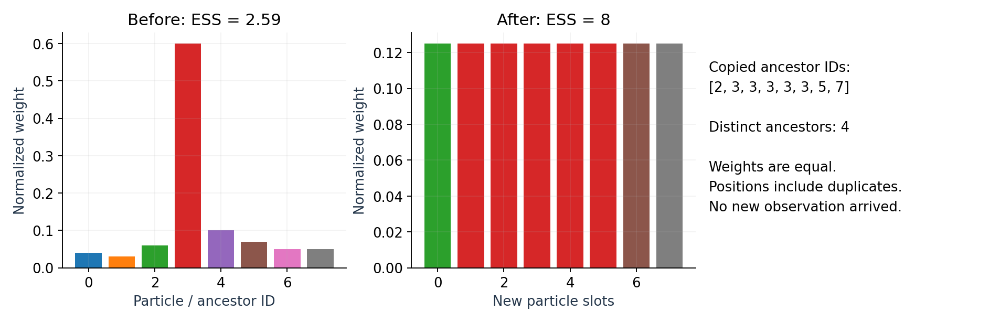

**F12 distinguishes two facts.** The weight-ESS formula becomes $N$ after resampling because the new weights are equal. But several new slots may contain copies of the same old particle. Resampling adds randomness and reallocates future effort; it does not create new evidence or restore lost ancestors.

Our implementation uses systematic resampling when weight ESS is below $\tau N$, with default $\tau=0.5$. A threshold of zero disables resampling and gives SIS. Systematic resampling uses one random offset and equally spaced cumulative-weight positions; offspring counts have the appropriate expectations, but the resulting particles are not independent.

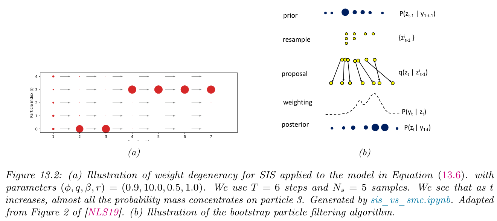

**Textbook figure, unmodified excerpt.** Murphy, *Probabilistic Machine Learning: Advanced Topics*, online December 10, 2025, Figure 13.2, printed p.548 (PDF p.582). Panel (a) is credited in the original caption to an adaptation of Naesseth, Lindsten, and Schön (2019), [*Elements of Sequential Monte Carlo*](https://arxiv.org/abs/1903.04797). The textbook's model and numbers differ from our linear-Gaussian lab.

**How to read F13.** First follow the changing dot sizes in panel (a): unequal weight, not merely unequal position, is the problem. Then read panel (b) vertically: select ancestors, propose successor states, evaluate the new likelihood, and obtain the new weighted posterior.

The textbook illustration places resampling before the next propagation. Our code records the current weighted estimate and then resamples at the end of that time step. These are consistent cycle conventions: follow where the weights become uniform before comparing pseudocode line by line.

**CP10. Why can resampling increase weight ESS while reducing ancestor diversity?**

## 12. Compare with the right reference

For the scalar linear-Gaussian model, the Kalman update gives a tractable oracle:

**E14 — prediction and correction, for $t\ge1$**

$$
m_t^-=a m_{t-1},\quad V_t^-=a^2 V_{t-1}+q^2,\quad
K_t=\frac{V_t^-}{V_t^-+r^2},
$$

$$
m_t=m_t^-+K_t(y_t-m_t^-),\qquad
V_t=(1-K_t)V_t^-.
$$

At $t=0$, start with $m_0^-=0$ and $V_0^-=1$ rather than applying an extra transition. For a first observation $y_0=2$ and observation SD $r=1$, the gain is $1/2$, posterior mean is 1, and variance is $1/2$. This small calculation checks the time convention.

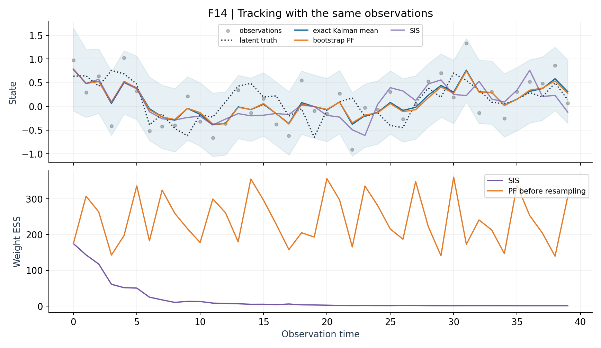

The pale band is the exact pointwise 95% Gaussian filtering interval. It represents uncertainty about the latent state, not the particle approximation's MCSE and not a simultaneous guarantee over all times.

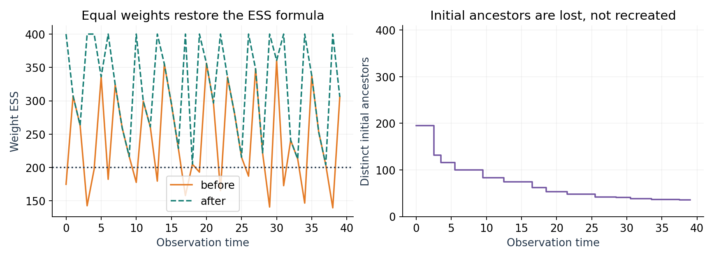

Compare the two panels before declaring recovery. Lost ancestry is particularly important when estimating old paths or smoothing; good present-time filtering can coexist with poor path diversity.

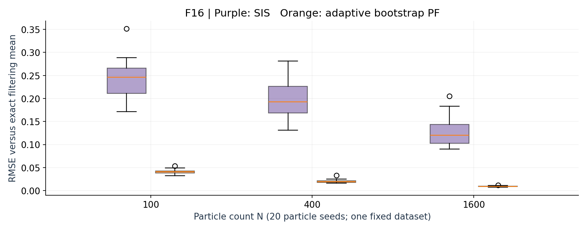

**Read F16 as a controlled experiment.** All runs use one fixed observation series. Particle count and resampling rule vary, and each setting uses 20 particle seeds. The distribution of errors is more informative than a single lucky seed.

| Error or uncertainty | Reference | Meaning |
|---|---|---|
| PF mean RMSE versus Kalman mean | Same model, same observations | Numerical approximation error |
| PF mean RMSE versus latent truth | Simulated unobserved trajectory | Inference error, including unavoidable statistical uncertainty |
| Kalman posterior variance | Conditional model distribution | Remaining latent-state uncertainty |
| Weight ESS / ancestor count | Current weights / initial identities | Two distinct diagnostics, neither an accuracy certificate |

**CP11. Why should particle-filter error against the Kalman mean be separated from error against latent truth?**

**Lab B1–B5.** Verify the first Kalman update by hand, audit the SIS recursion, compare resampling thresholds, and repeat particle seeds. Keep observations fixed when changing particle settings.

## 13. Finish by building and using the web app

The final notebook builds **Sampling Explorer** with two tabs. The fixed-target tab controls the method, target, proposal, initialization, and seed. The tracking tab controls particle count, observation noise, resampling threshold, and particle seed. Each tab returns plots, named diagnostics, and a CSV record.

The connection is explicit: a UI control supplies an argument; a button calls a Python callback; the callback calls the shared inference functions; returned objects populate the plot, diagnostic, and download components. The code guide links each layer to its actual GitHub definition. Students then modify a callback and connect it to a small interface, rather than merely watching an app launch.

**Lab A7 / B6.** Predict a result, change one control, run, and explain the evidence. When changing observation SD, the app regenerates observations from the same underlying noise seed and updates the likelihood; that experiment changes the statistical problem. Changing only particle count, threshold, or particle seed leaves the observed data fixed.

The Gradio share URL is temporary and depends on an active Colab runtime. The permanent entry point is the Lab B notebook. Save the CSV and notebook copy for reproducible comparisons.

## Checkpoint questions

Attempt these before opening the separate explanations.

1. Why can posterior SD stay the same while MCSE decreases?
2. Why is full support necessary but insufficient for reliable importance sampling?
3. Why does cancellation of the normalizing constant not make finite-sample SNIS unbiased?
4. Which quantities cancel in the MH ratio, and when do proposal densities cancel?
5. Why does discarding rejected MH proposals bias the empirical distribution?
6. Why does an invariant target not guarantee that a short MCMC run is accurate?
7. Why is a Gibbs conditional draw different from a CAVI mean update?
8. Why are weight ESS and MCMC ESS not interchangeable?
9. Why do bootstrap particle-filter weights simplify to observation likelihoods after resampling?
10. Why can resampling increase weight ESS while reducing ancestor diversity?
11. Why should particle-filter error against the Kalman mean be separated from error against latent truth?
12. How can a near-one R-hat coexist with a badly wrong posterior mean?

## Sources and further reading

- Murphy, *Probabilistic Machine Learning: Advanced Topics*, selected sections in the reading map. [Official book site](https://probml.github.io/book2).
- [Official pyprobml code](https://github.com/probml/pyprobml): MC accuracy, Gaussian Gibbs, MCMC mixture, and tempered-SMC examples informed the source review. Our core labs use separately written, tested NumPy/SciPy code; linked upstream notebooks are not claimed to run in this environment.
- [Stan: posterior analysis](https://mc-stan.org/docs/reference-manual/analysis.html): interpretation of MCMC diagnostics.
- [ArviZ 0.22: ESS](https://python.arviz.org/en/v0.22.0/api/generated/arviz.ess.html) and [MCSE](https://python.arviz.org/en/v0.22.0/api/generated/arviz.mcse.html): the diagnostic implementation used by the labs.
- [particles basic tutorial](https://particles-sequential-monte-carlo-in-python.readthedocs.io/en/latest/notebooks/basic_tutorial.html): an optional package-based continuation after the transparent bootstrap-filter implementation.

Except for the explicitly attributed textbook excerpt, figures are original course diagrams or calculations from the shared algorithms. Numerical plots use fixed seeds; schematic diagrams are identified as conceptual illustrations.
