# Making Sense of Probabilistic Inference

**Advanced Machine Learning · Week 6 · October 6, 2026**

This week rebuilds the ideas from Weeks 1–5. We begin with a table small enough to calculate by hand. Then we use the same example to understand messages, variational inference and sampling. Bayesian neural networks and Gaussian processes are deferred; they are not prerequisites for this lesson.

Start here even if the earlier formulas felt unfamiliar. Keep asking: **What did we observe? What remains unknown? Which probability are we trying to calculate?**

[Repair and worked calculations](w6-repair.md) · [Experiment worksheet](w6-experiment-record.md) · [Code definitions](w6-code-guide.md) · [Open the CPU notebook in Colab](https://colab.research.google.com/github/lunalab-ai/advML/blob/2026-fall-w6/notebooks/student/w6-inference-rebuild.ipynb)

## 1. Name the objects before doing algebra

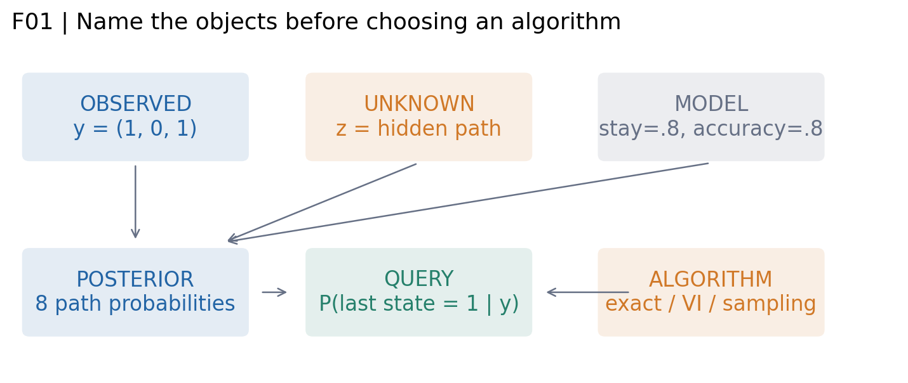

Imagine a machine that is either inactive (0) or active (1). A noisy sensor reports its state three times. We observe **1, 0, 1**. We do not observe the true machine states.

- An **observation**, $y_t$, is the sensor reading already available to us.
- A **hidden state**, $z_t$, is the machine state we want to infer.
- A **model** specifies how states persist and how readings are generated. Its parameters are fixed in this exercise.
- A **posterior distribution** gives probabilities to the possible hidden paths after seeing the readings.
- A **query** is one question about that posterior, such as the probability that the last state is active.
- An **algorithm** calculates or approximates an answer. Changing the algorithm does not create new sensor readings.

The symbol $z$ in a sum ranges over possible values. It is not a number we already measured. The observed vector $y=(1,0,1)$ remains fixed while we compare possible $z$ values.

**Q1. Does drawing 1,000 more posterior samples give us 1,000 new sensor observations?**

Before continuing, explain your answer without using an equation.

## 2. Build a model with eight possible explanations

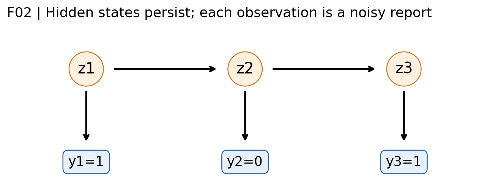

We assume:

1. The first state is active with probability 0.5.
2. The next state equals the previous state with probability 0.8.
3. Given the current state, the sensor reports it correctly with probability 0.8.
4. Given the hidden states, the readings are independent. The next state depends on the previous state, not on the entire earlier history.

These are modeling choices, not facts proved by the three readings. Here we study **inference with known parameters**, not parameter learning. A real application would need to justify or estimate these parameters and check the assumptions.

The graph says how to multiply probabilities:

$$
p(z_{1:3},y_{1:3})=p(z_1)p(z_2\mid z_1)p(z_3\mid z_2)\prod_{t=1}^{3}p(y_t\mid z_t).
$$

Read the equation as: first-state probability × two transition probabilities × three sensor probabilities. There are only $2^3=8$ hidden paths.

For the path 111, the state stays unchanged twice. The first and last readings agree with it; the middle reading disagrees:

$$
p(111,101)=0.5(0.8)(0.8)(0.8)(0.2)(0.8)=0.04096.
$$

The path 101 matches every reading, but requires two unlikely switches. Its joint weight is $0.5(0.2)(0.2)(0.8)^3=0.01024$. The most plausible explanation need not match every noisy observation.

| Hidden path | Joint weight for the observed readings | Posterior probability |
| --- | --- | --- |
| 000 | 0.01024 | 64 / 545 |
| 001 | 0.01024 | 64 / 545 |
| 010 | 0.00016 | 1 / 545 |
| 011 | 0.00256 | 16 / 545 |
| 100 | 0.01024 | 64 / 545 |
| 101 | 0.01024 | 64 / 545 |
| 110 | 0.00256 | 16 / 545 |
| 111 | 0.04096 | 256 / 545 |

## 3. Bayes' rule rescales the table

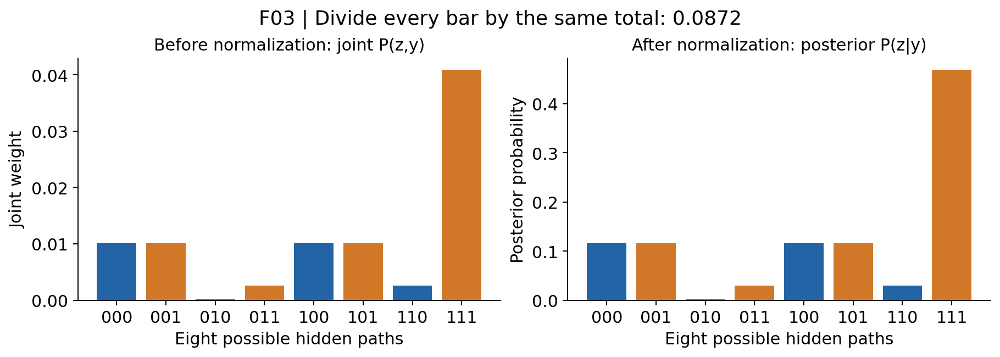

The joint weights add to **0.0872**. This is the probability of obtaining the particular reading sequence 101 under our model. It is not supposed to equal one: we have fixed one observation sequence out of many possibilities.

After seeing that sequence, we ask how its probability is distributed among possible hidden explanations. Divide every weight by the same sum:

$$
p(z\mid y)=\frac{p(z,y)}{p(y)},\qquad p(y)=\sum_{z'}p(z',y)=0.0872.
$$

The prime in $z'$ is only a label for the summation variable. The denominator includes **all eight paths**, including the path in the numerator. This makes the posterior table sum to one and preserves all pairwise weight ratios.

The likelihood $p(y\mid z)$ asks how compatible the observed readings are with a proposed path. The posterior $p(z\mid y)$ also accounts for how plausible that path was before those readings. Swapping the sides of the conditioning bar changes the question.

**Q2. What does the normalizing denominator add up?**

## 4. A marginal answers a question by adding paths

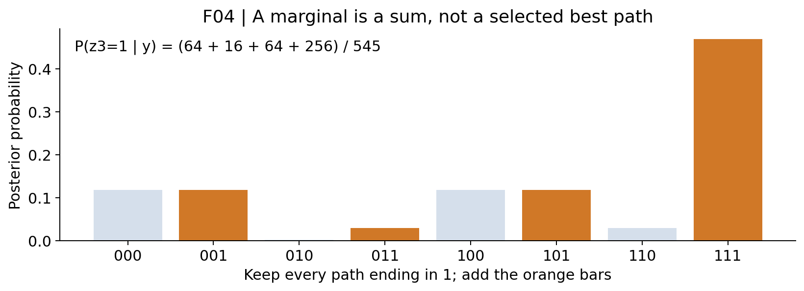

Our main query is: **How likely is the machine to be active at the last time?** Four paths qualify: 001, 011, 101 and 111. We do not choose one winner. We add all four probabilities:

$$
p(z_3=1\mid y)=\sum_{z_1=0}^{1}\sum_{z_2=0}^{1}p(z_1,z_2,z_3=1\mid y)
=\frac{400}{545}\approx0.733945.
$$

This is **marginalization**: sum over unknown values that are not part of the question. **Conditioning** instead fixes a value and changes the distribution under consideration. Summing over $z_2$ and asserting $z_2=1$ are different operations.

An expectation is the same weighted-average operation applied to a function:

$$
\mathbb E[f(z)\mid y]=\sum_z f(z)p(z\mid y).
$$

Set $f(z)=1$ when the last state is one and 0 otherwise. The expectation becomes the event probability above. Because $z_3$ is itself a zero-or-one number, its mean is also that probability. This does not mean the machine is physically “0.734 active.”

A MAP path selects the single largest posterior entry, 111. That entry has probability $256/545\approx0.470$. A point estimate discards the remaining distribution. MLE selects a parameter value maximizing likelihood, while MAP parameter estimation also uses a prior on parameters. Neither is the same operation as preserving an entire posterior. We are not fitting those parameters in this lab.

**Q3. Why is the probability of the MAP path different from the probability that the last state is one?**

## 5. A message is a partial calculation we can reuse

Enumerating every path works here. With 50 binary states there are $2^{50}$ paths. A chain lets us reuse a sum instead of recalculating it for every complete path.

Define the forward message $a_t(j)=p(z_t=j,y_{1:t})$. This is a two-entry table, one entry for each current state:

$$
a_t(j)=p(y_t\mid z_t=j)\sum_{i=0}^{1}p(z_t=j\mid z_{t-1}=i)a_{t-1}(i).
$$

The sum collects the two ways to arrive at state $j$. Multiplying by the emission adds the current reading. The message stores the resulting subtotal for the next step.

For the first reading 1, $a_1=[0.1,0.4]$. For the second reading 0:

$$
a_2(0)=0.8[0.8(0.1)+0.2(0.4)]=0.128,
$$
$$
a_2(1)=0.2[0.2(0.1)+0.8(0.4)]=0.068.
$$

Normalize these two entries to obtain the filtered probability $0.068/(0.128+0.068)=17/49\approx0.34694$ for state one.

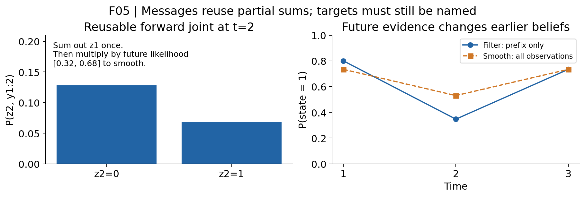

**Filtering** at time 2 uses readings 1 and 2. **Smoothing** at time 2 also uses reading 3. The future reading contributes likelihoods $[0.32,0.68]$ for the two possible states at time 2. Multiply these by $[0.128,0.068]$ and normalize: the smoothed probability becomes $289/545\approx0.53028$.

Neither answer is a bug. They answer different questions. The filter has not yet seen the later reading favoring state one. In Week 2, tree sum-product reorganized exactly these kinds of finite sums. Tree exactness is structural. On a graph with loops, messages becoming stable does not by itself prove that their probabilities are accurate.

**Q4. At time 2, why must an online particle filter be compared with a filtering reference rather than the full-data smoother?**

## 6. Variational inference chooses a simpler distribution

Suppose we represent the posterior by independent Bernoulli factors:

$$
q_\phi(z)=\prod_{t=1}^{3}\phi_t^{z_t}(1-\phi_t)^{1-z_t}.
$$

Three numbers $\phi_1,\phi_2,\phi_3$ determine all eight probabilities. This is convenient, but it forces independence in $q$. The original model does not say the hidden states are independent. A **model assumption** and an **approximation-family restriction** are different choices.

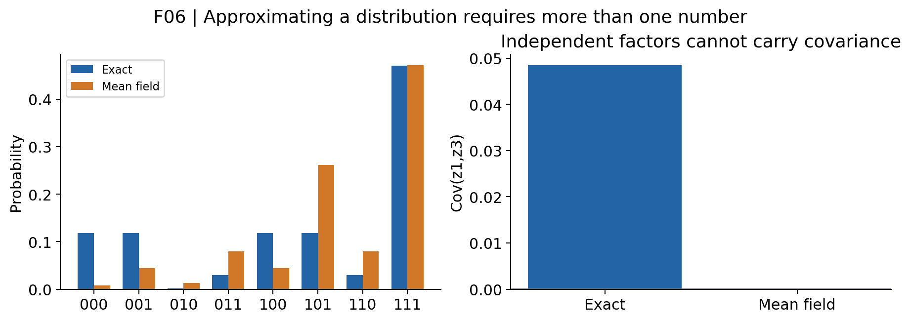

Coordinate-ascent VI repeatedly improves one factor while holding the others fixed. In our default example it converges from the demonstrated starts to approximately $\phi=(0.85598,0.64284,0.85598)$. The last-state probability differs from the exact 0.73394. The covariance of the first and last states is forced to zero under $q$, while the exact posterior covariance is positive.

### Read the ELBO identity before deriving it

$$
\log p(y)=\mathcal L(q)+\operatorname{KL}(q\Vert p(z\mid y)).
$$

The left side is fixed for a fixed model and observed data. The KL term measures a discrepancy and is nonnegative. Therefore the ELBO cannot exceed the log evidence. Increasing the ELBO decreases this reverse KL.

Here is the derivation as a sequence of substitutions:

$$
\begin{aligned}
\operatorname{KL}(q\Vert p(z\mid y))
&=\sum_z q(z)\log\frac{q(z)}{p(z\mid y)}\\
&=\sum_zq(z)[\log q(z)-\log p(z,y)+\log p(y)]\\
&=\log p(y)-\mathbb E_q[\log p(z,y)-\log q(z)].
\end{aligned}
$$

We define the expectation on the last line to be $\mathcal L(q)$. The last equality uses $\sum_zq(z)=1$. In the finite example every joint probability is positive, so all these logarithms are well-defined.

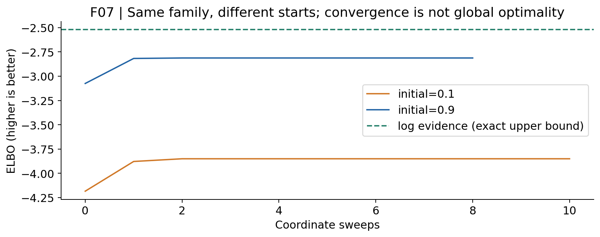

Two obstacles must be separated. An optimizer may fail to reach the best member of the chosen family. Even the best member may fail to equal the target because the family cannot represent it. At stay probability 0.95, the demonstrated starts reach different values. Label the better result **best found among these starts**; these runs alone do not prove a global optimum.

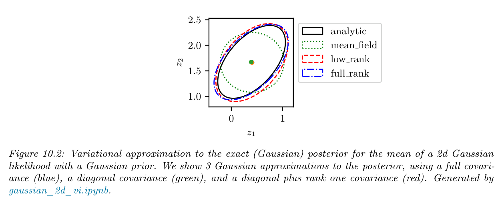

Source: Kevin P. Murphy, *Probabilistic Machine Learning: Advanced Topics*, online version December 10, 2025, Figure 10.2, printed p. 442 (PDF p. 476). Selected teaching figure. Read the shapes: the diagonal family cannot rotate to follow the target's dependence. In this Gaussian illustration, matching the mean can hide covariance error. Our binary example shows that mean-field means need not match either. The sensor example and its visualizations are original teaching additions.

**Q5. Can more optimization always remove the error caused by a factorized variational family?**

## 7. Monte Carlo averages simulated possibilities

If we can draw independent paths from the posterior, replace a weighted sum over all paths by a sample average:

$$
\widehat\mu_N=\frac1N\sum_{s=1}^{N}f(z^{(s)}).
$$

For our event, count the sampled paths ending in one and divide by $N$. A sample path is one possible hidden explanation, not a new sensor measurement. Our lab's iid sampler uses the exact eight-row posterior. It is a teaching benchmark; access to such an exact sampler is precisely what is difficult in larger problems.

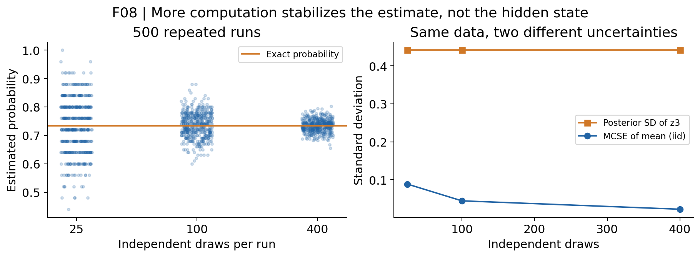

For independent draws of the last binary state, posterior SD is $\sqrt{p(1-p)}\approx0.442$. The standard deviation of its sample mean is $\sqrt{p(1-p)/N}$. At $N=100$ this is about 0.0442; at $N=400$ it is about 0.0221. The state remains uncertain, but our numerical estimate becomes more stable. A single run need not improve when its budget increases.

**Q6. Which uncertainty shrinks when we draw more samples while keeping the observed data fixed?**

## 8. Importance sampling changes the drawing distribution

Sometimes it is easier to draw from a proposal $g(z)$ than from the posterior. A proposal that visits unlikely paths too often should not give every visit the same influence.

$$
z^{(s)}\sim g,\qquad w_s=\frac{p(z^{(s)},y)}{g(z^{(s)})},\qquad
\widetilde w_s=\frac{w_s}{\sum_r w_r},\qquad
\widehat\mu=\sum_s\widetilde w_s f(z^{(s)}).
$$

The unknown evidence cancels when we normalize weights. The proposal must cover every state that can contribute to the target expectation. A missing region cannot be repaired by weighting samples that never visit it.

For a uniform proposal, $g(z)=1/8$. One draw of path 111 has unnormalized weight 0.32768; path 010 has weight 0.00128. Their ratio is 256. Normalize over the **actual sampled draws**, including repeated draws, not over a hypothetical list in which every path appears once.

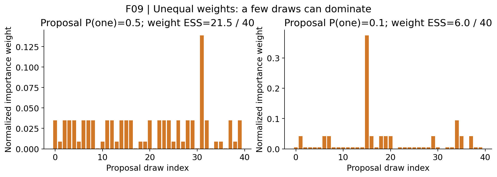

The weight diagnostic $1/\sum_s\widetilde w_s^2$ lies between 1 and $N$. It describes weight concentration. It is not the number of unique states and not MCMC effective sample size. This self-normalized estimator is generally biased at finite $N$; suitable support and moment conditions are needed for consistency and error guarantees.

## 9. MCMC constructs dependent visits

Metropolis–Hastings proposes a move and accepts it with a probability designed to preserve the posterior. Our proposal chooses one of three bit flips or a self proposal with equal probability. It is symmetric, so:

$$
\alpha(z,z')=\min\left(1,\frac{p(z',y)}{p(z,y)}\right).
$$

The evidence cancels. A general asymmetric proposal requires the reverse/forward proposal ratio as well. From 001 to 011 the joint ratio is 0.25. If the generated uniform number is 0.7, reject the move and record 001 again.

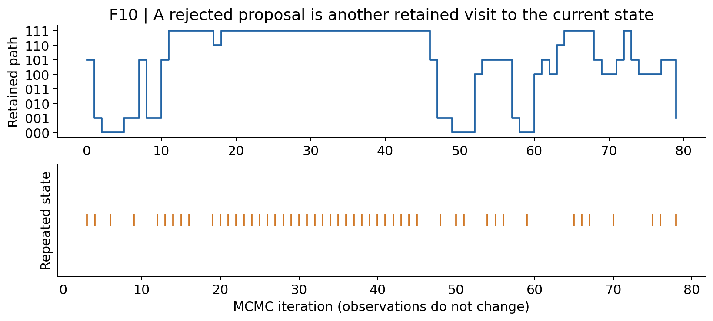

Removing repeated states changes how long the chain visits each state and generally changes the target distribution represented by its histogram. Burn-in discards an initial segment; it does not make the remaining draws independent or prove convergence.

Gibbs sampling draws one coordinate from its conditional distribution while holding the other coordinates at their current sampled values. For example, with $z_1=z_3=1$, the conditional probability of $z_2=1$ is $0.04096/(0.01024+0.04096)=0.8$. This is not the marginal probability of $z_2=1$ and not a VI factor update. VI averages log probabilities over other factors; Gibbs conditions on a current state and draws a random value.

**Q7. Why must a rejected MH proposal remain as a repeated state in the chain?**

## 10. Sequential Monte Carlo follows arriving data

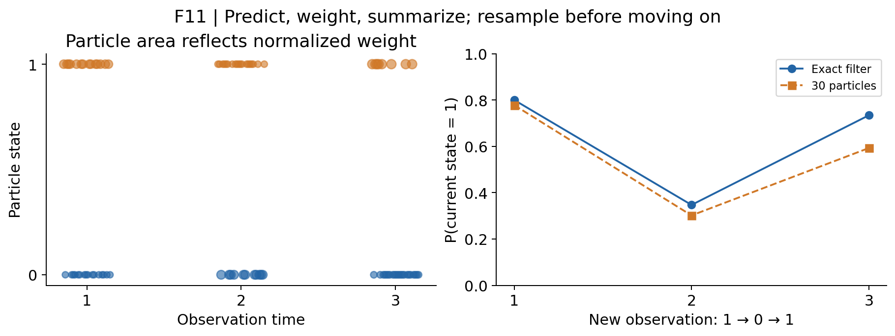

At time 1 we infer the first state from the first reading. At time 2 we have a new reading and a new target. This index is observation time, unlike MCMC's repeated computation on fixed data.

Our bootstrap filter follows this cycle:

1. Draw initial states from the prior, or propagate previously resampled states through the transition model.
2. Weight each current particle by the likelihood of the new reading.
3. Normalize weights and calculate the current filtering estimate.
4. Before the next transition, sample ancestor indices according to the weights.

Resampling gives high-weight particles more descendants. It can reduce weight imbalance but also reduce ancestry diversity; it does not create new observations or guarantee accuracy. Distinct particles can share the same binary state. “Two unique state values” is not evidence that only two particle lineages remain.

The exact filtered probabilities for our example are approximately **0.800, 0.347, 0.734**. The lab compares particles with these prefix-specific values. SMC is the optional guided extension if the foundational calculations need more time.

## 11. Compare methods with a controlled experiment

| Method | What is stored or changed? | Main issue to inspect |
| --- | --- | --- |
| Enumeration / tree messages | Exact sums under this model | Exponential enumeration cost; graph structure |
| Mean-field VI | Parameters of a restricted distribution | Family restriction and optimization |
| iid MC benchmark | Independent posterior draws | Numerical variation; exact sampler assumption |
| Self-normalized IS | Proposal draws and normalized weights | Support and weight concentration |
| MH / Gibbs | Dependent visits to a fixed target | Exploration and dependence |
| Bootstrap SMC | Particles as observations arrive | Weight and ancestry degeneration; matching target time |

The Week 3 research lesson applies here: specify the claim before choosing the plot. Keep observations, model and query fixed when comparing algorithms. Change one setting at a time. Repeat random seeds. Report both the event error and a distribution/dependence diagnostic. Do not announce that one method is universally best from one small example.

In the notebook, first study dependence at stay probabilities 0.5, 0.8 and 0.95. Then vary sample budget with observations fixed. Finish by modifying one diagnostic in the **Inference Workbench** and exporting your experiment record.

**Q8. What must stay fixed to interpret a comparison as an algorithm comparison?**

Before leaving, complete: “We observed ____. We inferred ____. Our query was ____. The approximation differed because ____.”

## Optional reference: where the equations came from

For mean-field coordinate ascent, terms independent of $z_j$ vanish into the normalizer:

$$
\log q_j^*(z_j)=\mathbb E_{q_{-j}}[\log p(z,y)]+\text{constant}.
$$

For our Bernoulli factor, calculate the expected log joint at zero and one, exponentiate and normalize the two numbers. The code does this explicitly over the small table. It is not scalable variational software.

For MH, the symmetric proposal ensures $p_iT_{ij}=p_jT_{ji}$ for distinct states. Summing over incoming states gives invariance. Our positive probabilities, connected bit-flip moves and self transitions give a finite irreducible, aperiodic chain. These asymptotic properties do not specify how long a particular finite run must be.

The bootstrap proposal is the model transition, so its transition factors cancel from the incremental importance ratio. After resampling the incoming particles have equal weights; the next weights are proportional to the new emission likelihood. A different proposal or a filter that skips resampling requires the corresponding weight formula.

## Reading map and attribution

The actual sequence was W1 foundations, W2 graphical models, W3 research methodology, W4 VI and W5 sampling. This is selected review, not complete coverage of several textbook chapters.

- Murphy, *Probabilistic Machine Learning: Advanced Topics*: Chapter 7 provides the inference map; selected prerequisites in Chapters 2–4, HMM/message connections in Chapter 9, VI in Chapter 10, Monte Carlo in Chapter 11, MCMC in Chapter 12 and SMC in Chapter 13. [Official book page](https://probml.github.io/pml-book/book2.html).
- Blei, Kucukelbir and McAuliffe (2017), [Variational Inference: A Review for Statisticians](https://www.cs.columbia.edu/~blei/papers/BleiKucukelbirMcAuliffe2017.pdf): approximation by optimizing within a family.
- [Stan Reference Manual: Posterior Analysis](https://mc-stan.org/docs/reference-manual/analysis.html): posterior spread, simulation error and finite-chain diagnostic limitations.
- The sensor model, calculations, plots F01–F11 and exercises are original teaching additions. F12 is the attributed selected textbook figure. The code reuses the course's inspected W2 finite-graph implementation; it does not claim to run the textbook's JAX notebooks.
